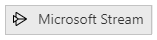
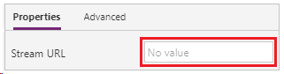

# Microsoft Stream video control in Power Apps
A video player for Microsoft Stream videos and channels.

> [!IMPORTANT]
> The Stream (Classic) control is deprecated and will be removed from Power Apps Studio. Microsoft is working on releasing a new control for Stream that is based on SharePoint. For more information, see [Migration Overview - Stream (Classic) to Stream (on SharePoint)](/stream/streamnew/stream-classic-to-new-migration-overview#migration--retirement-timeline).

## Description
The control will allow app users to play videos and browse through channels from the Microsoft Stream service. For a list of supported regions for this control, go to [Microsoft Stream FAQ](/stream/faq#which-regions-does-microsoft-stream-host-my-data-in-).

## Limitations
The control is not supported in Power Apps for Windows. On iOS, only [Power Apps mobile](../../../mobile/run-powerapps-on-mobile.md) is supported.

## Key properties
**StreamUrl** – The URL of the Microsoft Stream video or channel to be shown in the control.

**ShowControls** – Whether video playback controls are shown to the end user.

## Additional properties
**[AccessibleLabel](properties-accessibility.md)** – Label for screen readers. Should be the title of the video or audio clip.

**AutoStart** – Whether an audio or video control automatically starts to play a clip when the user navigates to the screen that contains that control.

**[BorderColor](properties-color-border.md)** – The color of a control's border.

**[BorderStyle](properties-color-border.md)** – Whether a control's border is **Solid**, **Dashed**, **Dotted**, or **None**.

**[BorderThickness](properties-color-border.md)** – The thickness of a control's border.

**[DisplayMode](properties-core.md)** – Whether the control allows user input (**Edit**), only displays data (**View**), or is disabled (**Disabled**).

**[Fill](properties-color-border.md)** – The background color of a control.

**[FocusedBorderColor](properties-color-border.md)** – The color of a control's border when the control is focused.

**[FocusedBorderThickness](properties-color-border.md)** – The thickness of a control's border when the control is focused.

**[Height](properties-size-location.md)** – The distance between a control's top and bottom edges.

**StartTime** – The time after the start of an audio or video clip when the clip starts to play.

**[TabIndex](properties-accessibility.md)** – Keyboard navigation order in relation to other controls.

**[Tooltip](properties-core.md)** – Explanatory text that appears when the user hovers over a control.

**[Visible](properties-core.md)** – Whether a control appears or is hidden.

**[Width](properties-size-location.md)** – The distance between a control's left and right edges.

**[X](properties-size-location.md)** – The distance between the left edge of a control and the left edge of its parent container (screen if no parent container).

**[Y](properties-size-location.md)** – The distance between the top edge of a control and the top edge of the parent container (screen if no parent container).

## Example

### Play an audio or video file from Microsoft Stream

1. On the **File** menu, select **Insert** and then open **Media** drop-down menu. 
2. Select **Microsoft Stream** from the list of media controls:

    

3. Paste the video link inside **Stream URL** property on the left:

    

4. Press F5, select the play button of the control that you added.

    > [!NOTE]
   > **Microsoft Stream** requires authentication to play the video. Ensure the app user has the required permission.
5. Press Esc to exit the preview mode.

## Browser considerations

### iOS
The Power Apps iOS player does not support direct playback of videos embedded in the app.  To watch the video, click on the Stream icon to launch the video player in a full-screen mode.

### Safari

In order to view Microsoft Stream videos in an app in the Safari browser, you will need to turn off the option to [prevent cross-site tracking](https://support.apple.com/guide/safari/sfri40732/mac).

## Accessibility guidelines
### Audio and video alternatives
* **ShowControls** must be true so that users can listen or watch multimedia at their own pace. This also allows users to toggle closed captions and full-screen mode on video players.
* Closed captions must be provided for videos.
 * Consider providing an audio or video transcript using one of these methods:
  1. Put the text in a **[Label](control-text-box.md)** and position it adjacent to the multimedia player. Optionally, create a **[Button](control-button.md)** to toggle the display of the text.
  2. Put the text in a different screen. Create a **[Button](control-button.md)** that navigates to the screen and position the button adjacent to the multimedia player.
  3. If the description is short, it can be put it in the **[AccessibleLabel](properties-accessibility.md)**.

### Color contrast
There must be adequate color contrast between:
* **[FocusedBorderColor](properties-color-border.md)** and the outside color
* **[Fill](properties-color-border.md)** and the multimedia player controls (if the fill is visible)

Provide closed captions and/or transcript if the video content has color contrast issues.

### Screen reader support
* **[AccessibleLabel](properties-accessibility.md)** must be present.

### Keyboard support
* **[TabIndex](properties-accessibility.md)** must be zero or greater so that keyboard users can navigate to it.
* Focus indicators must be clearly visible. Use **[FocusedBorderColor](properties-color-border.md)** and **[FocusedBorderThickness](properties-color-border.md)** to achieve this.
* **AutoStart** should be false because it can be difficult for keyboard users to stop playback quickly.

### Known issue 
Microsoft Stream appears as a connection in the [connection consent dialog](/power-apps/maker/canvas-apps/connections-list#connection-consent-dialog) although it is a control. The control will appear in the app regardless of what actions the end-user takes in the connection consent dialog. The Microsoft Stream control will only display video for end-users that have permissions to the content presented in the control. 

[!INCLUDE[footer-include](../../../includes/footer-banner.md)]
