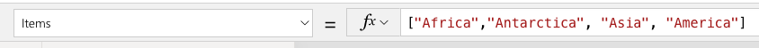
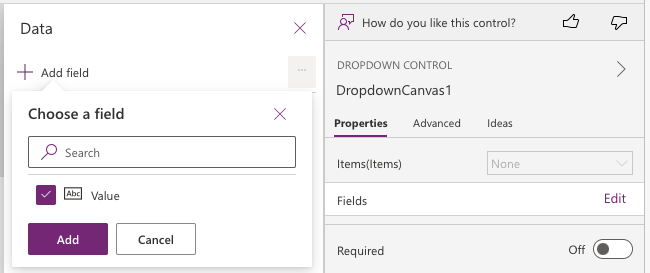

# Limitations of modern controls in canvas apps (preview)
[This article is pre-release document and is subject to change.]

In this article, learn about the general limitations of the modern controls used in canvas apps. 

1. If you add items through an array such as PowerFx bar or advance properties. Then, you'll need to additionally select the **Value** field from the properties panel.

   > [!div class="mx-imgBorder"]
   > 

   > [!div class="mx-imgBorder"]
   > 

2. While updating properties of controls in property panel, some of the property value updates in format of:

    `PowerApps.CoreControls.<Control name>.<Property name>`  `.<Value>`
  
     This is a valid format, or you can update to value only. Both approaches will work for configuration of the control.

3. The property sets for new controls are different than property sets of original controls. Not all scenarios are supported on new controls. We're consistently trying to make improvements for new scenarios.
  
4. The modern controls don’t have support for properties that show up in command bar. Currently we only support property value updated through the property panel.
  
5. All app checker rules such as accessibility and formulas, currently don’t run on modern controls. We'll try to offer support as the feature develops.

6. Test Studio and Test engine compatiblity with modern controls is under development and modern controls are not fully supported on these tools.

### See also

[Overview of modern controls in canvas apps](overview-modern-controls.md)

