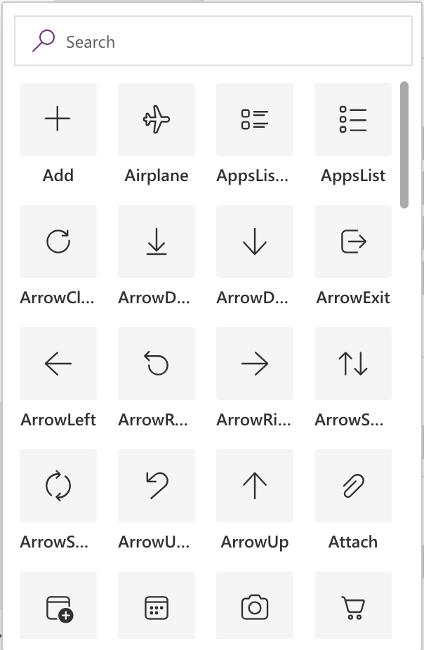

# Button modern control in Power Apps

A control that the user selects to interact with the app.

## Description
Use the modern button to set a button as primary or secondary. Configure the **[OnSelect](../properties-core.md)** property of a **Button** control to run one or more formulas when the user selects the control. As a design pattern, always place the primary button on the left and the secondary button to the right of it. The key properties for this control are **OnSelect** and **Text**.


## Adding and configuring a button
1. In Power Apps Studio, select **Insert** > **Button** from the modern controls.
1. The button appears on your canvas with default text "Button".
1. With the button selected, you can:
   - **Change the text:** Type in the formula bar or use the **Text** property in the Properties pane.
   - **Add functionality:** Configure the **OnSelect** property to define what happens when clicked.
   - **Style the button:** Use **Appearance** and other style properties.

## Button editing experience
Unlike Excel's developer mode, Power Apps provides a visual design interface:
- **Properties pane:** Configure all button properties on the right side.
- **Formula bar:** Enter formulas at the top of the screen.
- **Canvas:** See changes immediately as you design.
- **Tree view:** Navigate between controls on the left side.

The button properties update in real time as you make changes. No separate popup or developer mode is needed.

## General

**[Text](../properties-core.md)** – Text that appears on the button. To change the button text, select the button and either:
- Type directly in the formula bar at the top of the screen
- Enter text in the **Text** field in the Properties pane on the right
- Use a formula for dynamic text, such as `"Submit " & DataCardValue1.Text`

Examples:
- Static text: `"Save Changes"`
- Dynamic text: `"Items: " & CountRows(Gallery1.AllItems)`
- Conditional text: `If(EditMode, "Update", "Create")`

**AccessibleLabel** – Label for screen readers.

**Visible** - Whether a control appears or is hidden.

## Add an icon to a button control

The button control now includes a subset of Fluent icons. The following properties are available:

**Icon** - The button control now allows you to enhance its visual appeal by including Fluent icons. In the properties pane, select the desired icon from a dropdown menu that displays all available options.

> [!div class="mx-imgBorder"]
> 

**Layout** - Defines the positioning of the icon in relation to the text on the button or no icon at all.

**Icon Rotation** - Provides the ability to rotate the icon to a desired orientation.

**Icon Style** - Provides option for icon to be rendered in filled or outline state.

## Behavior

**DisplayMode** – Whether the control allows user input (Edit), only displays data (View), or is disabled (Disabled).

## Size and position 

**[X](../properties-size-location.md)** – The distance between the left edge of a control and the left edge of its parent container (screen if no parent container).

**[Y](../properties-size-location.md)** – The distance between the top edge of a control and the top edge of the parent container (screen if no parent container).

**Width** - The distance between a control's left and right edges. 

**Height** - The distance between a control's top and bottom edges. 

## Style and theme

**Appearance** – You can style a button's content and borders to make it stand out or to keep it subtle. This property accepts both static values and formulas that return text values. The available options are:
* Primary: Emphasizes the button as a primary action.
* Secondary: Emphasizes the button as a secondary action.
* Outline: Removes background styling.
* Subtle: Minimizes emphasis to blend into the background until hovered or focused.
* Transparent: Removes background and border styling.

Use formulas to dynamically set the appearance based on app state. For example: `If(UserRole = "Admin", "Primary", "Secondary")` or `Switch(AppState, "Loading", "Subtle", "Error", "Outline", "Primary")`.

For more information about using formulas with modern control properties, see [Modern controls overview](overview-modern-controls.md).

**BasePaletteColor** - The color palette applied to a control. This color impacts all surfaces of the control that render a theme color. If you set the value to null or zero, the selected Fluent theme drives the color.

**Font** - The name of the family of fonts in which text appears.

**FontSize** - The font size of the text that appears on a control. If you set the value to null or zero, the selected Fluent theme drives the font size.

**FontColor** - The color of text in a control. 

**FontWeight** - The weight of the text in a control: **Bold**, **Lighter**, **Normal**, or **Semibold**. 

**FontItalic** - Whether the text in a control is italic. 

**FontUnderline** - Whether a line appears under the text that appears on a control. 

**FontStrikethrough** - Whether a line appears through the text that appears on a control. 

## Formula examples

The modern button control supports formulas for many properties. Here are some common examples:

**Dynamic appearance based on user role:**
```
If(User().Role = "Manager", "Primary", "Secondary")
```

**Conditional visibility:**
```
User().Department = "Sales"
```

**Context-aware text:**
```
If(IsBlank(SelectedItem), "Select Item", "Update Item")
```

For comprehensive information about Power Apps formulas, see [Formula reference](../../formula-reference.md).

## Additional properties

**[AcceptsFocus](../properties-accessibility.md)** - Determines whether the control can receive focus when the user navigates through the app by using the keyboard. 

**[OnSelect](../properties-core.md)** – Actions to perform when the user selects the control. Define what happens when someone clicks the button. To configure button actions:

1. Select the button.
1. In the **Properties** pane, find the **OnSelect** property.
1. Enter your formula in the formula bar.

Common button actions include:
- **Navigate to another screen:** `Navigate(Screen2, ScreenTransition.Slide)`
- **Submit a form:** `SubmitForm(Form1); Navigate(SuccessScreen)`
- **Save data:** `Patch(DataSource, Defaults(DataSource), {Name: TextInput1.Text})`
- **Show a popup:** `Set(ShowPopup, true)`
- **Reset a form:** `ResetForm(Form1)`
- **Multiple actions:** `UpdateContext({Loading: true}); SubmitForm(Form1); Navigate(HomeScreen)`

For more information about button actions, see [OnSelect property](../properties-core.md).


