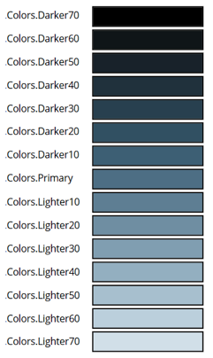

# Use modern themes in canvas apps (preview)

[This article is pre-release document and is subject to change.]

Your app's appearance can be quickly changed by applying modern themes, which are predefined sets of styles that affect the user interface. Modern themes use Microsoft's Fluent design language. They modify various style elements, including color, typography, borders, and shadows, in a consistent and visually appealing manner. Modern theming simplifies the customization process, allowing makers to create a visually cohesive and consistent app with ease.

> [!IMPORTANT]
> - This is a preview feature.
> - Preview features aren’t meant for production use and may have restricted functionality. These features are available before an official release so that customers can get early access and provide feedback.

## Prerequisites 

To use modern themes, you need to enable it. More information, see [Enable modern controls and themes for your app](overview-modern-controls.md#enable-modern-controls-and-themes-for-your-app).

> [!NOTE]
> When modern controls and themes is enabled, you won't be able to select classic themes from the command bar. To use classic themes, you'll need to turn off modern controls and themes.  

## Apply modern theme 

1. On the app authoring menu, select >  **Themes**.
2. On the **Themes** pane, select one of the six default themes. 

When a modern theme is selected, the style of the theme is automatically applied to all the modern controls in your app. This action sets the **App.Theme** property.  

> [!NOTE]
> Modern themes don't make any automatic changes to classic controls; however, these controls can be manually styled to align to the theme through Power Fx. 

## Use themes with Power Fx

Modern theme objects are available for makers to use through Power Fx. The currently active theme object can be referenced by **App.Theme**, and any theme loaded into the app can be referenced by its instance name such as **RedTheme**. It's recommended to reference the theme object using **App.Theme** to ensure that the color selections adapt to theme changes.  

Each theme object includes the following information: 
-  **Name**: The name of the theme.
-  **Colors**: A collection of the 16 colors comprising the brand ramp for the theme. Each color in this ramp is individually accessible by name.

The image below shows the slot variables inside the **Colors** collection and, as an example, the corresponding colors for the **Steel** theme.  
> [!div class="mx-imgBorder"]
> 

Using the theme brand ramp, you can manually style a classic control based on the current modern theme such as **Button.Fill = App.Theme.Colors.Primary**.

> [!NOTE]
> To provide feedback, see: [Provide your feedback to Microsoft](overview-modern-controls.md#provide-feedback-to-microsoft).

## See also

[Modern controls blog post](https://go.microsoft.com/fwlink/?linkid=2229189) 
