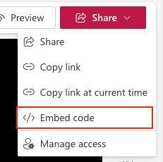

# Stream control (based on SharePoint) in Power Apps (preview)

[This article is pre-release document and is subject to change.]

The Stream control in Power Apps lets you embed Microsoft Stream videos directly into Power Apps applications. This results in a smooth integration of videos hosted on Microsoft Stream within your app. By enabling video content to be part of the app's interface, Stream control significantly improves the user experience.

## Add the Microsoft Stream control 

1. Go to the stream video which needs to be embedded. 
1. Obtain the embed code from the Microsoft Stream video in SharePoint by selecting the “Embed Code” option. 
> [!div class="mx-imgBorder"]
   > 
14. Copy the stream URL from iframe src starting from https:// to the unique id of the control. Please ensure it only contains the Unique ID and no additional attributes.
1. Set the URL property of the control to the copied embed URL.
1. Customize the size of the embedded video player by setting the Width and Height properties of the control.

> [!IMPORTANT]
>  Embed URL should be copied only till unique id. Any additional parameters will render the URL invalid.

## Properties

**URL (Required)** - The URL of the Microsoft Stream video to be embedded. This URL should be the embed URL of the video. The URL should only have Unique ID. If URL detects more parameters, the control will detect as invalid URL.
 
**[X](../properties-size-location.md)** – The distance between the left edge of a control and the left edge of its parent container (screen if no parent container).

**[Y](../properties-size-location.md)** – The distance between the top edge of a control and the top edge of the parent container (screen if no parent container).

**Width** - The distance between a control's left and right edges. 

**Height** - The distance between a control's top and bottom edges. 

## Limitations
1. Only browsers are supported in this version. Support for mobile app will be rolled out in few weeks.
2. Some of the properties like auto start, auto play or start from, will be supprted in coming weeks.
3. We do not recommend having more than 4 videos on a single canvas app screen as doing so will have performance implications.
4. Videos in galleries will not be able to retain it's last played state.

