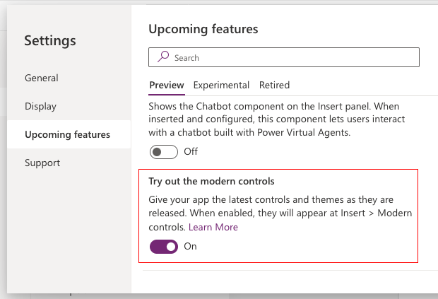

# Overview of modern controls in canvas apps (preview)

[This article is pre-release document and is subject to change.]

Modern controls in canvas apps are a new set of controls that are based on Microsoft design system. Modern controls are quicker and simpler for makers to configure. They also provide a more cohesive experience for end-users. Modern controls are designed with a focus on accessibility, usability, and performance that makes them visually appealing, highly functional, and intuitive to use.

> [!IMPORTANT]
> - This is a preview feature.
> - Preview features aren’t meant for production use and may have restricted functionality. These features are available before an official release so that customers can get early access and provide feedback.

## Enable modern controls for your app
With your [canvas app open for editing](../../edit-app.md):
1. On the command bar, select **Settings** > **Upcoming features**.
2. From the Preview tab, set the toggle for **Try out the modern controls** to **On**.

   > [!div class="mx-imgBorder"]
   > 

3. On the app authoring menu, select **Insert**.
4. From the list of controls, select **Modern controls**.

You'll see list of all the modern controls.

> [!div class="mx-imgBorder"]
> 

## What's next for these controls?
We're consistently improving and adding new capabilities for modern controls. See our blog for [what's new](https://go.microsoft.com/fwlink/?linkid=2229189).
  
## Provide feedback to Microsoft

If you'd like to provide feedback, offer suggestions, or report issues go to [community forum](https://go.microsoft.com/fwlink/?linkid=2229838).

You can also provide feedback for individual controls in Power Apps Studio from the control properties by selecting the thumbs up or down and comments option.

### See also
[Limitations of modern controls in canvas apps](limitations-modern-controls.md)

