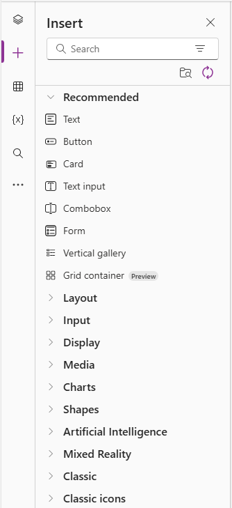
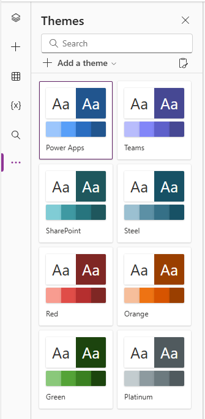

# Overview of modern controls and themes in canvas apps

Canvas apps now support modern controls and theming based on the [Microsoft Fluent 2 design system](https://fluent2.microsoft.design). Modern controls offer improved accessibility, performance, and usability compared to classic controls. The accompanying theming system lets you customize your app's appearance from a central location.

This article explains how to enable modern controls and themes in your canvas apps and provides information about ongoing development.

## Enable modern controls and themes for your app
With your [canvas app open for editing](../../edit-app.md):
1. On the command bar, select **Settings** > **Updates**.
1. Select the **New** tab and then turn on **Modern controls and themes**.

- The app refreshes with the new app authoring menu. Modern controls are part of existing categories. Two additional categories exist for legacy controls - Classic and Classic icons.

   > [!div class="mx-imgBorder"]
   > 

- To see modern themes, on the app authoring menu, select **Themes**. For information, see [Use modern themes in canvas apps](modern-theming.md).

   > [!div class="mx-imgBorder"]
   > 

## What's next for these controls and themes?
The Power Apps team is consistently improving and adding new capabilities for modern controls and themes. They publish updates to the [Power Apps blog](https://powerapps.microsoft.com/en-us/blog/) every month on the progress made for modern controls.
  
## Provide feedback to Microsoft

To provide feedback, offer suggestions, or report problems, go to the [community forum](https://go.microsoft.com/fwlink/?linkid=2229838).

You can also provide feedback for individual controls in the Power Apps Studio from the control properties by selecting the thumbs up or down and comments option. The same feedback mechanism is available for modern themes in the **Themes** pane. 

