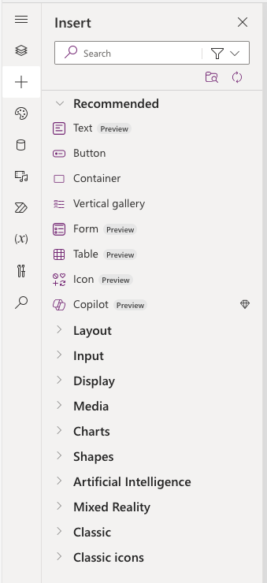

# Overview of modern controls in canvas apps

[This article is pre-release document and is subject to change.]

Modern controls in canvas apps are a new set of controls that are based on Microsoft design system. Modern controls are quicker and simpler for makers to configure. They also provide a more cohesive experince and top-notch design for end-users. Modern controls are designed with a focus on accessibility, usability, and performance which makes them visually appealing, highly functional, and intuitive to use.

> [!IMPORTANT]
> - This is a preview feature.
> - Preview features aren’t meant for production use and may have restricted functionality. These features are available before an official release so that customers can get early access and provide feedback.

## Enable modern controls for your app
With your [canvas app open for editing](../../edit-app.md):
1. On the command bar, select **Settings** > **Upcoming features**.
2. From the Preview tab, set the toggle for **Try out the modern controls** to **On**.

   > [!div class="mx-imgBorder"]
   > 

3. On the app authoring menu, select **Insert**.
4. From the list of controls, select **Modern controls**.

You will see list of all the modern controls.

> [!div class="mx-imgBorder"]
 > 

## What's next for these controls?
We will be consistently shipping improvements and new capabilities for modern controls with up to date documentation. You can keep track of coming changes through this blog (link).
  
## Provide feedback to Microsoft
Your feedback will help us improve the new controls and make Power Apps even better. We are constantly listening to feedback from our users and working to improve the platform in meaningful ways.

You can provide feedback even to individual controls within Power Apps studio while building apps. You will view thumbs up/down and comments option in properties of new controls. Once you provide feedback, our teams will consider those for next set of improvements. 

You can also provide feedback and reach out to us via the community forum (add link) where we will also eagerly answer all your queries.

### See also
[Limitations of modern controls in canvas apps](limitations-modern-controls.md)

