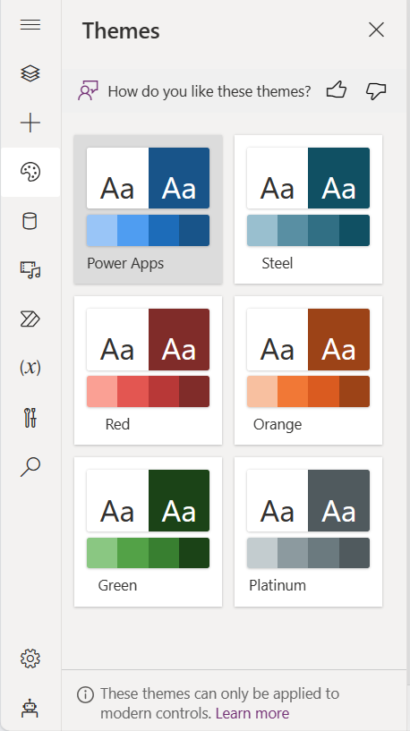

# Overview of modern controls and themes in canvas apps (preview)

[This article is pre-release document and is subject to change.]

Modern controls in canvas apps are a new set of controls that are based on the Microsoft Fluent design system. These controls are quicker and simpler for makers to configure, and they also provide a more cohesive experience for end-users. Modern controls are designed with a focus on accessibility, usability, and performance that makes them visually appealing, highly functional, and intuitive to use. Bundled with the modern controls is a new modern theming system, also rooted in the Fluent design system, that allows an app's look and feel to be modified from a central place.  

> [!IMPORTANT]
> - This is a preview feature.
> - Preview features aren’t meant for production use and may have restricted functionality. These features are available before an official release so that customers can get early access and provide feedback.

## Enable modern controls and themes for your app
With your [canvas app open for editing](../../edit-app.md):
1. On the command bar, select **Settings** > **Upcoming features**.
2. From the Preview tab, set the toggle for **Modern controls and themes** to **On**.

- To see list of all the modern controls, on the app authoring menu, select **Insert**. From the list of controls, select **Modern controls**.

   > [!div class="mx-imgBorder"]
   > 

- To see modern themes, on the app authoring menu, select **Themes**. For information, see [Use modern themes in canvas apps](modern-theming.md).

   > [!div class="mx-imgBorder"]
   > 

## What's next for these controls and themes?
We're consistently improving and adding new capabilities for modern controls and themes. See our blog for [what's new](https://go.microsoft.com/fwlink/?linkid=2229189).
  
## Provide feedback to Microsoft

To provide feedback, offer suggestions, or report issues, go to [community forum](https://go.microsoft.com/fwlink/?linkid=2229838).

You can also provide feedback for individual controls in the Power Apps Studio from the control properties by selecting the thumbs up or down and comments option. The same feedback mechanism is available for modern themes in the **Themes** pane. 

### See also
[Limitations of modern controls in canvas apps](limitations-modern-controls.md)

