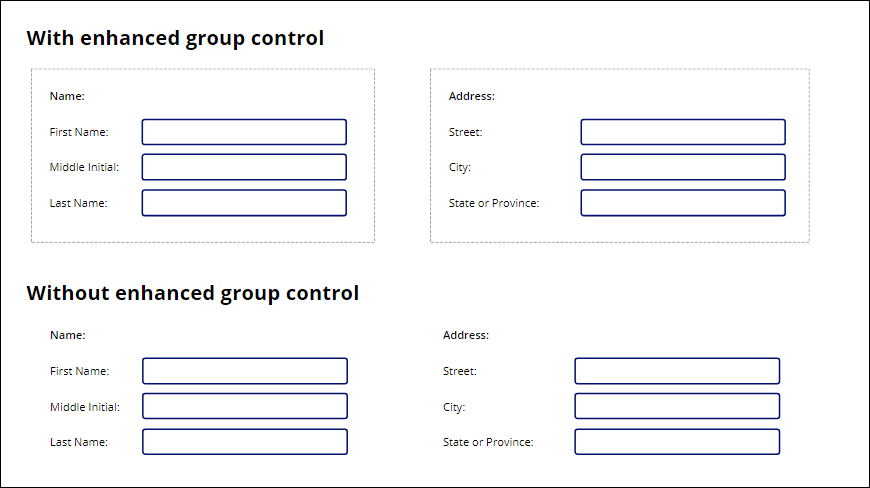

# Accessibility properties for canvas apps

Configuration of properties that aid alternative ways of interacting with controls suitable for users with disabilities.

## Properties

**AccessibleLabel** – Label for screen readers. An empty value for Image, Icon and Shape controls will make the controls invisible to the screen reader and treated as decorations.

**Live** – How screen readers should announce changes to content. Available only in the **[Label](control-text-box.md)** control.

* When set to **Off**, the screen reader doesn't announce changes.
* When set to **Polite**, the screen reader finishes speaking before announcing any changes that occurred while the screen reader was speaking.
* When set to **Assertive**, the screen reader interrupts itself to announce any changes that occurred while the screen reader was speaking.

Learn how to [announce dynamic changes with live regions](../accessible-apps-live-regions.md).

**TabIndex** – Determines if the control participates in keyboard navigation.

This property has two valid values:

| **TabIndex** value | Behavior | Default for |
|--------------------|----------|-------------|
| 0 | Control participates in keyboard navigation. | [**Button**](control-button.md), [**Text input**](control-text-input.md), [**Combo box**](control-combo-box.md), and other typically interactive controls. |
| &minus;1 | Control does not participate in keyboard navigation. | [**Label**](control-text-box.md), [**Image**](control-image.md), [**Icon**](control-shapes-icons.md), and other typically non-interactive controls. |

The navigation order is based on the relative **X** and **Y** property values of the controls, navigating first across and then down.  If controls are dynamically moved on the screen, for example by having a formula for **X** or **Y** based on a timer or other control, the navigation order will change dynamically too.

Use the [**Enhanced group control**](https://powerapps.microsoft.com/en-us/blog/enhanced-group-experimental-control-with-layout-control-and-nesting/) (experimental) to bundle controls that should be navigated together.  At the top of the following example, the name fields are contained within an enhanced group control which causes navigation to proceed down before moving across.  At the bottom of the example, no group controls are used, and navigation proceeds across and then down as normal. 

Similarly, tabbing through containers such as [**Form**](control-form-detail.md) and [**Gallery**](control-gallery.md) controls will navigate through all elements of the container before proceeding to the next control outside of the container.  

Controls which have a **Visible** property value of *false* or a **DisplayMode** property value of **Disabled** are not included in the navigation.  

When using a browser, navigating from the last control of the screen will move to the browser's built-in controls, such as the URL address.  

Values for **TabIndex** greater than 0 are highly discouraged. Ultimately controls are rendered in HTML where even the [W3C has warned](https://www.w3.org/TR/wai-aria-practices/#kbd_general_between) "Authors are strongly advised NOT to use these values." Many HTML tools warn if if values other than 0 and &minus;1 are used.  All for good reason: using **TabIndex** in this manner can be very difficult to get right and can make assistive technologies such as screen readers unusable.

