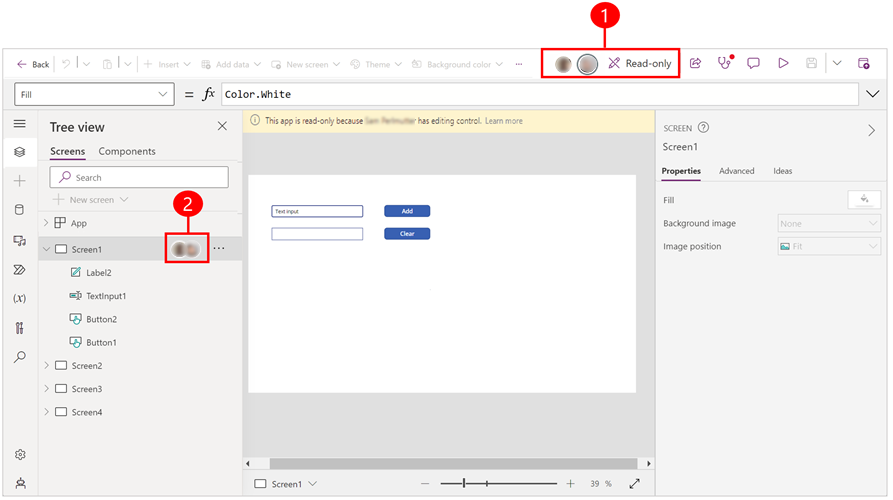

# Find out who's working on the same app

Use copresence to identify individuals working on the same app as you in Power Apps Studio. 

> [!div class="mx-imgBorder"] 
> 

Legend

1. The command bar displays the names and icons of other makers who are working on the app and may be making changes. 
2. The left-hand navigation pane in Power Apps Studio displays the app's structure, indicating which part of the app is being worked on. You receive a notification to refresh the app when the maker that's editing the app makes changes and saves that app.

## How copresence works

The first time someone opens your app in Power Apps Studio while you're working on it, copresence indicators appear that shows other people are also working on the app. 

The maker that opens the app first has editing control. If a second user tries to open the app, a notification appears letting them know that someone else is editing the app so they're in read-only mode. If you're in read-only mode, you can save a copy of the app.

Icons of copresent makers appear in both the command bar and the left navigation pane showing where other makers are working in the app.

You may be working on the app, or you may be idle, but once someone else saves a change to the app, you receive a notification letting you know that another maker made changes. When you see this notification, consider refreshing the app to get the latest version.

## Live updates (experimental)

[This section is pre-release documentation and is subject to change.]

> [!IMPORTANT]
> - This is an experimental feature.
> - Experimental features aren’t meant for production use and may have restricted functionality. These features are available before an official release so that customers can get early access and provide feedback.
> - This feature is in the process of rolling out, and might not be available in your region yet.

Live updates is a new experimental feature that works similarly to copresence. The user who opens the app first has the editing privileges. When another user attempts to open the app, a notification is displayed, informing them that someone else is currently editing the app and they're limited to read-only access. The benefit of live updates is that you can see in real-time the changes that are being made by the maker editing the app without the need to refresh the app.

### Enable live updates

To use live updates, it must be turned on for each individual app. Once live updates is enabled, it takes precedence over the copresence feature.

1. To enable live updates, open your app for editing in Power Apps Studio.
2. Go to **Settings** > **Upcoming features** > **Experimental**.
3. Set the toggle for **Enable live updates** to **On**.

### Limitations of live updates

The maker editing the app and those accessing it in read-only mode are unable to perform or have disabled access to these options:

- Undo or redo changes
- Switch authoring version
- Open a new app from data, app from template, new app from blank, and edit app
- Use **Save as** option or save the app locally
- [Monitor tool](../monitor-overview.md)
- Search pane
- Makers accessing the app in read-only mode can't make any changes

