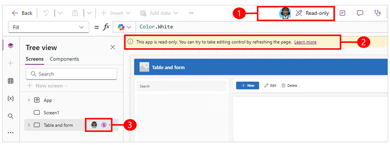

# Find out who's working on the same app

Use copresence to identify individuals working on the same app as you in Power Apps Studio.

When you're in read-only mode the command bar, add new screen, and edit control properties are disabled. 

> [!div class="mx-imgBorder"] 
> 

Legend

1. The command bar displays the names and icons of other makers who are working on the app and are making changes. 
1. The left-hand navigation pane in Power Apps Studio displays the app's structure, indicating which part of the app is being worked on. You receive a notification to refresh the app when the maker that's editing the app makes changes and saves that app.

## How copresence works

The first time someone opens your app in Power Apps Studio while you're working on it, copresence indicators appear that shows other people are also working on the app. 

The maker that opens the app first has editing control. If a second user tries to open the app, a notification appears letting them know that someone else is editing the app so they're in read-only mode. If you're in read-only mode, you can save a copy of the app.

Icons of copresent makers appear in both the command bar and the left navigation pane showing where other makers are working in the app.

You might be working on the app, or you're inactive, but once someone else saves a change to the app, a notification appears letting you know that another maker made changes. When you get the notification, refresh the app to get the latest version.

## Inactive during editing

When you're editing an app and become inactive for two hours, a **Continue editing** dialog box is displayed, asking if you want to continue editing the app or switch to read-only. If you don't respond, the system informs you that you were inactive and puts you in read-only mode, so other readers can to become the editor. 

If auto save is turned on, your changes are automatically saved. If auto save isn't turned on, a **You're no longer editing** dialog box appears that lets you save a copy of your changes.

## Coauthor (preview)

[This section is pre-release documentation and is subject to change.]

Coauthoring allows multiple makers to make changes to the app at the same time and see those changes. When more then one person is editing the app, you'll see presecne indicators showing where they are working and you'll see their changes in real time.

> [!NOTE]
> Since mltiple users can select and edit the same control at the same time, you may overwrite each others edits.

> [!IMPORTANT]
> - This is an preview feature.
> - This feature is in the process of rolling out, and might not be available in your region yet.

### Enable coauthoring

To use coauthoring, it must be turned on for each individual app. Once coauthoring is enabled, it takes precedence over the copresence feature.

1. To enable live updates, open your app for editing in Power Apps Studio.
2. Go to **Settings** > **Updates** > **Experimental**.
3. Set the toggle for **Coauthoring** to **On**.

### Limitations 

- The following options are disabled when there's more then one user editing the app:
  - Search 
  - Save as
  - Within current app and open another app or start a new app 
  - Copy and paste
  - Undo and redo
  - Switch authoring versions
- The app language is locked to the locale of the first user that open the app for editing.
- Coauthoring is disabled for Test Studio and the Monitor tool.

