# Example: Create a flow and trigger it from a Power App

Power Automate can be used to create logic that performs one or more tasks when an event occurs in a canvas app. For example, a button can be configured so that, when a user selects it, an item is created in a SharePoint list, an email or meeting request is sent, a file is added to the cloud, or all of these. Any control in the app can be configured to start the flow, which continues to run even if you close Power Apps.

In this topic we will learn how to use create and trigger a flow using canvas apps.

## Prerequisites

To complete this lesson, you will need a Flow and Power Apps environment with a Dataverse database. If you do not have a license, you can sign up for the [Power Apps Developer Plan](https://powerapps.microsoft.com/communityplan/) or use a Power Apps trial.

## Create a trial environment

An environment in Power Apps is a space to store, manage, and share your organization’s business data, apps, chatbots, and flows. It also serves as a container to separate apps that might have different roles, security requirements, or target audiences.

Each environment can have one Dataverse database.

To make sure that you have what you need to complete this lesson, we are going to create a new environment that includes a Dataverse database. This is a 30-day trial that will go away at the end of the 30 days, but it can be upgraded to a sandbox or production environment if you want to keep it

We are going to create a trial environment that will include a Dataverse database, and the sample data used in this topic.

1.  Go to <https://aka.ms/ppac> in a web browser

2.  Select **Environments**

3.  Select **New**

4.  Name the environment **Dataverse Trial**

5.  Select **Trial** for environment type

6.  Toggle **Create Database** to **Yes**

7.  Select **Next**

    

8.  Toggle **Deploy Sample Apps and Data** to **Yes**

9.  Select **Save**

Your trial environment will now be created, including a Dataverse database and sample data in common business data tables.

## Build a canvas app

In this lesson we will build an app to search, filter and lookup customer Account data

1.  Log in to <https://make.powerapps.com>

2.  Select the Dataverse Trial environment in the upper right corner

    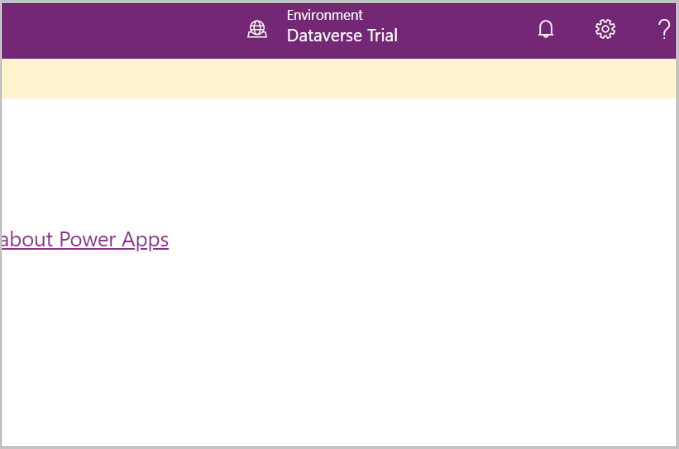

3.  Under **Build business apps – Make your own app, fast** select the button for **Canvas app from blank**
    
    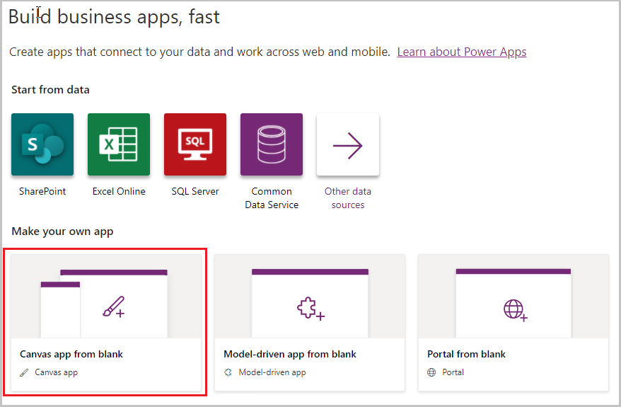
    
4.  Give the app a name and select Format – Phone and select Create

    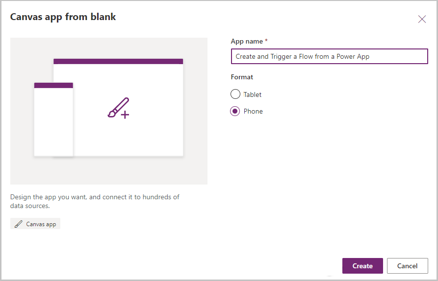

5.  On the Welcome to Power Apps Studio dialog box, do not select any option and select the Skip button

    
    
6.  An App with Screen1 gets created – Select Accounts as the data source for the gallery

    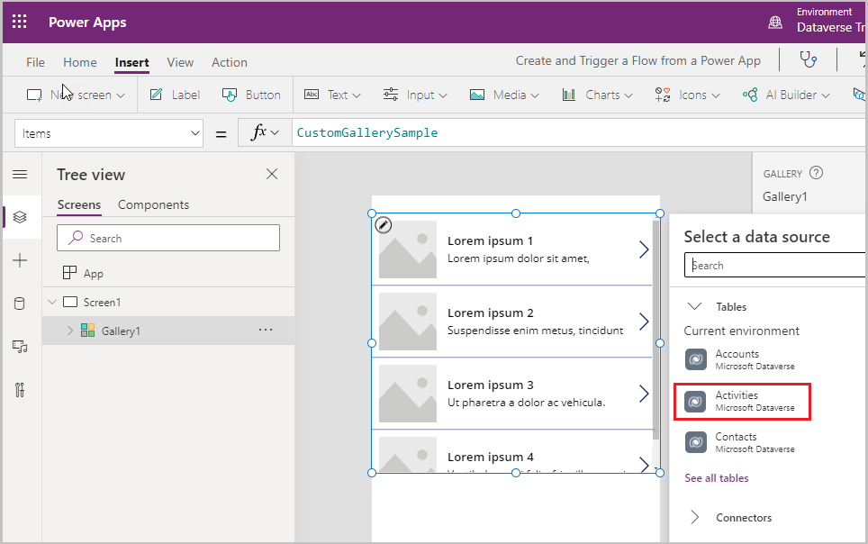
    
7.  Stretch the gallery to the bottom of the screen and add a label to the top with the Text Accounts and other properties as shown below

    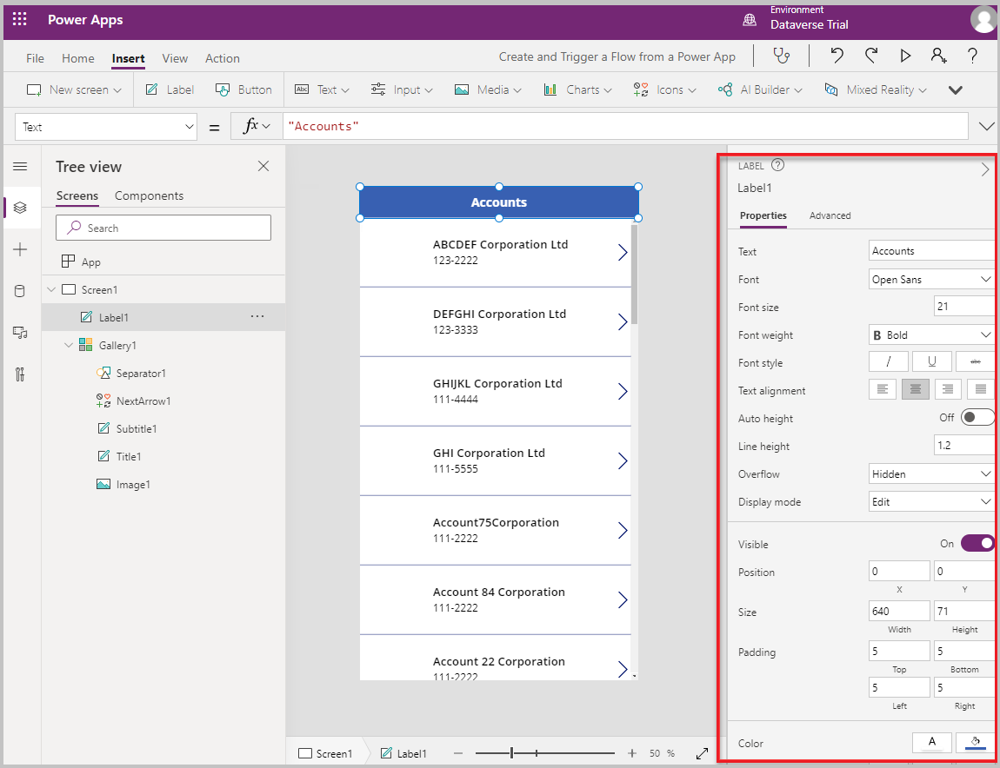

8.  Add an **Add** icon to the top right of the screen by selecting Insert -\> Icon -\> Add and update the properties of the icon to color white and padding of 5 from all sides

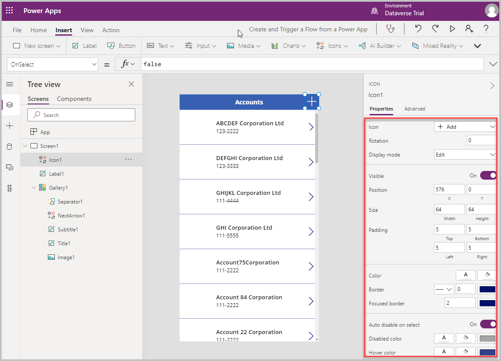

9.  Select New screen on the top left to add a new Form screen to the app


10.  Screen 2 is added to the app

11.  Update the title of the form to New Account and select the data source as Accounts in the right pane


12.  Select the Edit fields button in the right pane

    

13.  Select Add field button and look for Email and add the Email field to the form

    

14.  The email field gets added

    

15.  Set the default mode of the form to New

    

16.  Navigate to Screen1 – accounts gallery screen and set the OnSelect property of the + icon to **Navigate(Screen2)**

    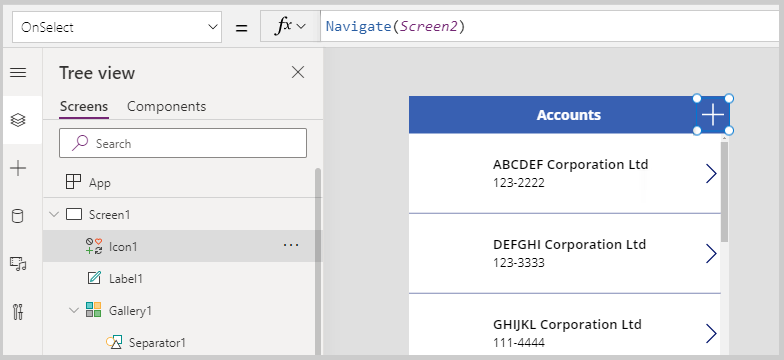

17.  Select Insert -\> New screen -\> Blank screen to add a new screen to the app

    

18.  Select Insert -\> Icon and select the Check (badge) icon to add it to the screen

    

19. Place the check icon and adjust the icon position and size as shown in the screenshot below

    

20. Add a label with text **Account was created successfully!** and size and position as shown in the screenshot below


21.  Add an additional label as shown below with text **Send a welcome note to the Customer?**

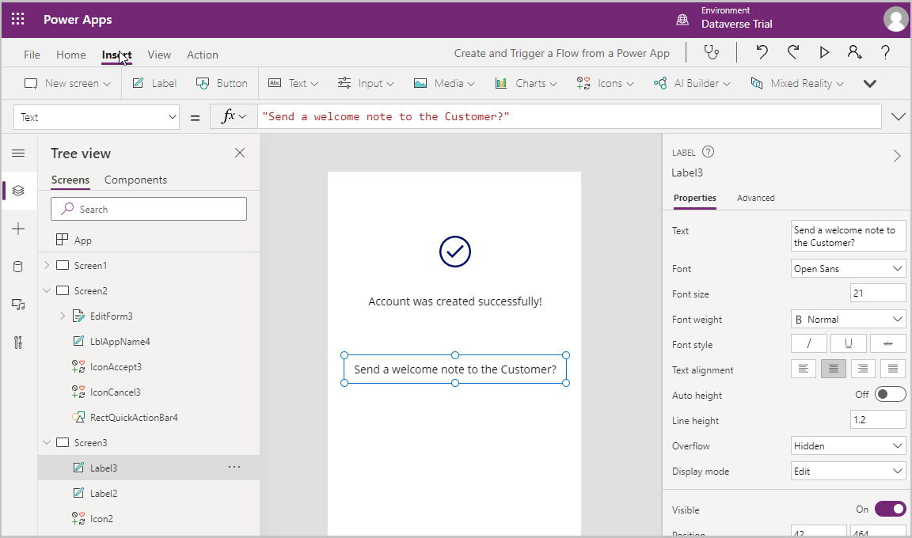

22.  Add a Text Input box by selecting Insert -\> Input -\> Text Input and set the Mode to **Multiline** and default text to **Thank you for creating an account with us. We look forward to serving you!**

    

23.  Set the following value on the OnVisible property of Screen3 – **Reset(TextInput1)**

    

24.  Add two buttons to the screen with text Yes and No and place them below the Input text box as shown in the screenshot below

    

25. Navigate to the New Account form screen and set the OnVisible property of the screen to **ResetForm(EditForm3)**

    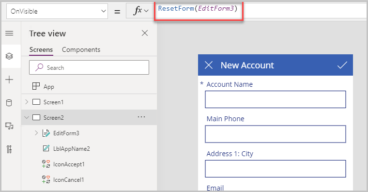

26. Select the check icon on the top right and set the OnSelect property to **SubmitForm(EditForm3);Navigate(Screen3)**

    

27. Select the x button on the top right and set the OnSelect property to **Back()**

    

28. Navigate back to Screen3 by selecting Screen3 in the tree view

    

29. Select the No button and select the OnSelect property and set it to Navigate(Screen1)

    

30. Select the Yes button and select Action on the top and select Power Automate

    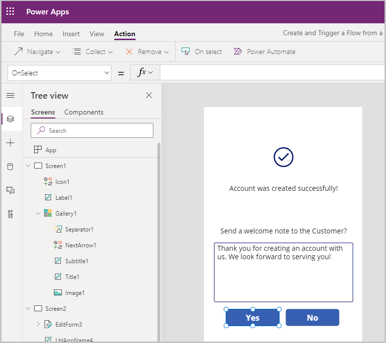

31. Select Create a new flow to create a new Power Automate flow

    

## Create the Power Automate Flow

1.  Power Automate opens – select the **+Create** option from the left navigation menu and select the **Instant cloud flow** option

    

2.  Enter a name for the flow – Flow triggered by Power app and select PowerApps as the trigger

    

3.  PowerApps gets added as the trigger – select +New Step

    

4.  Enter Send an email in the search connections textbox and select **Send an email (V2)** action

    

5.  For the To field, select Add dynamic content and select Ask in PowerApps and then select Sendanemail(V2)\_To

    

6.  For the Body field, select Add dynamic content and select Ask in PowerApps and then select Sendanemail(V2)\_Body

    

    

7.  Enter Thank you for your business! In the Subject field

    

8.  Save the Power Automate Flow and go back to the Power App

## Trigger the Flow from within the Power App

1.  Select the Yes button and select Action -\> Power Automate and then select the flow just created – **FlowtriggeredbyaPowerapp.Run(** is added to the OnSelect property – the parameters for this run function need to be defined in the next step

    

2.  Then fill in the two parameters for the To email address and the Body of the email as follows

```
FlowtriggeredbyaPowerapp.Run(
   EditForm3.LastSubmit.Email,
   TextInput1.Text
);
Navigate(Screen1);
```

  NOTE: The email address is picked up from the new account record created on the previous screen and the body for the email is picked from the text box text captured on this screen.

  

# Test the app

1.  Run the app in Preview mode – In this test, we will create a new account by entering details like account name, phone number, city, and email address on the New Account page. On saving the new account details, we will be prompted to send an email to the customer where we can update the verbiage of the email and then select Yes to send the email. This will trigger the flow and email will be sent to the email address on the account.


An email like this should appear in your inbox

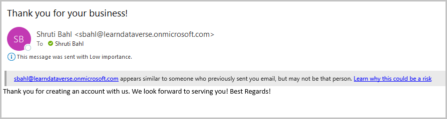

