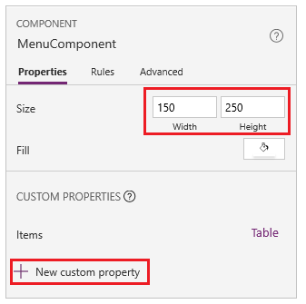
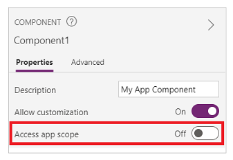

# Create a component for canvas apps

> [!IMPORTANT]
> This feature is still in public preview. For more information, see [Experimental and preview features](./working-with-experimental-preview.md).

Components are reusable building blocks for canvas apps so that app makers can create custom controls to use inside an app, or across apps using a [component library](component-library.md). Components can use advanced features such as custom properties and enable complex capabilities. This article introduces component concepts and some examples.

Components are useful in building larger apps that have similar control patterns. If you update a component definition inside the app, all instances in the app reflect your changes. Components also reduce duplication of efforts by eliminating the need to copy/paste controls and improve performance. Components also help create collaborative development and standardizes look-and-feel in an organization when you use a [component library](component-library.md).

Watch this video to learn how to use components in canvas apps:
> [!VIDEO https://www.microsoft.com/videoplayer/embed/RWLlkO]

## Components in canvas apps

You can create a component from within an app as explained in this article, or by creating a new component inside a [component library](component-library.md). A component library should be used for requirements to use components across multiple app screens. You can also copy the existing components into an existing or a new component library.

To create a component within an app, go to **Tree View**, select the **Components** tab, and then select **New component**:


Selecting **New component** opens an empty canvas. You can add controls as part of the component definition on the canvas. If you edit a component in the canvas, you'll update instances of the same component in other app screens. Apps that reuse an already created component can also receive component updates after you publish component changes.

You can select a component from the list of existing components in the left pane after you select a screen. When you select a component, you insert an instance of that component onto the screen, just as you insert a control.

Components available inside the app are listed under the **Custom** category in a list of components inside the tree view. Components imported from component libraries are listed under the **Library components** category:


> [!NOTE]
> Components discussed in this article are different from the Power Apps component framework that enables developers and makers to create code components for model-driven and canvas apps. For more information, go to [Power Apps component framework overview](../../developer/component-framework/overview.md).

## Custom properties

A component can receive input values and emit data if you create one or more custom properties. These scenarios are advanced and require you to understand [formulas](formula-reference.md) and binding contracts.

**Input property** is how a component receives data to be used in the component. Input properties appear in the **Properties** tab of the right-hand pane if an instance of the component is selected. You can configure input properties with expressions or formulas, just as you configure standard properties in other controls. Other controls have input properties, such as the **Default** property of a **Text input** control.

**Output property** is used to emit data or component state. For example, the **Selected** property on a **Gallery** control is an output property. When you create an output property, you can determine what other controls can refer to the component state.

The following walk-through further explains these concepts.

## Create an example component

In this example, you'll create a menu component that resembles the following graphic. And you can change the text later to use it in multiple screens, apps, or both:


> [!NOTE]
> We recommend that you use a [component library](component-library.md) when creating components for reuse. Updating components inside an app only makes the component updates available inside the app. When using a component library, you get prompted to update components if components inside a library are updated and published.

### Create a new component

1. Sign in to [Power Apps](https://make.powerapps.com).

1. Select **Apps** and select **Canvas app from blank**.

1. Provide an app name, select any layout, and then select **Create**.

1. In the **Tree View**, select **Components** and then select **New component** to create a new component.

    

1. Select the new component in the left pane, select the ellipsis (**...**), and then select **Rename**. Type or paste the name as **MenuComponent**.

1. In the right-hand pane, set the component's width as **150** and its height as **250**, and then select **New custom property**. You can also set the height and width to any other value as appropriate.

    

1. In the **Display name**, **Property name**, and **Description** boxes, type or paste text as *Items*.

    

    Don't include spaces in property name because you'll refer to the component by this name when you write a formula. For example, **ComponentName.PropertyName**.

    The display name appears on the **Properties** tab of the right-hand pane if you select the component. A descriptive display name helps you and other makers understand the purpose of this property. The **Description** appears in a tooltip if you hover over the display name of this property in the **Properties** tab.

1. In the **Data type** list, select **Table**, and then select **Create**.

    

    The **Items** property is set to a default value based on the data type that you specified. You can set it to a value that suits your needs. If you specified a data type of **Table** or **Record**, you might want to change the value of the **Items** property to match the data schema that you want to input to the component. In this case, you'll change it to a list of strings.

    You can set the property's value in the formula bar if you select the name of the property on the **Properties** tab of the right-hand pane.

    

    As the next graphic shows, you can also edit the property's value on the **Advanced** tab of the right-hand pane.

1. Set the component's **Items** property to this formula:

    ```powerapps-dot
    Table({Item:"SampleText"})
    ```

    

1. In the component, insert a blank vertical **Gallery** control and select **Layout** on the property pane as **Title**.

1. Make sure that the property list shows the **Items** property (as it does by default). And then set the value of that property to this expression:

    ```powerapps-dot
    MenuComponent.Items
    ```

    This way, the **Items** property of the **Gallery** control reads and depends on the **Items** input property of the component.

1. Optional - set the **Gallery** control's **BorderThickness** property to **1**  and its **TemplateSize** property to **50**. You can also update values for border thickness and template size to any other value as appropriate.

### Add component to a screen

Next, you'll add the component to a screen and specify a table of strings for the component to show.

1. In the left pane, select the list of screens, and then select the default screen.

    

1. On the **Insert** tab, open the **Components** menu, and then select **MenuComponent**.

    

    The new component is named **MenuComponent_1** by default.

1. Set the **Items** property of **MenuComponent_1** to this formula:

    ```powerapps-dot
    Table({Item:"Home"}, {Item:"Admin"}, {Item:"About"}, {Item:"Help"})
    ```

    This instance resembles this graphic, but you can customize the text and other properties of each instance.

    

### Create and use output property

So far, you've created a component and added it to an app. Next, you'll create an output property that reflects the item that the user selects in the menu.

1. Open the list of components, and then select **MenuComponent**.

1. In the right-hand pane, select the **Properties** tab, and then select **New custom property**.

1. In the **Display name**, **Property name**, and **Description** boxes, type or paste **Selected**.

1. Under **Property type**, select **Output**, and then select **Create**.

    

1. On the **Advanced** tab, set the value of the **Selected** property to this expression, adjusting the numeral in the gallery name if necessary:

    ```powerapps-dot
    Gallery1.Selected.Item
    ```

    

1. On the default screen of the app, add a label, and set its **Text** property to this expression, adjusting the numeral in the component name if necessary:

    ```powerapps-dot
    MenuComponent_1.Selected
    ```

    **MenuComponent_1** is the default name of an instance, not the name of the component definition. You can rename any instance.

1. While holding down the Alt key, select each item in the menu.

    The **Label** control reflects the menu item that you selected most recently.

## Scope

Input and output properties clearly define the interface between a component and its host app.  By default, the component is encapsulated so that it's easier to reuse the component across apps, requiring the use of the properties to pass the information in and out of the component. Scope restrictions keep the data contract of a component simple and cohesive, and it helps enable component-definition updates&mdash;especially across apps with component libraries.

But there are times when a component may want to share a data source or a variable with its host. Especially when the component is only intended for use in one particular app. For these cases, you can directly access app level information by turning on the **Access app scope** switch in the component's property pane:



When **Access app scope** is turned on, the following are accessible from within a component:

- Global variables
- Collections
- Controls and components on screens, such as a TextInput control
- Tabular data sources, such as Dataverse tables

When this setting is turned Off, none of the above are available to the component. [**Set**](functions/function-set.md) and [**Collect**](functions/function-clear-collect-clearcollect.md) functions are still available but the resulting variables and collections are scoped to the component instance and not shared with the app.

Non-tabular data sources, such as Azure Blob Storage or a custom connector, are available whether this setting is turned on or off. Think of these data sources more like referencing an environment resource rather than an app resource. When a component is brought into an app from a component library, these data sources from the environment are also brought in.

Components in a component library can never have access to app scope, as there's no single app scope to refer to. So, this setting isn't available in this context, and is effectively off. Once imported into an app, and if customization was allowed by the component maker, the switch can be enabled, and the component can be modified to use the app scope.

> [!NOTE]
> - You can insert instances of components into a screen within a component library, and preview that screen for testing purposes.
> - Component library doesn't display when using [Power Apps Mobile](https://powerapps.microsoft.com/downloads/).

## Import and export components

> [!NOTE]
> This feature is retired. [Component libraries](component-library.md) are the recommended way to reuse the components across the apps. When using component library, an app maintains dependencies on the components it uses. The app maker will be alerted when the updates to dependent components become available. Hence, all new reusable components should be created within the component libraries instead.

The ability to import and export of components is disabled by default since this feature is retired. While recommended method to work with components is to use [component libraries](component-library.md), you can still enable this feature on a per-app basis as an exception until the feature is removed. To do this, [edit your app](edit-app.md) in Power Apps Studio and then, go to **File** > **Settings** > **Upcoming features** > **Retired** > Set **Export and import components** to On.


After you enable this feature, you can use the following capabilities to import and export components.

### Import components from another app

To import one or more components from one app into another, select **Import components** from the **Insert** menu and then use the **Custom** drop-down menu. Or use **Components** in the tree view on the left pane.

A dialog box lists all apps that contain components that you have permission to edit. Select an app, and then select **Import** to import the most recent published version of all of the components in that app. After you import at least one component, you can edit your copy and delete any that you don’t need.


You can save an app with existing components to a file locally and then reuse the file by importing it. You can use the file to import components to another app.

If the app contains a modified version of the same component, you're prompted to decide whether to replace the modified version or cancel the import. 

After you create components in an app, other apps can consume the components from this app by importing them.

### Export components from your app

You can export components to a file and download them for import to another app.

Select the **Export components** option from the **Components** section in the tree view on the left pane:


You can also use the **Insert** menu and then select the **Custom** drop-down menu instead.


Selecting **Export components** downloads the components to a file:


The downloaded component file uses the *.msapp* file name extension. 

### Import components from exported components file

To import components from an exported components file, select **Import components** from either **Insert** menu and then use the **Custom** drop-down menu or use **Components** in the tree view on the left pane. From the components dialog box, select **Upload file** instead of selecting any other components or apps:


From the **Open** dialog box, browse to the location of the component file and select **Open** to import components inside the app.

### Import components from exported app

You can save an app locally using the **File** > **Save As** option:


Once you save the app, you can reuse the components of this app using the same method of importing components from a file. Follow the steps in the previous section on import components from exported components file.

## Known limitations

- You can't save data sources, forms, and data tables with components.
- Collections in components aren't supported.
- You can't insert a component into a gallery or a form.
- A master instance of a component is a local master and scoped to the app. If you change a master instance, only copies of the component within the app will reflect the change. Copies in other apps will remain the same unless you import the component library again. All master instances in those apps will be automatically detected and updated.
- You can't package media files when you import a component.
- Components don't support the [**UpdateContext**](./functions/function-updatecontext.md) function, but you can create and update variables in a component by using the [**Set**](functions/function-set.md) function. The scope of these variables is limited to the component, but you can access them from outside the component through custom output properties.

## Next steps

Learn to use a [component library](component-library.md) to create a repository of reusable components.


[!INCLUDE[footer-include](../../includes/footer-banner.md)]