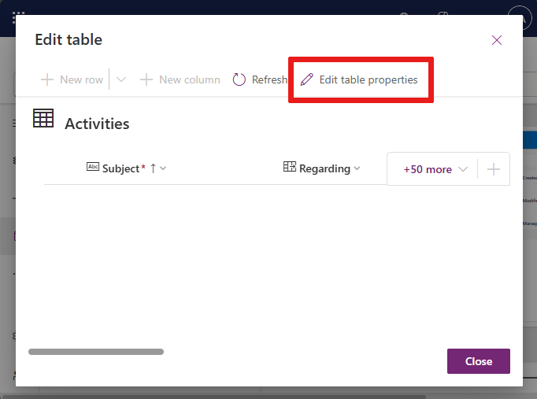

# Create and edit tables using the table designer

Create and edit Dataverse tables in canvas apps using the table designer inside [Power Apps Studio](power-apps-studio.md). You can also work with the data that's in the table without leaving the app that you're working on.

## Create a table

1. Create a [new](data-platform-create-app.md) or open an [existing](edit-app.md) app in Power Apps Studio.

1. In the app authoring menu, select **Data**.

   :::image type="content" source="media/tables/data-pane-1.png" alt-text="Screenshot that shows where to select the Data menu option from the authoring menu.":::

1. On the **Data** pane, select **Add Data** > **Create new table**.  

   > [!NOTE]
   > If the **Create new table** button is disabled then review [**Required permissions and limitations**](create-edit-tables.md#required-permissions-and-limitations).

   :::image type="content" source="media/tables/create-new-table.png" alt-text="Screenshot that shows what you see after you select Create new table." lightbox="media/tables/create-new-table.png":::

1. You see **Choose an option to create tables**. For example, you can choose to **Start from blank** or **Start with Copilot** to create a new table.

1. A new table is created for you in the canvas. Enter a name for the table directly where you see the table name.

   You can also expand the **Properties** pane found in the table's overflow menu (the ellipses) to edit the table properties, such as the plural name for the table. For example, a table name can be Ticket, and the plural table name can be Tickets.

   :::image type="content" source="media/tables/edit-table-properties.png" alt-text="Screenshot that shows the Edit table properties popup next to a table in the canvas." lightbox="media/tables/edit-table-properties.png":::

   Can you also add columns or sample data to the table.

1. When you're done editing, select **Save** and exit.

## Edit an existing table

Once a Dataverse table is created, you can start editing the table. You can also add existing Dataverse tables to your app and edit those tables using the table designer.

1. From the app authoring menu, select **Data**.

1. On the **Data** pane, select **Add data**.

1. In the **Select a data source** dialog box, from the list of Dataverse tables, select a table to add to your app.

   :::image type="content" source="media/tables/select-table-5.png" alt-text="Screenshot that shows how to add a table from the Data pane.":::

1. On the newly added table select, **More actions** > **Edit data**.

   :::image type="content" source="media/tables/edit-table-data-6.png" alt-text="Screenshot that shows the Data pane with the overflow menu on a table selected with the Edit data option.":::

1. The selected table is ready for editing in the table designer.

    > [!NOTE]
    > Some system tables might not be available for editing, or some editing actions may be disabled.

### Edit the table properties

After selecting **Edit data**, you see the **Edit table** designer.

1. Select **Edit table properties**.

   

You can edit the following table properties.

| **Property** | **Description** |
|--------------|-----------------|
| **Display name** | The singular name for the table shown in the app. The display name can be changed later. |
| **Plural display name** | The plural name for the table shown in the app. The plural display name can be changed later. |
| **Description** | Provide a meaningful description of the purpose of the table. |

Select **Enable Attachments** to append notes and files to records for this table.

Select the **Primary column** tab if you want to change its **Display Name** or **Description**. The primary column is used by lookup fields when establishing relationships with other tables.

#### Advanced options

Select **Advanced options** to see the optional properties you can set. Otherwise some are already set for you.

| **Property** | **Description** |
|--------------|-----------------|
| **Schema name** | By default, the schema name is automatically created for you based on the display name, but you can change it. The schema name can't contain spaces and includes the customization prefix for the Dataverse solution publisher. You can't change the schema name after the table is saved. |
| **Logical name** | A unique identifier for the entity. This name can't be changed once the entity is created. |
| **Type** | Select the type of table. Use standard for most tables. Activity tables are special tables that can only be owned by a user or team, but can't be owned by an organization. Virtual tables require the table be populated with data from an external source. |
| **Record ownership** | Switch the table type to Activity table, so you can create tables that can manage tasks. The type of **Ownership** defines who can perform operations on a record. |
| **Color** | You can select your table color using words or hex codes.|
| **Primary row image** | You can choose whether to display an image for the table. This image is displayed in Power Apps in some design areas. Notice that the image doesn't appear in apps using the table. To display images in apps, use the image column. Learn more in [Image columns](../data-platform/types-of-fields.md#image-columns). |
| **Apply duplicate detection rules** | If duplicate detection is enabled for your organization, enabling allows you to create duplicate detection rules for this table. |
| **Track changes** | Enables data synchronization in a performant way by detecting what data changed since the data was initially extracted or last synchronized. |
| **Provide custom help** | When selected, set a **Help URL** to control what page users see when they select the help button in the application. Use help to provide guidance specific to your company processes for the table. |
| **Audit changes to its data** | When auditing is enabled for your organization, table records can change to be captured over time. When you enable auditing for a table, auditing is also enabled on all its fields. You can select or clear fields that you want to enable auditing on. |
| **Leverage quick create form if available** | After you create and publish a Quick Create Form for this table, people can create a new record using the Create button in the navigation pane. Learn more in [Create and design model-driven app forms](../model-driven-apps/create-design-forms.md).  If enabled for a custom activity table, the custom activity is visible in the group of activity entities when people use the **Create** button in the navigation pane. However, because activities don't support quick create forms, the main form is used when the custom table icon is selected. |
| Enable long term retention | Table can be included in the configuration of data retention, which moves certain records to long term storage. |
| **Creating a new activity** | Associate activities to records for this table. |
| **Doing a mail merge** | App users can use this table with mail merge. |
| **Setting up SharePoint document management** | After other tasks are performed to enable document management for your organization, enabling this feature allows for this table to participate in integration with SharePoint. |
| **Can have connections** | Use the connections feature to show how records for this table have connections to records of other tables that also have connections enabled. |
| **Can have a contact email** | Send emails using an email address stored in one of the fields for this table. If a **Single Line of Text** column with format set to email doesn't already exist for this table, a new one is created when you enable sending email. |
| **Have an access team** | Create team templates for this table. |
| **Can be linked to feedback** | Let app users write feedback for any table record, or rate table records within a defined rating range. Learn more in [Configure a table for feedback/ratings](../data-platform/configure-entity-feedback.md). |
| **Appear in search results** | Enable so that table records can be included in search results when using an app. |
| **Can be taken offline** | Makes data in this table available while the Power Apps application isn't connected to a network. |
| **Can be added to a queue** | Use the table with queues. Queues improve routing and sharing of work by making records for this table available in a central place that everyone can access. |

### Add and edit columns

You can create and edit columns in the table editor.

Learn more in [How to create and edit columns](../data-platform/create-edit-fields.md).

### Editing other table properties

For more advanced table editing scenarios, using the table hub is required. Some examples of these kinds of edits are table relationships, keys, and deleting the table.

Learn more in [Create and edit tables using Power Apps](../data-platform/create-edit-entities-portal.md).

### Add and edit data

The table designer for canvas apps allows you to add new rows to a Dataverse table or edit rows inside Power Apps Studio using the table designer. You can start typing directly into the grid or select, **New row**.

Learn more in [Create your first table](../../teams/create-first-app.md#create-your-first-table).

## Remove a table

To remove a table from your app, select **More options** to the right of the table name then select, **Remove**.

> [!NOTE]
> When you remove a table, the table is removed and not deleted.

:::image type="content" source="media/tables/remove-table-8.png" alt-text="Screenshot that shows the Remove option from the overflow menu of a table in the Data pane.":::

## Required permissions and limitations

- To create a table in Dataverse, the environment must have a Dataverse database provisioned. You must have system customizer or system administrator permissions for the environment where you'd like to build a table. If these conditions aren't met, the **Create New Table** button is disabled.

- You can only create and edit tables in the current Dataverse environment. If you changed your Dataverse environment using the environment picker, then the **Create new table** and **Edit table** options is disabled.
