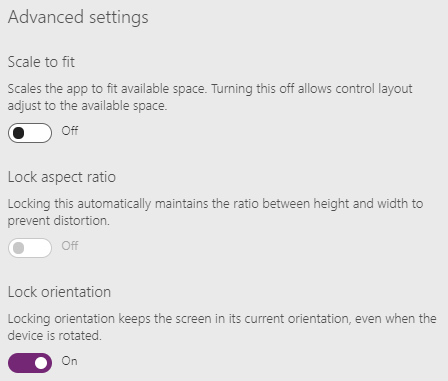
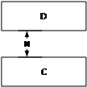
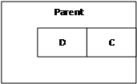
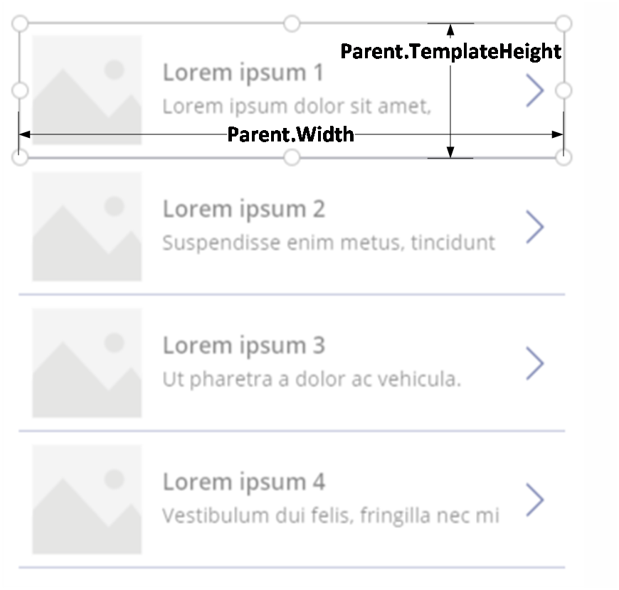

# Create responsive layouts in canvas apps

Before you build a canvas app in PowerApps, you specify whether to tailor the app for a phone or a tablet. This choice determines the size and shape of the canvas on which you'll build your app.

After you make that choice, you can make a few more choices about the canvas. If you select **File** > **App settings** > **Screen size + orientation**, you can choose whether you want portrait or landscape orientation and which screen size (tablet only) to use. You can also lock or unlock the aspect ratio and support device rotation (or not).

Those choices underlie every other choice you make as you design screen layouts. If your app is used on a device of a different size (or on the web), your entire layout is scaled larger (or smaller) to fit the screen where it runs. If an app designed for a phone runs in a large browser window, for example, the app scales to compensate and looks oversized for its space. It can't take advantage of all those additional pixels, by showing more controls or more content.

Responsive layout and design means that the controls on the screen can respond to the different sizes of the app accordingly, making the experience on different form factors feel more at home. In order to achieve responsive layout, you will have to adjust some settings and write expressions throughout your app. 

## Disable Scale to Fit

You can configure each screen so that its layout adapts to the actual space in which the app runs.

You activate responsiveness by turning off the **Scale to fit** setting, which is on by default when you create an app. When you turn this setting off, you also turn off **Lock aspect ratio** because you're no longer designing for a specific screen shape. (You can still specify whether your app supports device rotation.)

To make your app responsive, you must do more than just turn the **Scale to fit** setting off. However, this change is the first step toward making responsiveness possible.

## Understanding app dimensions and screen dimensions

To make your app's layouts respond to changes in the screen dimensions, you'll write formulas that use the **Width** and **Height** properties of the screen. To show these properties, open an app in PowerApps Studio, and then select a screen. The default formulas for these properties appear on the **Advanced** tab of the right-hand pane.

**Width** = `Max(App.Width, App.DesignWidth)`

**Height** = `Max(App.Height, App.DesignHeight)`

These formulas refer to the **Width**, **Height**, **DesignWidth**, and **DesignHeight** properties of the app. The app's **Width** and **Height** properties correspond to the dimensions of the device (or browser window) in which your app is running. If the user resizes the browser window (or rotates the device if you've turned off **Lock orientation**), the values of these properties change dynamically. The formulas in the screen's **Width** and **Height** properties are reevaluated when these values change.

The **DesignWidth** and **DesignHeight** properties come from the dimensions that you specify in the **Screen size + orientation** pane of **App settings**. For example, if you select the phone layout in the portrait orientation, **DesignWidth** is 640, and **DesignHeight** is 1136.

As they're used in the formulas for the screen's **Width** and **Height** properties, you can think of **DesignWidth** and **DesignHeight** as the minimum dimensions for which you'll design the app. If the actual area available to your app is even smaller than these minimum dimensions, the formulas for the screen's **Width** and **Height** properties ensure that their values won't become any smaller than minimums. When this happens, the screen will become scrollable to accommodate your screen's minimum design size, while still allowing the user to show all of it.

After you establish your app's **DesignWidth** and **DesignHeight**, you won't (in most cases) need to change default formulas for each screen's **Width** and **Height** properties. Later, this topic discusses cases in which you might want to customize these formulas.

## Using formulas for dynamic layout

The essence of responsive design involves arranging the controls on each screen not by using absolute (constant) coordinate values, but instead by using formulas that express each control's position and size in terms of the overall screen size, or relative to other controls on the screen.
Beware: After you write formulas for the X, Y, **Width** and **Height** properties of a control, if you subsequently drag the control in the canvas editor, your formulas will be overwritten with constant values. When you start using formulas to achieve dynamic layout, you should avoid dragging controls.

Let's start with a very simple case: A screen containing one control, which should fill the entire area of the screen. For such a control, you would set its properties as follows:

| Property      | Formula            |
|--------|---------------|
| X      | 0             |
| Y      | 0             |
| **Width**  | `Parent.Width`  |
| **Height** | `Parent.Height` |

These formulas use the Parent operator. For a control placed directly on a screen, Parent refers to the screen. So, these properties will position the control at the top-left corner of the screen (0, 0), and will make its **Width** and **Height** the same as those of the screen.

As we will see later, you can apply these same principles (and the Parent operator) for positioning controls inside other containers, such as galleries, group controls, and components.

Instead, you might want to have a control occupy only the top half of the screen. To express this, you would change the **Height** formula to **Parent.Height** / 2, leaving the other formulas unchanged.

If you had a second control that you wanted to fill the bottom half of the same screen, there are at least two possible approaches you could take to constructing its formulas. A simple approach might be:

### Upper control

| Control | Property | Formula           |
|-|----------|-------------------|
| **Upper** | **X**        | 0                 |
| **Upper** | **Y**        | 0                 |
| **Upper** | **Width**    | `Parent.Width`      |
| **Upper** | **Height**   | `Parent.Height / 2` |
| **Lower** | **X**        | 0                 |
| **Lower** | **Y**        | `Parent.Height / 2` |
| **Lower** | **Width**    | `Parent.Width`      |
| **Lower** | **Height**   | `Parent.Height / 2` |

This configuration would achieve the effect that you want. However, you'd need to edit each formula if you changed your mind about the relative sizes of the controls. For example, you might decide that the top control should occupy only the top one-third of the screen , with the bottom control filling the lower two-thirds. In that case, you'd need to change the formulas for the **Height** property of the **Upper** control and the **Y** and **Height** properties of the **Lower** control. Instead, consider writing the formulas for the **Lower** control in terms of the **Upper** control (and itself), like this:

| Control | Property | Formula           |
|-|----------|-------------------|
| **Upper** | **X**        | 0                 |
| **Upper** | **Y**        | 0                 |
| **Upper** | **Width**    | `Parent.Width`      |
| **Upper** | **Height**   | `Parent.Height / 2` |
| **Lower** | **X**        | 0                       |
| **Lower** | **Y**        | `Upper.Y + Upper.Height`  |
| **Lower** | **Width**    | `Parent.Width`            |
| **Lower** | **Height**   | `Parent.Height - Lower.Y` |

With these formulas in place, you need only change the **Height** property of the **Upper** control to express a different fraction of the height of the screen. The formulas for the **Lower** control will automatically calculate the correct position and size to account for the change.

You can use these formula patterns for expressing common layout relationships between a control, named **C**, and its parent or a sibling control, named **D**.

| Relationship between C and its parent | Property | Formula | Illustration |
|--|--|--|--|
| **C** fills width of parent, with a margin of N | **X**| N |  |
|  | **Width** | `Parent.Width - (N * 2)` |  |
| **C** fills height of parent, with a margin of N | **Y** | N |  |
|  | **Height** | `Parent.Height - (N * 2)` |  |
| **C** aligned with right edge of parent, with margin of N | **X** | `Parent.Width - (C.Width + N)` |  |
| **C** aligned with bottom edge of parent, with margin of N | **Y** | `Parent.Height - (C.Height + N)` |  |
| **C** centered horizontally on parent | **X** | `(Parent.Width - C.Width) / 2` |  |
| **C** centered vertically on parent | **Y** | `(Parent.Height - C.Height) / 2` |  |

| Relationship between C and D | Property | Formula | Illustration |
|--|--|--|--|
| **C** horizontally aligned with **D** and the same width as **D** | **X** | `D.X` |  |
|  | **Width**    | `D.Width` |  |
| **C** vertically aligned with **D** and same height as **D**  | **Y** | `D.Y` |  |
|  | **Height** | `D.Height` |  |
| Right edge of **C** aligned with right edge of **D** | **X** | `D.X + D.Width - C.Width` |  |
| Bottom edge of **C** aligned with bottom edge of **D** | **Y** | `D.Y + D.Height - C.Height` |  |
| **C** centered horizontally relative to **D** | **X** | `D.X + (D.Width - C.Width) / 2`  |  |
| **C** centered vertically relative to **D** | **Y** | `D.Y + (D.Height - C.Height) /2` |  |
| **C** positioned to the right of **D** with a gap of N | **X** | `D.X + D.Width - N` |  |
| **C** positioned below **D** with a gap of N             | **Y** | `D.Y + D.Height + N` |  |
| **C** fills space between **D** and right edge of parent | **X** | `D.X + D.Width` |  |
|  | **Width** | `Parent.Width - C.X` |  |
| **C** fills space between **D** and bottom edge of parent | Y | `D.Y + D.Height` |  |

## Hierarchical layout

As you construct screens that contain more controls, it will become more convenient (or even necessary) to position controls relative to a parent control, rather than relative to the screen or a sibling control. By organizing your controls into a hierarchical structure, you can make your formulas easier to write and maintain.

### Galleries

If you use a gallery in your app, you'll need to lay out controls within the gallery's template. You can position these controls by writing formulas that use the Parent operator, which will refer to the gallery template. In the formulas on controls within a gallery template, use the Parent.TemplateHeight and Parent.TemplateWidth properties. Use these instead of Parent.Width and Parent.Height, which refer to the overall size of the gallery.

### Enhanced Group control

You can use an experimental PowerApps feature, the enhanced **Group** control, as a parent control. To turn this feature on, select **File** > **App settings** > **Advanced settings**.

Consider the example of a header at the top of a screen. It's common to have a header with a title and several icons with which your users can interact. You can construct such a header using the enhanced Group control, containing a **Label** control and two **Icon** controls:

Configure the formulas for these controls as follows:

| Property | Header | Menu | Close | Title |
|--|--|--|--|--|
| **X** | 0  | 0 | `Parent.Width - Close.Width` | `Menu.X + Menu.Width` |
| **Y** | 0 | 0 | 0 | 0 |
| **Width**  | `Parent.Width` | `Parent.Height` | `Parent.Height` | `Close.X - Title.X` |
| **Height** | 64 | `Parent.Height` | `Parent.Height` | `Parent.Height` |

For the **Header** control, `Parent` refers to the screen. For the others, `Parent` refers to the **Header** control.

With these formulas written, it should be very easy to adjust the size or position of the **Header** control just by changing the formulas for its properties. The child controls will automatically adjust their sizes and positions accordingly.

### Components

If you use another experimental PowerApps feature, named Components, you can construct building blocks and reuse them in multiple places in your app. As with the **Group** control, the controls that you place within a component should base their position and size formulas on `Parent.Width` and `Parent.Height`, which refer to the size of the component. Learn more about building and using components here.

## Adapting layout for device size and orientation

So far, you've learned how to use formulas to change each control's size in response to the available space, while keeping controls aligned relative to each other. But often, you may want or need to make more substantial layout changes in response to different device sizes and orientations. When a device is rotated from portrait to landscape orientation, for example, you may want to switch from a vertical layout to a horizontal one. On a larger device, you can present more content or rearrange it to provide a more appealing layout. On a smaller device, you may need to split up content across multiple screens.

### Device orientation

The default formulas for a screen's **Width** and **Height**, introduced earlier, won't necessarily provide a good experience if a user rotates a device. For example, an app designed for a phone in portrait orientation has a **DesignWidth** of 640 and a **DesignHeight** of 1136. The same app on a phone in landscape orientation will have these property values:

- The screen's **Width** property is set to `Max(App.Width, App.DesignWidth)`. The app's **Width** (1136) is larger than its **DesignWidth** (640), so the formula evaluates to 1136.
- The screen's **Height** property is set to `Max(App.Height, App.DesignHeight)`. The app's **Height** (640) is smaller than it's **DesignHeight** (1136) so the formula evaluates to 1136.

With a screen **Height** of 1136 and a device height (in this orientation) of 640, the user must scroll the screen vertically to show all of its content, which may not be the experience that you want.

To adapt the screen's **Width** and **Height** properties to the device orientation, you can use different formulas:

**Width** = `Max(App.Width, If(App.Width < App.Height, App.DesignWidth, App.DesignHeight))`

**Height** = `Max(App.Height, If(App.Width < App.Height, App.DesignHeight, App.DesignWidth))`

These formulas swap the app's **DesignWidth** and **DesignHeight** values, based on whether the device's width is less than its height (portrait orientation) or not (landscape orientation).

After you adjust the screen's **Width** and **Height** formulas, you may also want to rearrange controls within your screen to better use the available space. For example, if two controls each occupy half of the screen, you might stack them vertically in portrait but arrange them side-by-side in landscape.

In landscape orientation, the **Upper** and **Lower** controls appear as left and right controls.

| Control | Property | Formula |
|--|----------|---|
| **Upper** | **X** | 0 |
| **Upper** | **Y** | 0 |
| **Upper** | **Width** | `If(Parent.Width < Parent.Height, Parent.Width, Parent.Width / 2)` |
| **Upper** | **Height**   | `If(Parent.Width < Parent.Height, Parent.Height / 2, Parent.Height)` |
| **Lower** | X | `If(Parent.Width < Parent.Height, 0, Upper.X + Upper.Width)`  |
| **Lower** | Y | `If(Parent.Width < Parent.Height, Upper.Y + Upper.Height, 0)` |
| **Lower** | **Width** | `Parent.Width - Lower.X` |
| **Lower** | **Height** | `Parent.Height - Lower.Y` |

###Known limitations

There are some limitations with the existing implementation. 

The authoring canvas does not respond to the sizing formulas created. In order to test the responsive behavior, you will need to save and publish your app, then test it using the playing experience. 
After writing expressions in the X,Y, Width and Height properties, if you drag the controls on the screen or change their sizes, you will overwrite the formulas. 

The current process for creating responsive layout is complex, requiring a lot of dedication to achieve. There is intention to continue to invest in this area to make it easier. 