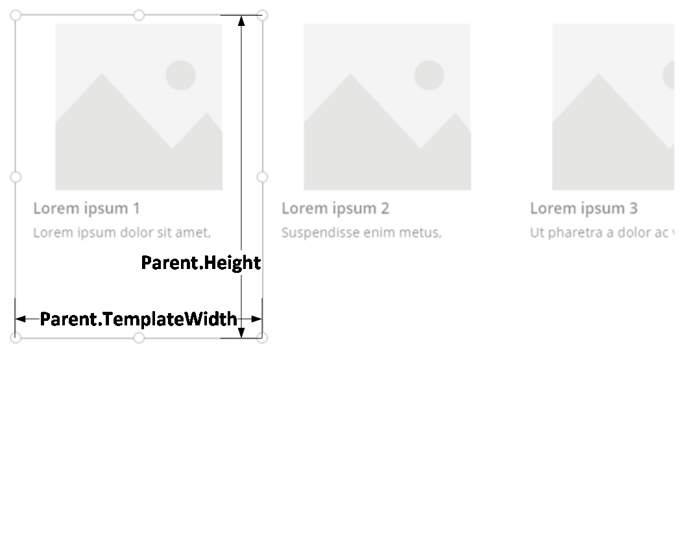

# Create responsive behavior with expressions in canvas apps

If you’ve built canvas apps using PowerApps, you’ve noticed that one of the first decisions you need to make is whether you want a layout that is tailored for a phone or for a tablet. This choice will determine the size and shape of the canvas you will work with while building your app.
Once you have chosen a layout, there are a few more selections available (in File > App settings > Screen size + orientation ) that affect will affect the layout. You can choose a portrait or landscape orientation, a screen size (tablet only), and whether to lock the aspect ratio, and whether device rotation is supported.
Once you have made your selections and constructed the screens of your app, everything about your design will be based on your choices. If your app is used on a device of a different size (or on the web), your entire layout is scaled larger (or smaller) to fit the screen where it is running. If an app designed for a phone is run in a large web browser window, for example, it appears almost comically oversized for its space. It can’t take advantage of all those additional pixels, by showing more controls or more content.

### Disable Scale to Fit

You’ll be able to adapt the layout of each of your screens to the actual space in which they are running.
To activate responsiveness, you will want to turn off the Scale to fit setting, which is on by default in every app. You will notice that as soon as you turn this setting off, Lock aspect ratio will also turn off , since you will no longer be designing for a specific screen shape. (You still have the choice of whether your app supports device rotation.)
Just turning the Scale to fit switch off won’t, magically make your app responsive; there is still additional work for you to do. But this is the first step in making responsiveness possible.

## Understanding App dimensions and Screen dimensions

To make the layouts of your app’s screens responsive to the screen dimensions, you will be writing formulas that use two properties of the screen: Width and Height. Let’s examine where the values of these properties will come from. In the PowerApps app designer, if you select a screen, and then go to the Advanced tab of the property inspector pane, you will see the default formulas for the screen’s Width and Height.

	Screen.Width = Max(App.Width, App.DesignWidth)
	Screen.Height = Max(App.Height, App.DesignHeight)

These formulas refer to four properties of the App: Width, Height, DesignWidth, and DesignHeight. 
The App’s Width and Height properties correspond to the dimensions of the device (or browser window) in which your app is running. If the user resizes the browser window (or rotates the device, if Lock orientation is turned off), the values of these properties will change dynamically. The formulas in the screen’s Width and Height properties will be reevaluated when these values change.
The DesignWidth and DesignHeight properties come from the dimensions established in the Screen size + orientation pane in App settings. For example, if you have selected the phone layout in the portrait orientation, DesignWidth and DesignHeight will be 640 and 1136, respectively.
As they are used in the formulas for the screen’s Width and Height, you can think of DesignWidth and DesignHeight as the minimum dimensions that you will design for. If the actual area available to your app is ever smaller than these minimum dimensions, then the formulas for the screen’s Width and Height properties ensure that their values will not become any smaller than minimums.  When this happens, your app’s screen will become scrollable to accommodate your screen’s minimum design size, while still allowing the app’s user to reach all of it.
Once you have established your app’s DesignWidth and DesignHeight, in most cases you will not need to change default formulas for each screen’s Width and Height properties. Later, we will examine possible cases in which you might want to customize these formulas.

## Understanding breakpoints

TODO: Content with units for mobile, tablet, desktop recommendations
Expectation to rarely work with these numbers themselves. 

## Using formulas for dynamic layout
The essence of responsive design involves arranging the controls on each screen not by using absolute (constant) coordinate values, but instead by using formulas that express each control’s position and size in terms of the overall screen size, or relative to other controls on the screen.
Beware: Once you have written formulas for the X, Y, Width and Height properties of a control, if you subsequently drag the control in the canvas editor, your formulas will be overwritten with constant values. When you start using formulas to achieve dynamic layout, you should avoid using the drag and drop features of the canvas editor to make changes. Future releases of PowerApps will add drag and drop operations that will be compatible with dynamic layout, but for now these operations can only perform static layout.
Let’s start with a very simple case: A screen containing one control, which should fill the entire area of the screen. For such a control, you would set its properties as follows:

| Property      | Formula            |
|--------|---------------|
| X      | 0             |
| Y      | 0             |
| Width  | Parent.Width  |
| Height | Parent.Height |

Observe that in these formulas we are using the Parent operator. For a control placed directly on a screen, Parent will refer to the screen. So, these properties will position the control at the top-left corner of the screen (0, 0), and will make its Width and Height the same as those of the screen.
Note: As we will see later, you can apply these same principles (and the Parent operator) for positioning controls inside other containers, such as galleries, group controls, and components.
Instead, you might want to have a control occupy only the top half of the screen. To express this, you would change the Height formula to Parent.Height / 2, leaving the other formulas unchanged.
If you had a second control that you wanted to fill the bottom half of the same screen, there are at least two possible approaches you could take to constructing its formulas. A simple approach might be:

Upper control 
| Property | Formula           |
|----------|-------------------|
| X        | 0                 |
| Y        | 0                 |
| Width    | Parent.Width      |
| Height   | Parent.Height / 2 |

Lower control
| Property | Formula           |
|----------|-------------------|
| X        | 0                 |
| Y        | Parent.Height / 2 |
| Width    | Parent.Width      |
| Height   | Parent.Height / 2 |

This would certainly achieve the desired effect, but if you were to change your mind about the relative sizes of the controls, you would need go back and edit multiple formulas. For example, if you decided the top control should occupy only the top one-third of the screen , with the bottom control filling the lower two-thirds, you would need to change the formulas for Upper.Height, Lower.Y, and Lower.Height  to complete the adjustment. Instead, consider writing the formulas for the lower control in terms of the upper control (and itself), like this:

Upper control
| Property | Formula           |
|----------|-------------------|
| X        | 0                 |
| Y        | 0                 |
| Width    | Parent.Width      |
| Height   | Parent.Height / 2 |

Lower control
| Property | Formula                 |
|----------|-------------------------|
| X        | 0                       |
| Y        | Upper.Y + Upper.Height  |
| Width    | Parent.Width            |
| Height   | Parent.Height - Lower.Y |

With these formulas in place, you need only change the formula for Upper.Height to express a different fraction of the height of the screen. The formulas for the lower control will automatically calculate the correct position and size to account for the change.
Following are some formula patterns  you can use for expressing common layout relationships between a control and its parent, or between a control and its siblings.

| Relationship of control C to its parent                | Property | Formula                        | Illustration |
|--------------------------------------------------------|----------|--------------------------------|--------------|
| C fills width of parent, with a margin of N            | X        | N                              |       to add       |
|                                                        | Width    | Parent.Width - (N * 2)         |       to add       |
| C fills height of parent, with a margin of N           | Y        | N                              |       to add       |
|                                                        | Height   | Parent.Height - (N * 2)        |       to add       |
| C aligned with right edge of parent, with margin of N  | X        | Parent.Width - (C.Width + N)   |       to add       |
| C aligned with bottom edge of parent, with margin of N | Y        | Parent.Height - (C.Height + N) |       to add       |
| C centered horizontally on parent                      | X        | (Parent.Width - C.Width) / 2   |       to add       |
| C centered vertically on parent                        | Y        | (Parent.Height - C.Height) / 2 |       to add       |

| Relationship of control C to sibling control D    | Property | Formula                        | Illustration |
|---------------------------------------------------|----------|--------------------------------|--------------|
| C horizontally aligned with, and same width as, D | X        | D.X                            |     to add         |
|                                                   | Width    | D.Width                        |     to add         |
| C vertically aligned with, and same height as, D  | Y        | D.Y                            |     to add         |
|                                                   | Height   | D.Height                       |     to add         |
| Right edge of C aligned with right edge of D      | X        | D.X + D.Width - C.Width        |     to add         |
| Bottom edge of C aligned with bottom edge of D    | Y        | D.Y + D.Height - C.Height      |     to add         |
| C centered horizontally relative to D             | X        | D.X + (D.Width - C.Width) / 2  |     to add         |
| C centered vertically relative to D               | Y        | D.Y + (D.Height - C.Height) /2 |     to add         |
| C positioned to the right of D, with a gap of N   | X        | D.X + D.Width – N              |     to add         |
| C positioned below D, with a gap of N             | Y        | D.Y + D.Height + N             |     to add         |
| C fills space between D and right edge of parent  | X        | D.X + D.Width                  |     to add         |
|                                                   | Width    | Parent.Width - C.X             |     to add         |
| C fills space between D and bottom edge of parent | Y        | D.Y + D.Height                 |     to add         |

## Hierarchical Layout

As you construct screens that contain more controls, you will find many cases in which it will be convenient – or even necessary – to position controls relative to a parent control, rather than relative to the screen or a sibling control. Organizing your controls into a hierarchical structure can make your formulas easier to write and maintain.

### Galleries
If you use a gallery in your app, you will need to lay out controls within the gallery item’s template. These controls can be positioned by writing formulas that use the Parent operator, which will refer to the gallery template. If the gallery is a vertical gallery, use Parent.TemplateHeight for the height of the template and Parent.Width    for its width; for a horizontal gallery, use Parent.TemplateWidth for the width and Parent.Height  for the height.

### Enhanced Group control
An experimental PowerApps feature, the enhanced Group control, allows you to use a Group control as a parent control. Turn on this feature in File > App settings > Advanced settings.
Consider the example of a header at the top of a screen. It is common to have a header with a title and several icons with which your users can interact. You can construct such a header using the enhanced Group control, containing a Label and two Icon controls:

Configure the formulas for these controls as follows:
| Header | Menu         | Close         | Title                      |                     |
|--------|--------------|---------------|----------------------------|---------------------|
| X      | 0            | 0             | Parent.Width - Close.Width | Menu.X + Menu.Width |
| Y      | 0            | 0             | 0                          | 0                   |
| Width  | Parent.Width | Parent.Height | Parent.Height              | Close.X - Title.X   |
| Height | 64           | Parent.Height | Parent.Height              | Parent.Height       |

Note that for the Header control, Parent refers to the screen. For the others, Parent refers to the Header control.
With these formulas written, it should be very easy to adjust the size or position of the Header just by changing the formulas for its properties. The child controls will automatically adjust their sizes and positions accordingly.

### Components

Another experimental PowerApps feature, Components, allow you construct building blocks that can be reused in multiple places in your app. As with the enhanced Group control, the controls you place within a component should base their position and size formulas on Parent.Width and Parent.Height, which will refer to the size of the component. Learn more about building and using components here.

## Adapting layout for device size and orientation
So far, we have explained how to use formulas to let each control change its size in response the available space, while staying aligned relative to the other controls. But often, you may want or need to make more substantial layout changes in response to different device sizes and orientations. When a device is rotated from portrait to landscape orientation, for example, you may want to switch from a vertical layout to a horizontal one. On a larger device, you can present more content, or rearrange it to provide a more appealing layout. On a smaller device, you may need to split up content across multiple screens.

### Device orientation

The default formulas for a screen’s Width and Height, introduced earlier, will not necessarily provide a good experience when the device has been rotated out of the orientation for which you have designed. For example , if you have designed for a phone in portrait orientation (App.DesignWidth = 640, App.DesignHeight = 1136), the screen Width and Height formulas on a phone in landscape orientation will evaluate as follows:

	Screen.Width = Max(App.Width, App.DesignWidth) -> Max(1136, 640) -> 1136
	Screen.Height = Max(App.Height, App.DesignHeight) -> Max(640, 1136) -> 1136

Notice that Screen.Height evaluates to 1136, even though the device in this orientation has a height of only 640. As a result, the user will need to scroll the screen vertically to see all of its content, which may not be the design you want.
To adapt Screen.Width and Screen.Height to the device orientation, you can use different formulas:

	Screen.Width = Max(App.Width, If(App.Width < App.Height, App.DesignWidth, App.DesignHeight))
	Screen.Height = Max(App.Height, If(App.Width < App.Height, App.DesignHeight, App.DesignWidth))

These formulas swap the App.DesignWidth and App.DesignHeight values, based on whether the device’s width is less than its height (portrait orientation) or not (landscape orientation).
Once you have adjusted the Screen.Width and Screen.Height formulas, you may also want to rearrange controls on within your screen to better use the available space. For example, if two controls each occupy half of the screen, you might stack them vertically in portrait, but arrange them side-by-side in landscape.
Note that when in landscape orientation, the “upper” and “lower” controls will be arranged as “left” and “right” controls instead.

Upper control 

| Property | Formula                                                            |
|----------|--------------------------------------------------------------------|
| X        | 0                                                                  |
| Y        | 0                                                                  |
| Width    | If(Parent.Width < Parent.Height, Parent.Width, Parent.Width / 2)   |
| Height   | If(Parent.Width < Parent.Height, Parent.Height / 2, Parent.Height) |

Lower control

| Property | Formula                                                     |
|----------|-------------------------------------------------------------|
| X        | If(Parent.Width < Parent.Height, 0, Upper.X + Upper.Width)  |
| Y        | If(Parent.Width < Parent.Height, Upper.Y + Upper.Height, 0) |
| Width    | Parent.Width - Lower.X                                      |
| Height   | Parent.Height - Lower.Y                                     |

