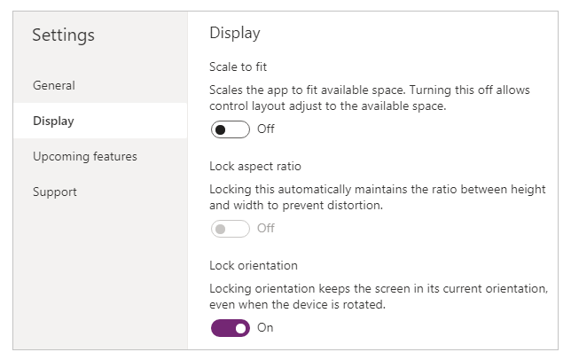

# Create responsive layouts in canvas apps

Before you build a canvas app in Power Apps, you specify whether to tailor the app for a phone or a tablet. This choice determines the size and shape of the canvas on which you'll build your app.

After you make that choice, you can make a few more choices if you select **File** > **Settings** > **Display**. You can choose portrait or landscape orientation and screen size (tablet only). You can also lock or unlock the aspect ratio and support device rotation (or not).

Those choices underlie every other choice you make as you design screen layouts. If your app runs on a device of a different size or on the web, your entire layout scales to fit the screen where the app is running. If an app designed for a phone runs in a large browser window, for example, the app scales to compensate and looks oversized for its space. The app can't take advantage of the additional pixels by showing more controls or more content.

If you create a responsive layout, controls can respond to different devices or window sizes, making various experiences feel more natural. To achieve responsive layout, you adjust some settings and write expressions throughout your app. 

## Disable Scale to fit

You can configure each screen so that its layout adapts to the actual space in which the app is running.

You activate responsiveness by turning off the app's **Scale to fit** setting, which is on by default. When you turn this setting off, you also turn off **Lock aspect ratio** because you're no longer designing for a specific screen shape. (You can still specify whether your app supports device rotation.)



To make your app responsive, you must take additional steps, but this change is the first step toward making responsiveness possible.

## Understand app and screen dimensions

To make your app's layouts respond to changes in the screen dimensions, you'll write formulas that use the **Width** and **Height** properties of the screen. To show these properties, open an app in Power Apps Studio, and then select a screen. The default formulas for these properties appear on the **Advanced** tab of the right-hand pane.

**Width** = `Max(App.Width, App.DesignWidth)`

**Height** = `Max(App.Height, App.DesignHeight)`

These formulas refer to the **Width**, **Height**, **DesignWidth**, and **DesignHeight** properties of the app. The app's **Width** and **Height** properties correspond to the dimensions of the device or browser window in which your app is running. If the user resizes the browser window (or rotates the device if you've turned off **Lock orientation**), the values of these properties change dynamically. The formulas in the screen's **Width** and **Height** properties are reevaluated when these values change.

The **DesignWidth** and **DesignHeight** properties come from the dimensions that you specify in the **Display** pane of **Settings**. For example, if you select the phone layout in portrait orientation, **DesignWidth** is 640, and **DesignHeight** is 1136.

As they're used in the formulas for the screen's **Width** and **Height** properties, you can think of **DesignWidth** and **DesignHeight** as the minimum dimensions for which you'll design the app. If the actual area available to your app is even smaller than these minimum dimensions, the formulas for the screen's **Width** and **Height** properties ensure that their values won't become any smaller than minimums. In that case, the user must scroll to view all of the screen's content.

After you establish your app's **DesignWidth** and **DesignHeight**, you won't (in most cases) need to change default formulas for each screen's **Width** and **Height** properties. Later, this topic discusses cases in which you might want to customize these formulas.

## Use formulas for dynamic layout

To create a responsive design, you locate and size each control by using formulas instead of absolute (constant) coordinate values. These formulas express each control's position and size in terms of the overall screen size or relative to other controls on the screen.

> [!IMPORTANT]
> After you write formulas for the **X**, **Y**, **Width** and **Height** properties of a control, your formulas will be overwritten with constant values if you subsequently drag the control in the canvas editor. When you start to use formulas to achieve dynamic layout, you should avoid dragging controls.

In the simplest case, one control fills an entire screen. To create this effect, set the control's properties to these values:

| Property      | Value            |
|--------|---------------|
| **X**      | `0`             |
| **Y**      | `0`             |
| **Width**  | `Parent.Width`  |
| **Height** | `Parent.Height` |

These formulas use the **Parent** operator. For a control placed directly on a screen, **Parent** refers to the screen. With these property values, the control appears in the upper-left corner of the screen (0, 0) and has the same **Width** and **Height** as the screen.

Later in this topic, you'll apply these principles (and the **Parent** operator) to position controls inside other containers, such as galleries, group controls, and components.

As an alternative, the control can fill only the top half of the screen. To create this effect, set the **Height** property to **Parent.Height** / 2, and leave the other formulas unchanged.

If you want a second control to fill the bottom half of the same screen, you can take at least two other approaches to constructing its formulas. For simplicity, you might take this approach:

| Control | Property | Formula           |
|-|----------|-------------------|
| **Upper** | **X**        | `0`                 |
| **Upper** | **Y**        | `0`                 |
| **Upper** | **Width**    | `Parent.Width`      |
| **Upper** | **Height**   | `Parent.Height / 2` |
| **Lower** | **X**        | `0`                 |
| **Lower** | **Y**        | `Parent.Height / 2` |
| **Lower** | **Width**    | `Parent.Width`      |
| **Lower** | **Height**   | `Parent.Height / 2` |


This configuration would achieve the effect that you want, but you'd need to edit each formula if you changed your mind about the relative sizes of the controls. For example, you might decide that the top control should occupy only the top one-third of the screen, with the bottom control filling the lower two-thirds. 

To create that effect, you'd need to update the **Height** property of the **Upper** control and the **Y** and **Height** properties of the **Lower** control. Instead, consider writing the formulas for the **Lower** control in terms of the **Upper** control (and itself), as in this example:


| Control | Property | Formula           |
|-|----------|-------------------|
| **Upper** | **X**        | `0`                 |
| **Upper** | **Y**        | `0`                 |
| **Upper** | **Width**    | `Parent.Width`      |
| **Upper** | **Height**   | `Parent.Height / 2` |
| **Lower** | **X**        | `0`                       |
| **Lower** | **Y**        | `Upper.Y + Upper.Height`  |
| **Lower** | **Width**    | `Parent.Width`            |
| **Lower** | **Height**   | `Parent.Height - Lower.Y` |


With these formulas in place, you need only change the **Height** property of the **Upper** control to express a different fraction of the height of the screen. The **Lower** control automatically moves and resizes to account for the change.

You can use these formula patterns for expressing common layout relationships between a control, named **C**, and its parent or a sibling control, named **D**.

| Relationship between C and its parent | Property | Formula | Illustration |
|--|--|--|--|
| **C** fills width of parent, with a margin of *N* | **X**| `N` |  |
|  | **Width** | `Parent.Width - (N * 2)` |  |
| **C** fills height of parent, with a margin of *N* | **Y** | `N` |  |
|  | **Height** | `Parent.Height - (N * 2)` |  |
| **C** aligned with right edge of parent, with margin of *N* | **X** | `Parent.Width - (C.Width + N)` |  |
| **C** aligned with bottom edge of parent, with margin of *N* | **Y** | `Parent.Height - (C.Height + N)` |  |
| **C** centered horizontally on parent | **X** | `(Parent.Width - C.Width) / 2` |  |
| **C** centered vertically on parent | **Y** | `(Parent.Height - C.Height) / 2` |  |

| Relationship between C and D | Property | Formula | Illustration |
|--|--|--|--|
| **C** horizontally aligned with **D** and the same width as **D** | **X** | `D.X` |  |
|  | **Width**    | `D.Width` |  |
| **C** vertically aligned with **D** and same height as **D**  | **Y** | `D.Y` |  |
|  | **Height** | `D.Height` |  |
| Right edge of **C** aligned with right edge of **D** | **X** | `D.X + D.Width - C.Width` |  |
| Bottom edge of **C** aligned with bottom edge of **D** | **Y** | `D.Y + D.Height - C.Height` |  |
| **C** centered horizontally relative to **D** | **X** | `D.X + (D.Width - C.Width) / 2`  |  |
| **C** centered vertically relative to **D** | **Y** | `D.Y + (D.Height - C.Height) /2` |  |
| **C** positioned to the right of **D** with a gap of N | **X** | `D.X + D.Width + N` |  |
| **C** positioned below **D** with a gap of *N*             | **Y** | `D.Y + D.Height + N` |  |
| **C** fills space between **D** and right edge of parent | **X** | `D.X + D.Width` |  |
|  | **Width** | `Parent.Width - C.X` |  |
| **C** fills space between **D** and bottom edge of parent | Y | `D.Y + D.Height` |  |
| | **Height** | ```Parent.Height - C.Y```

## Hierarchical layout

As you construct screens that contain more controls, it will become more convenient (or even necessary) to position controls relative to a parent control, rather than relative to the screen or a sibling control. By organizing your controls into a hierarchical structure, you can make your formulas easier to write and maintain.

### Galleries

If you use a gallery in your app, you'll need to lay out controls within the gallery's template. You can position these controls by writing formulas that use the **Parent** operator, which will refer to the gallery template. In the formulas on controls within a gallery template, use the **Parent.TemplateHeight** and **Parent.TemplateWidth** properties; don't use **Parent.Width** and **Parent.Height**, which refer to the overall size of the gallery.


### Container control

You can use an experimental feature, the **Layout container** control, as a parent control. To turn this feature on, select **File** > **Settings** > **Upcoming features** > **Preview**, and select **Layout containers** to turn the feature on.

Consider the example of a header at the top of a screen. It's common to have a header with a title and several icons with which your users can interact. You can construct such a header using the **Container** control, containing a **Label** control and two **Icon** controls:


Set the properties for these controls to these values:

| Property | Header | Menu | Close | Title |
|--|--|--|--|--|
| **X** | `0`  | `0` | `Parent.Width - Close.Width` | `Menu.X + Menu.Width` |
| **Y** | `0` | `0` | `0` | `0` |
| **Width**  | `Parent.Width` | `Parent.Height` | `Parent.Height` | `Close.X - Title.X` |
| **Height** | `64` | `Parent.Height` | `Parent.Height` | `Parent.Height` |

For the **Header** control, `Parent` refers to the screen. For the others, `Parent` refers to the **Header** control.

Having written these formulas, you can adjust the size or position of the **Header** control by changing the formulas for its properties. The sizes and positions of the child controls will automatically adjust accordingly.

## Auto-layout container controls

You can use an experimental feature, the **Auto-layout** container controls to automatically lay out the child components. These containers determine the position of the child components so that you never have to set X, Y for a component inside the container. Also, it can distribute the available space to its child components based on the settings, as well as determines both the vertical and horizontal alignment of the child components. More information: [Auto-layout container controls](build-responsive-apps.md#auto-layout-containers)

### Components

If you use another experimental feature, named Components, you can construct building blocks and reuse them throughout your app. As with the **Container** control, the controls that you place within a component should base their position and size formulas on `Parent.Width` and `Parent.Height`, which refer to the size of the component. More information: [Create a component](create-component.md).

## Adapting layout for device size and orientation

So far, you've learned how to use formulas to change each control's size in response to the available space, while keeping controls aligned relative to each other. But you might want or need to make more substantial layout changes in response to different device sizes and orientations. When a device is rotated from portrait to landscape orientation, for example, you might want to switch from a vertical layout to a horizontal one. On a larger device, you can present more content or rearrange it to provide a more appealing layout. On a smaller device, you might need to split up content across multiple screens.

### Device orientation

The default formulas for a screen's **Width** and **Height** properties, as this topic described earlier, won't necessarily provide a good experience if a user rotates a device. For example, an app designed for a phone in portrait orientation has a **DesignWidth** of 640 and a **DesignHeight** of 1136. The same app on a phone in landscape orientation will have these property values:

- The screen's **Width** property is set to `Max(App.Width, App.DesignWidth)`. The app's **Width** (1136) is larger than its **DesignWidth** (640), so the formula evaluates to 1136.
- The screen's **Height** property is set to `Max(App.Height, App.DesignHeight)`. The app's **Height** (640) is smaller than its **DesignHeight** (1136), so the formula evaluates to 1136.

With a screen **Height** of 1136 and a device height (in this orientation) of 640, the user must scroll the screen vertically to show all of its content, which might not be the experience that you want.

To adapt the screen's **Width** and **Height** properties to the device orientation, you can use these formulas:

**Width** = `Max(App.Width, If(App.Width < App.Height, App.DesignWidth, App.DesignHeight))`

**Height** = `Max(App.Height, If(App.Width < App.Height, App.DesignHeight, App.DesignWidth))`

These formulas swap the app's **DesignWidth** and **DesignHeight** values, based on whether the device's width is less than its height (portrait orientation) or more than its height (landscape orientation).

After you adjust the screen's **Width** and **Height** formulas, you might also want to rearrange controls within your screen to better use the available space. For example, if each of two controls occupies half of the screen, you might stack them vertically in portrait but arrange them side by side in landscape.

You can use the screen's **Orientation** property to determine whether the screen is oriented vertically or horizontally.

> [!NOTE]
> In landscape orientation, the **Upper** and **Lower** controls appear as left and right controls.

| Control | Property | Formula |
|--|----------|---|
| **Upper** | **X** | `0` |
| **Upper** | **Y** | `0` |
| **Upper** | **Width** | `If(Parent.Orientation = Layout.Vertical, Parent.Width, Parent.Width / 2)` |
| **Upper** | **Height**   | `If(Parent.Orientation = Layout.Vertical, Parent.Height / 2, Parent.Height)` |
| **Lower** | X | `If(Parent.Orientation = Layout.Vertical, 0, Upper.X + Upper.Width)`  |
| **Lower** | Y | `If(Parent.Orientation = Layout.Vertical, Upper.Y + Upper.Height, 0)` |
| **Lower** | **Width** | `Parent.Width - Lower.X` |
| **Lower** | **Height** | `Parent.Height - Lower.Y` |


### Screen sizes and breakpoints

You can adjust your layout based on the size of the device. The screen's **Size** property classifies the current device size. The size is a positive integer; the ScreenSize type provides named constants to help with readability. This table lists the constants:

| Constant              | Value | Typical device type (using default app settings) |
|-----------------------|-------|--------------------------------------------------|
| ScreenSize.Small      | 1     | Phone                                            |
| ScreenSize.Medium     | 2     | Tablet, held vertically                          |
| ScreenSize.Large      | 3     | Tablet, held horizontally                        |
| ScreenSize.ExtraLarge | 4     | Desktop computer                                 |

Use these sizes to make decisions about your app's layout. For example, if you want a control to be hidden on a phone-sized device but visible otherwise, you could set the control's **Visible** property to this formula:

`Parent.Size >= ScreenSize.Medium`

This formula evaluates to **true** when the size is medium or larger and **false** otherwise.

If you want a control to occupy a different fraction of the screen width based on the screen size, set the control's **Width** property to this formula:

```powerapps-dot
Parent.Width *  
    Switch(Parent.Size,  
        ScreenSize.Small, 0.5,  
        ScreenSize.Medium, 0.3,  
        0.25)
```
This formula sets the control's width to half of the screen width on a small screen, three-tenths of the screen width on a medium screen, and a quarter of the screen width on all other screens.

## Custom breakpoints

The screen's **Size** property is calculated by comparing the screen's **Width** property to the values in the app's **SizeBreakpoints** property. This property is a single-column table of numbers that indicate the width breakpoints that separate the named screen sizes:

In an app created for tablet or web, the default value in the app's **SizeBreakpoints** property are **[600, 900, 1200]**. In an app created for phones, the value is **[1200, 1800, 2400]**. (The values for phone apps are doubled because such apps use coordinates that are effectively double the coordinates used in other apps.)


You can customize your app's breakpoints by changing the values in the app's **SizeBreakpoints** property. Select **App** in the tree view, select **SizeBreakpoints** in the property list, and then edit the values in the formula bar. You can create as many breakpoints as your app needs, but only sizes 1 through 4 correspond to named screen sizes. In formulas, you can refer to sizes beyond ExtraLarge by their numeric values (5, 6, and so forth).

You can also specify fewer breakpoints. For example, your app might need only three sizes (two breakpoints), so the possible screen sizes will be Small, Medium, and Large.

## Known limitations

The authoring canvas doesn't respond to the sizing formulas created. To test responsive behavior, save and publish your app, and then open it on devices or in browser windows of various sizes and orientations.

If you write expressions or formulas in the **X**, **Y**, **Width**, and **Height** properties of a control, you'll overwrite those expressions or formulas if you later drag the control to a different location or resize the control by dragging its border.


[!INCLUDE[footer-include](../../includes/footer-banner.md)]