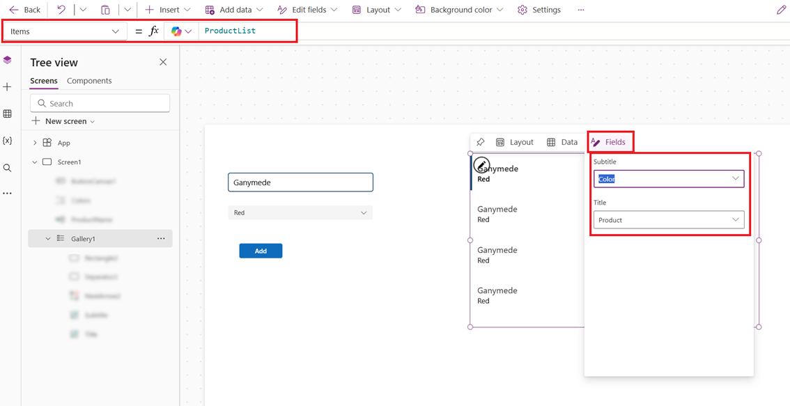
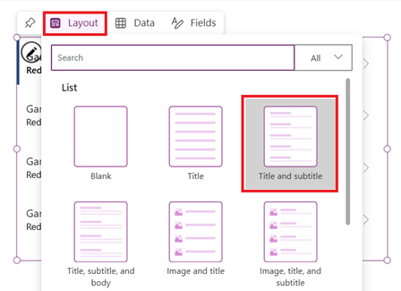

# Create and update a collection in a canvas app

Use a collection to store data that users can manage in your app. A collection is a group of items that are similar, such as products in a product list. For more information about different types of variables such as collections: [Understand canvas-app variables](working-with-variables.md).

## Prerequisites

- [Sign up](../signup-for-powerapps.md) for Power Apps, and then [sign in](https://make.powerapps.com?utm_source=padocs&utm_medium=linkinadoc&utm_campaign=referralsfromdoc) by providing the same credentials that you used to sign up.
- Create an app or open an existing app in Power Apps.
- Learn how to [configure a control](add-configure-controls.md) in Power Apps.

## Create a multicolumn collection

1. In Power Apps Studio, add a **Text input** control.

    

1. Rename the control by selecting its ellipsis in the left navigation pane, selecting **Rename**, and then typing **ProductName**.

    

1. Add a **Drop down** control.

    

1. Rename the **Drop down** control **Colors**, and make sure that the **Items** property is selected in the property list.

    

1. In the formula bar, replace **DropDownSample** with this expression:

    `["Red","Green","Blue"]`

1. Add a **Button** control, set its **Text** property to **"Add"**, and set its **OnSelect** property to this formula:

    ```powerapps-dot
    Collect(
        ProductList,
        {
            Product: ProductName.Text,
            Color: Colors.Selected.Value
        }
    )
    ```

1. Press F5, type some text into **ProductName**, select an option in **Colors**, and then select **Add**.

    

1. Repeat the previous step at least two more times, and then press Esc.

1. On the **File** menu, select **Collections** to show the collection that you created.

    

## Show a collection

1. Add a vertical **Gallery** control.

    

1. Set the gallery's **Items** property to **ProductList**.

1. In the **Data** pane, set the subtitle field to **Color**, and set the title field to **Product**.

    

1. Close the **Data** pane, select the gallery, and then set the **Layout** field to **Title and subtitle**.

    

    Your screen resembles this example:

    

## Remove one or all items

1. Select the gallery template by clicking or tapping near the bottom of the gallery and then clicking or tapping the pencil icon near the upper-left corner.

    

1. Add a **Trash** icon to the gallery template.

    

1. Set the icon's **OnSelect** property to this formula:

    `Remove(ProductList, ThisItem)`

1. Outside the gallery, add a button, set its **Text** property to **"Clear"**, and set its **OnSelect** property to this formula:

    `Clear(ProductList)`

1. While holding down the Alt key, select the **Trash** icon for an item to remove that item from the collection, or select the **Clear** button to remove all items from the collection.

## Put a SharePoint list into a collection

1. [Create a connection to a SharePoint list](connections/connection-sharepoint-online.md#create-a-connection).

1. Add a button, and set its **[OnSelect](controls/properties-core.md)** property to this function, replacing *ListName* with the name of your SharePoint list:<br>

    `Collect(MySPCollection, ListName)`

    This function creates a collection that's named **MySPCollection** and that contains the same data as your SharePoint list.

1. While holding down the Alt key, select the button.

1. (optional) To preview the collection that you created, select **Collections** on the **File**  menu.

For information about how to show data from a SharePoint list (such as dates, choices, and people) in a gallery: [Show list columns in a gallery](connections/connection-sharepoint-online.md#show-list-columns-in-a-gallery). For information about how to show data in a form (with drop-down lists, date pickers, and people pickers): [Edit form and 
Display form controls](controls/control-form-detail.md).

## Next steps

- Review the [reference topic](functions/function-clear-collect-clearcollect.md) for the **Collect** function.
- Learn how to shape data in a collection by using the [AddColumns, DropColumns, RenameColumns, and ShowColumns](functions/function-table-shaping.md) functions.


[!INCLUDE[footer-include](../../includes/footer-banner.md)]