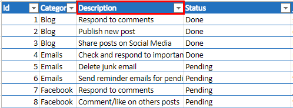
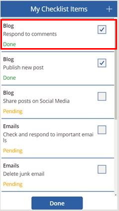
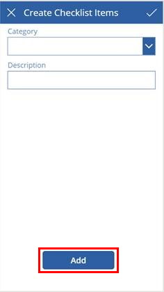

# Update or create bulk records in Power Apps canvas app

Updating or creating records in bulk allows you to act on many records at once. Here are some scenarios where you would want to bulk *update* records:

- You have many photos and want to upload them all at once.
- You want to submit a time sheet with a week’s data at once.

 You might also want to *create* new records in bulk. For example, when your app has to select many images, you might want to upload them all at once.

This article explains how to update or create bulk records depending on your scenario.

## Formulas to bulk update records

The formulas in this section can be used to bulk update records in canvas apps.

- [Patch() function](functions/function-patch.md#modify-or-create-a-set-of-records-in-a-data-source-1)&mdash;Use this function when the collection matches the data source.

    ```powerapps-dot
    Patch( DataSource, Collection )
    ```

- [ForAll() function](functions/function-forall.md) + [nested Patch](functions/function-patch.md) + [disambiguation operator](functions/operators.md)&mdash;Use this function when the data sources have different columns that you need to join.

    ```powerapps-dot
    ForAll( Collection,
        Patch( DataSource, 
            LookUp( DataSource, Id = Collection[@Id] ),
            { Column: Value }
        )
    )
    ```

- [AddColumns() function](functions/function-table-shaping.md)&mdash;This function can be used to provide a lookup reference in the Collection that contains the updates to the DataSource if it doesn't have fields that easily reference the table.

For a complete list of formulas to update bulk records, download [related files](https://blogcode.blob.core.windows.net/pablogassets/BulkUpdate_blog/Bulkupdate_blog.zip).

## Example of a checklist

This example uses a checklist of tasks. When you're done with a few tasks, you can mark them as complete. You could extend this scenario to a product launch checklist, home inspection checklist, or other lists.

The following screenshot shows the checklist items in Microsoft Excel file. You can check off the tasks related to your blogging or posting on social media in this example. The table in Excel is called  `ChecklistItems`. Here's the [example in Excel](https://blogcode.blob.core.windows.net/pablogassets/BulkUpdate_blog/Bulkupdate_blog.zip).

The example uses collections to demo this behavior. The approach works for any tabular backend of your choice.

> [!div class="mx-imgBorder"]
> 

The Excel data is imported as static data into the app. On the `App.OnStart` property, `Collect()` the Excel ChecklistItems data into the `ChecklistItemsSource` collection. The `ChecklistItemsSource` collection will be used as the source data throughout the app.

This example uses a two screen app:

- **Screen 1**&mdash;Used to review the checklist items and mark them as complete.
- **Screen 2**&mdash;Used to create a new checklist item. The new item will be added to `ChecklistItemsSource` collection.

> [!div class="mx-imgBorder"]
>  

Every time a checklist item is checked, it's added into a collection called `CheckedItems`. It uses the formula below on the `OnCheck` event property of the checkbox control. If the item is already checked and is part of the collection, it's removed. If not, the checked item is added.

You can toggle the status between **Done** and **Pending**, or you can use the `Oncheck` and `OnUncheck` events:

```powerapps-dot
If( !IsBlank( 
        LookUp( CheckedItems, Id = ThisItem.Id )
    ),
    Remove( CheckedItems, ThisItem ),
    Collect( CheckedItems, ThisItem )
)
```

## Create multiple records at once

There are different ways of bulk updating records depending on the scenario. This section explains how to create multiple records at once in canvas apps.

When the user selects **Done** in the above example, you need to update `ChecklistItemsSource` with changes from the CheckedItems collection.

### For columns with the same name

If your source and destination have the same column names, you can use a Patch statement. For example, `ChecklistItemsSource` and the `CheckedItems` collections have the same column names. You can use the formula below to update the source at once with all the changes.

```powerapps-dot
Patch( ChecklistItemsSource, CheckedItems )
```

### For columns with different names

If the columns in source and destination tables vary, use ForAll with Patch instead.

With `ForAll()`, you must loop through each record using a condition. The condition is a comparison between similar columns (for example, `Id` column) of the different tables. This comparison becomes complicated when the source table and the destination table have the same column names (for example, if `ProjectId` was a column found in both `Project` and `PurchaseOrder` tables).

Here are the alternatives:

#### Use with disambiguation operator

To update the `Status` of `CheckedItems` to "Done", when the source and destination table column names are the same, use this formula:

```powerapps-dot
ForAll( CheckedItems,
    Patch( ChecklistItemsSource, 
        LookUp( ChecklistItemsSource, Id = CheckedItems[@Id] ),
        { Status: "Done" }
    )
)
```

For each item in the `CheckedItems` collection, the Id (represented by the disambiguation operator `CheckedItems[@Id])` is compared against the Id column of the `ChecklistItemsSource` collection. Then, each matched record is updated with the status as "Done". The disambiguation operator is used when two columns belonging to different tables have the same name. If you don't use this disambiguation operator, you'll see that only the first record gets updated.

#### Use an extra label within the gallery

If you don't want to use an extra collection to store the checked items, you can try the following steps:
1. Create an extra label within the gallery template.
   1. Bind it to the Id column.
   1. Rename the label to IdText.

1. Remove the code on the **OnCheck** of the checkbox control mentioned above.

1. Write the following formula on the OnSelect event of the Done Button:

      ```powerapps-dot
      ForAll(
          Filter( ChecklistGallery.AllItems,
            StatusCheckbox.Value = true
          ),
          Patch( ChecklistItemsSource,
            LookUp( ChecklistItemsSource, Id = IdText.Text ),
            { Status: "Done" }
          )
      )
    ```

Here, you're directly applying the filter on the Gallery's items to find the checked items. For each record in the filtered items, a match is found on the **ChecklistItemsSource** table by comparing the Id with value stored in IdText label.

The status is updated to "Done".

The disambiguation operator can't be used on the Gallery's items. Instead, you can store a label within the gallery and reference it for comparison.

#### Use an alternative to create a new column with a different label

This method is an alternative to using the disambiguation operator or a label inside gallery.

While creating a local copy of your data source, you can use the `AddColumns()` formula to create a new column with a different label (`NewId`) for the Id column in your source collection. When using ForAll with Patch, you compare the NewId column against the Id column in your source data.

## Bulk create records

You may want to create new records in bulk if, for example, you want to upload many images all at once.

Here's an example using [Example of a checklist](#example-of-a-checklist).

On the Create Checklist Items screen, each time you select **Add**, the information is stored in the `NewChecklistItems` collection. When you select **Submit**, `ForAll()` with `Patch()` are used to update the source collection.

```powerapps-dot
ForAll( NewChecklistItems,
    Patch( ChecklistItemsSource,
        Defaults( ChecklistItemsSource ),{
            Id: Id,
            Category: Category,
            Description: Description,
            Status:Status
        }
    )
)
```

For each item in the `NewChecklistItems`, a new record is created (indicated by `Defaults(ChecklistItemsSource)`) in the `ChecklistItemsSource` collection. The `Id` is set to the `Id` from the `NewChecklistItems` collection. Similarly, `Category`, `Description`, and `Status` values are set.

### See also

- [Formula reference for Power Apps](formula-reference.md)
