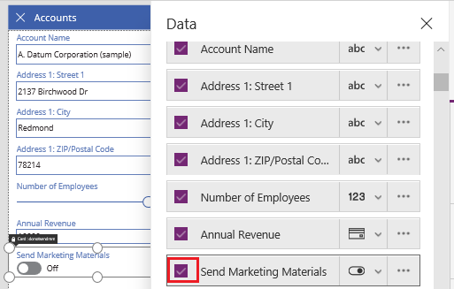
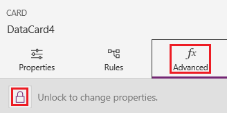
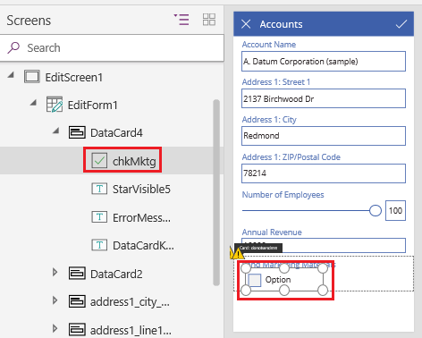
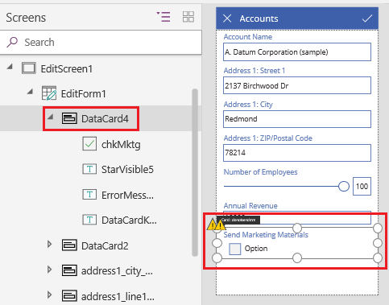
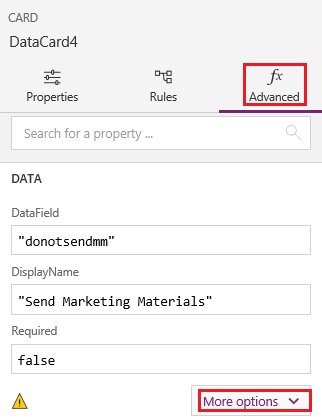
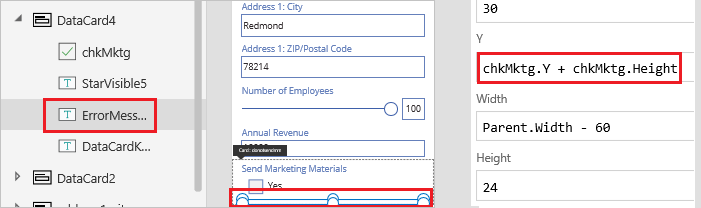
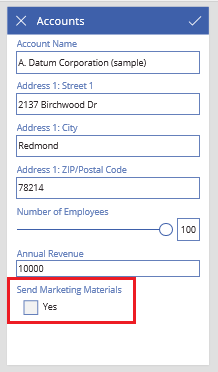

# Customize a card in PowerApps
Perform basic customization (without unlocking a card) by, for example, changing its control. Perform advanced customization by unlocking the card and, for example, adding a control that isn't available for that card by default.

For an overview, see [Understand data cards](working-with-cards.md).

## Prerequisites

* Learn how to [add and configure controls](add-configure-controls.md).
* You can review this topic for general concepts only, or you can follow it step by step if you complete the procedures in these topics:

  1. [Generate an app](data-platform-create-app.md).
  2. [Customize its gallery](customize-layout-sharepoint.md).
  3. [Customize its forms](customize-forms-sharepoint.md).

## Customize a locked card
In this procedure, you'll replace a **[Text-input](controls/control-text-input.md)** control with a **[Slider](controls/control-slider.md)** control without unlocking the card.

1. Sign in to [PowerApps](http://web.powerapps.com?utm_source=padocs&utm_medium=linkinadoc&utm_campaign=referralsfromdoc).

    

1. Open the app that you generated and customized, select **EditForm1**, and then open the **Data** pane by selecting **Accounts** in the right-hand pane.

1. In the list of fields, select the down arrow for **Number of Employees** to show a list of options, and then select **Edit Slider**.

    

    The screen reflects your change.

    

## Unlock and customize a card
In this procedure, you'll unlock a card and then replace a **[Toggle](controls/control-toggle.md)** control with a **[Checkbox](controls/control-check-box.md)** control.

1. In **EditForm1**, show the **Send Marketing Materials** field.

    

2. With that card selected, click or tap **Advanced** near the top of the right-hand pane, and then click or tap the lock icon to unlock the card.

    

1. In the card, delete the **Toggle** control, add a **Check box** control, and name the new control **chkMktg**.

    

1. Select the card that you just updated.

    

1. In the right-hand pane, ensure that the **Advanced** tab is still showing, and then click or tap **More options**.

    

1. Change the value of the card's **Update** property to this expression:
 `chkMktg.Value`

1. Change value of the **Y** property of the error message for that card to this expression: 
`chkMktg.Y + chkMktg.Height`

    

1. Change the value of the **Text** property of **chkMktg** to **Yes**.

    The screen reflects your changes, and the errors are resolved.

    

## Next steps
Now that you have a basic understanding of how to generate an app and customize a gallery, a form, and a card, you can [build your own app from scratch](data-platform-create-app-scratch.md).
