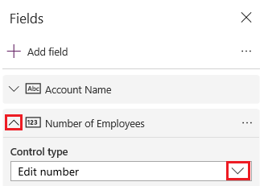
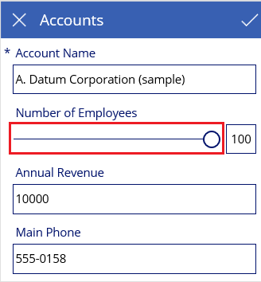
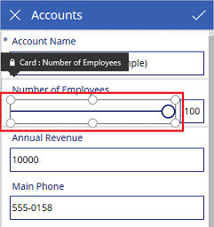
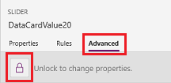
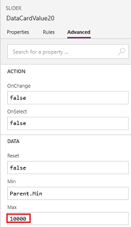
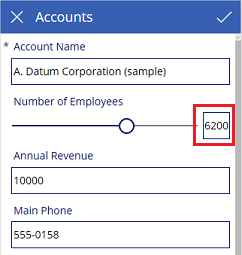

# Customize a card in a canvas app

Perform basic customization (without unlocking a card) by, for example, changing its control. Perform advanced customization by unlocking the card and, for example, adding a control that isn't available for that card by default.

For an overview, see [Understand data cards](working-with-cards.md).

## Prerequisites

- Learn how to [add and configure controls](add-configure-controls.md).
- You can review this topic for general concepts only, or you can follow it step by step if you first complete the procedures in these topics:

    1. [Generate an app](data-platform-create-app.md).
    1. [Customize its gallery](customize-layout-sharepoint.md).
    1. [Customize its forms](customize-forms-sharepoint.md).

## Customize a locked card

In this procedure, you'll replace a **[Text-input](controls/control-text-input.md)** control with a **[Slider](controls/control-slider.md** control without unlocking the card.

1. In the app that you generated and customized, select **EditForm1** in the left navigation bar, and then select **Edit fields** on the **Properties** tab of the right-hand pane.

1. In the list of fields, select the down arrow for **Number of Employees**, and then open the list under **Control type**.

    > [!div class="mx-imgBorder"]
    > 

1. Select **Edit Slider**.

    The screen reflects your change.

    > [!div class="mx-imgBorder"]
    > 

## Unlock and customize a card

In this procedure, you'll unlock a card and update the **Max** property of the **Slider** control that you just added.

1. In **EditForm1**, select the **Slider** control in the **Number of Employees** card.

    > [!div class="mx-imgBorder"]
    > 

1. On the **Advanced** tab of the right-hand pane, select the lock icon to unlock the card.

    > [!div class="mx-imgBorder"]
    > 

1. Set the **Max** property of the **Slider** control to 10,000.

    > [!div class="mx-imgBorder"]
    > 

    The **Slider** control shows a more accurate value.

    > [!div class="mx-imgBorder"]
    > 

## Next steps

Now that you have a basic understanding of how to generate an app and customize a gallery, a form, and a card, you can [build your own app from scratch](data-platform-create-app-scratch.md).

[!INCLUDE[footer-include](../../includes/footer-banner.md)]