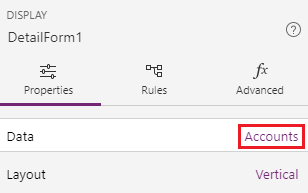
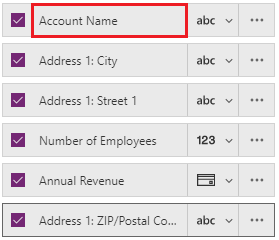

# Customize a canvas-app form in PowerApps

In a canvas app, customize a **Display form** control and an **Edit form** control so that they show the data that matters most and in the most intuitive order to help users easily understand and update the data.

Each form comprises one or more cards, each of which shows data from a particular column in the data source. By following the steps in this topic, you can specify which cards appear in a form and move cards up and down within a form.

If you're unfamiliar with PowerApps, see [Introduction to PowerApps](getting-started.md).

## Prerequisites

[Generate an app](data-platform-create-app.md) from the Common Data Service, and then [customize the gallery](customize-layout-sharepoint.md) in that app.

## Show and hide cards

1. Sign in to [PowerApps](http://web.powerapps.com?utm_source=padocs&utm_medium=linkinadoc&utm_campaign=referralsfromdoc).

    

1. Open the app that you generated and customized.

1. In the left navigation bar, type or paste **D** in the search bar to filter the list of elements, and then click or tap **DetailForm1** to select it.

    

1. In the right-hand pane, click or tap **Accounts** to show the **Data** pane.

    

1. In the **Data** pane, clear the **Primary Contact**, **Description**, and **Address 1: Street 2** checkboxes to hide those fields.

    

1.  In the **Data** pane, select the **Address 1: ZIP/Postal code** checkbox to show that field.

    

## Reorder the cards
1. In the **Data** pane, drag the **Account Name** field to the top of the list of fields.

    

    The cards in **DetailForm1** reflect the same change.

    

1. Reorder the other cards into this sequence:

    - Account Name
    - Address 1: Street 1
    - Address 1: City
    - Address 1: ZIP/Postal Code
    - Number of Employees
    - Annual Revenue

1. In the left navigation bar, type or paste **Ed** in the search bar, and then click or tap **EditForm1** to select it.

1. Repeat the steps in the previous procedure and this one so that the fields in **EditForm1** match those in **DetailForm1**.

## Run the app
1. In the left navigation bar, type or paste **Br** to filter the list, and then click or tap **BrowseScreen1** to select it.

2. Open Preview mode by pressing F5 (or by selecting the **Preview** icon near the upper-right corner).

    

3. In the upper-right corner, click or tap the plus icon to add a record in **EditScreen1**.

    

4. Add whatever data you want, and then click or tap the checkmark icon in the upper-right corner to save your changes and return to **BrowseScreen1**.

    

5. Click or tap the arrow for the item that you just created to show details about that item in **DetailScreen1**.  

    

6. In the upper-right corner, click or tap the edit icon to update the record in **EditScreen1**.

    

7. Change the information in one or more fields, and then click or tap the check mark in the upper-right corner to save your changes in the SharePoint list and return to **DetailScreen1**.  

    

8. Near the upper-right corner, click or tap the trash-can icon to delete the record that you just updated and to return to **BrowseScreen1**.

    

9. Close Preview mode by pressing Esc (or by clicking or tapping the close icon near the upper-left corner).

## Next steps
- [Save and publish](save-publish-app.md) your app.
- [Customize a card](customize-card.md) in your app.
