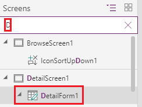
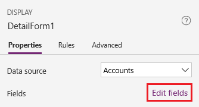
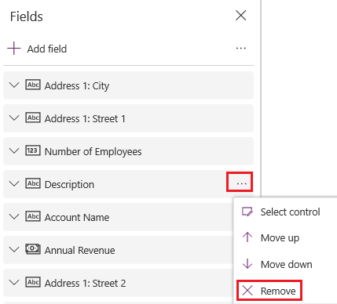
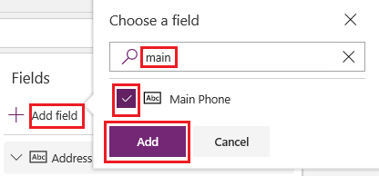

# Customize forms in canvas apps

In a canvas app, customize a **Display form** control and an **Edit form** control so that they show the data that matters most and in the most intuitive order to help users easily understand and update the data.

Each form comprises one or more cards, each of which shows data from a particular column in the data source. By following the steps in this topic, you can specify which cards appear in a form and move cards up and down within a form.

If you're unfamiliar with canvas-pps, see [What are canvas apps?](getting-started.md).

## Prerequisites

[Generate an app](data-platform-create-app.md) from the Microsoft Dataverse, and then [customize the gallery](customize-layout-sharepoint.md) in that app.

## Show and hide cards

1. Sign in to [Power Apps](https://make.powerapps.com?utm_source=padocs&utm_medium=linkinadoc&utm_campaign=referralsfromdoc), and then open the app that you generated and customized.

1. In the left navigation bar, type or paste **D** in the search bar to filter the list of elements, and then select **DetailForm1**.

    > [!div class="mx-imgBorder"]
    > 

1. On the **Properties** tab of the right-hand pane, select **Edit fields** to open the **Fields** pane.

    > [!div class="mx-imgBorder"]
    > 

1. Hide a field, such as **Description**, by hovering over it, selecting the ellipsis (...) that appears, and then selecting **Remove**.

    > [!div class="mx-imgBorder"]
    > 

1. Show a field by selecting **Add field**, typing or pasting the first few letters of the field's name in the search box, selecting the field's check box, and then selecting **Add**.

    > [!div class="mx-imgBorder"]
    > 

## Reorder the cards

1. In the **Fields** pane, drag the **Account Name** field to the top of the list of fields.

    The cards in **DetailForm1** reflect the change.

    > [!div class="mx-imgBorder"]
    > 

1. (optional) Reorder the other cards into this sequence:

    - Account Name
    - Number of Employees
    - Annual Revenue
    - Main Phone
    - Address 1: Street 1
    - Address 1: Street 2
    - Address 1: City
    - Address 1: ZIP/Postal Code

1. In the left navigation bar, type or paste **Ed** in the search bar, and then select **EditForm1** to select it.

1. Repeat the steps in the previous procedure and this one so that the fields in **EditForm1** match those in **DetailForm1**.

## Run the app

1. In the left navigation bar, type or paste **Br** in the search bar, and then select **BrowseScreen1** to select it.

1. Open Preview mode by pressing F5 (or by selecting the **Preview** icon near the upper-right corner).

    > [!div class="mx-imgBorder"]
    > 

1. In the upper-right corner, select the plus icon to add a record in **EditScreen1**.

    > [!div class="mx-imgBorder"]
    > 

1. Add whatever data you want, and then select the checkmark icon in the upper-right corner to save your changes and return to **BrowseScreen1**.

    > [!div class="mx-imgBorder"]
    > 

1. Select the arrow for the item that you just created to show details about that item in **DetailScreen1**.

    > [!div class="mx-imgBorder"]
    > 

1. In the upper-right corner, select the edit icon to update the record in **EditScreen1**.

    > [!div class="mx-imgBorder"]
    > 

1. Change the information in one or more fields, and then select the check mark in the upper-right corner to save your changes and return to **DetailScreen1**.

    > [!div class="mx-imgBorder"]
    > 

1. Near the upper-right corner, select the trash-can icon to delete the record that you just updated and to return to **BrowseScreen1**.

    > [!div class="mx-imgBorder"]
    > 

1. Close Preview mode by pressing Esc (or by selecting the close icon near the upper-left corner).

## Next steps

- [Save and publish](save-publish-app.md) your app.
- [Customize a card](customize-card.md) in your app.

### See also

- [SharePoint integration scenarios](sharepoint/scenarios-intro.md)

[!INCLUDE[footer-include](../../includes/footer-banner.md)]