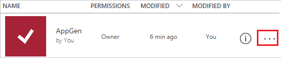
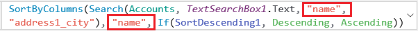

# Tutorial: Customize a gallery in PowerApps
In this tutorial, you'll customize the default browse screen, including the gallery, of an app generated in PowerApps. You can manage data by using the default app without customizing it, but it will be much more powerful and easier to use if you make these changes:

> [!div class="checklist"]
> * Change the layout
> * Change the data that appears
> * Set the columns for filtering and sorting
> * Test filtering and sorting
> * Change the title
> * Show a scrollbar

This tutorial starts with an app generated from the [Common Data Service for Apps](../common-data-service/data-platform-intro.md), but the same concepts apply to apps generated from SharePoint, Excel, and other data sources. 

If you don't have a license for PowerApps, you can [sign up for free](signup-for-powerapps.md).

## Prerequisites
Before you start this tutorial, [generate an app](data-platform-create-app.md) from the Common Data Service for Apps.

## Open the generated app
1. Sign in to [PowerApps](https://web.powerapps.com), and then click or tap **Apps** near the left edge.

	

1. Find the app that you generated, and then click or tap the ellipsis icon (**...**) for it near the right edge.

	

1. In the menu that appears, click or tap the option to edit the app. 

## Customize the gallery
1. On the browse screen, click or tap any item except the first one in the list of accounts.

	This step selects the **Gallery** control, which shows the list of accounts.

	

1. In the right-hand pane, click or tap **Accounts** to the right of the **Data** label.

	

1. In the **Data** pane, click or tap the down arrow to open the list of options under **Layout**.

	

1. In the list of options, click or tap the option that shows only a title.

	

1. In the **Data** pane, click or tap the down arrow to open the list of options for the title.

	

1. In the list of options, click or tap **Account Name (name)** to show that data in the **Gallery** control.

	

## Set the sort and search columns
1. Select the **Gallery** control as the previous section describes.

	

2. Near the upper-left corner, ensure that the property list shows **Items**.

	

	The value of this property appears in the formula bar and determines not only the data source for the gallery but also the filter and sort columns.

1. In the formula bar, replace both instances of **emailaddress1** to **name**, and retain the double-quotation marks that surround each instance.

	The formula should match this example:

	

	The first instance of **name** specifies that the user can filter the list to show only those records for which the account name contains text that the user typed in the search bar. The second instance of **name** specifies that the user can sort the list alphabetically by account name. For more information about these and other functions, see the [formula reference](formula-reference.md).

## Test sorting and searching
1. Open Preview mode by pressing F5 (or by clicking or tapping the play button near the upper-right corner).

	

1. Near the upper-right corner of the browse screen, click or tap the sort icon one or more times to change the alphabetical sort order between ascending and descending.

	

1. In the search box, type **k** to show only those accounts for which the name contains the letter that you typed.

	

1. Remove all text from the search bar, and then close Preview mode by pressing Esc (or by clicking or tapping the close icon *under* the title bar for PowerApps).

## Change the title of the screen
1. Click or tap the title of the screen to select it.

	

1. Ensure that the property list shows **Text**, and then type **Browse**, surrounded by double quotation marks, in the formula bar.

	

	The screen reflects your change.

	

## Show a scroll bar
If your users might not have touch screens or mouse wheels, configure the **Gallery** control to show a scroll bar when the user hovers over it with the mouse. That way, users can show all accounts even if the screen can't show them all at once.

1. Select the **Gallery** control as the first procedure describes.

	

1. On the **Gallery** tab, click or tap **Show scrollbar**, and confirm that the value of that property has changed to **true**. 

## Next steps
In this tutorial, you've customized the **Gallery** control and other controls on the default browse screen of a generated app. You can also customize the default screens for displaying details and creating or updating accounts. Those screens contain a **Display form** control and an **Edit form** control, and you can change (for example) which types of data they show and in which order.

> [!div class="nextstepaction"]
> [Customize forms](customize-form-sharepoint.md)