# Tutorial: Customize a gallery in Power Apps

In this tutorial, you'll customize a list of records, called a gallery, and make other changes in an app that was generated automatically in Microsoft Power Apps. Users can manage data in the app even if you don't make these changes, but the app will be easier to use if you customize it for your organization's needs.

For example, the gallery for this tutorial matches this graphic by default. The email address is featured more prominently than other types of data, and users can sort and filter the gallery based on text in that address:

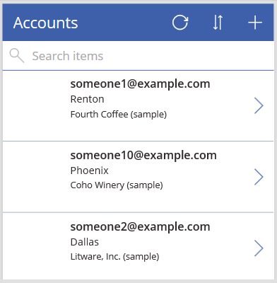

However, your users might be more interested in the account name more than the email address, so you'll reconfigure the gallery to highlight, sort, and filter based on the key data for your organization. In addition, you'll change the title of the default screen to differentiate it from the other screens in the app.

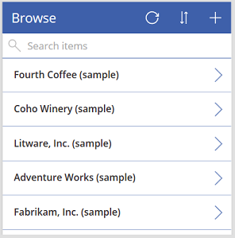

You'll also add a scroll bar so that users who don't have touch screens or mouse wheels can browse the entire gallery.

> [!div class="checklist"]
> * Change the layout of the gallery
> * Change the type of data that appears in the gallery
> * Change the columns by which users can sort and search the data
> * Change the screen title
> * Show a scroll bar

This tutorial starts with an app that was generated from a specific data source. However, the same concepts apply to any app that you generate in Power Apps, whether from a SharePoint list, an Excel table, or some other data source.

If you're not signed up for Power Apps, [sign up for free](https://make.powerapps.com?utm_source=padocs&utm_medium=linkinadoc&utm_campaign=referralsfromdoc) before you start.

## Prerequisites

[Generate an app](data-platform-create-app.md) from the **Accounts** table of Microsoft Dataverse.

## Open the generated app

1. Sign in to [Power Apps](https://make.powerapps.com?utm_source=padocs&utm_medium=linkinadoc&utm_campaign=referralsfromdoc), and then select **Apps** near the left edge.

1. Find the app that you generated, select the ellipsis icon (**...**) for it, and then select **Edit**.

    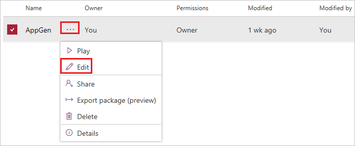

1. If the **Welcome to Power Apps Studio** dialog box appears, select **Skip**.

## Change the layout

1. In the left navigation pane, select **BrowseGallery1**.

    When the gallery is selected, a selection box with handles surrounds it.

    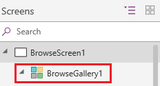

1. On the **Properties** tab of the right-hand pane, open the list of options under **Layout**, and then select the option that shows only a title.

    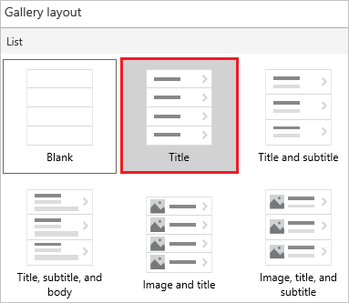

1. Next to **Fields**, select **Edit**, and then select the down arrow for the title box.

    The name of this control will end in a numeral, such as **Title1**, but the numeral might differ based on other actions you might have taken.

1. In the list of options, select **Account name**, and then close the **Data** pane.

    The gallery shows the name of each account.

    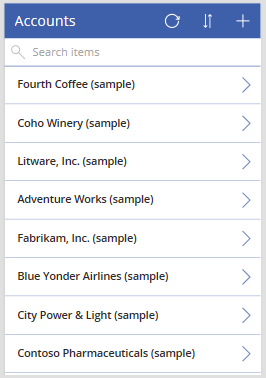

## Change sort and search columns

1. Select the gallery as the previous section describes.

    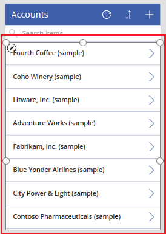

1. Near the upper-left corner, confirm that the property list shows **Items**.

    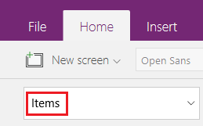

    The value of this property appears in the formula bar. You set this property to specify not only the data source for the gallery but also the columns by which users can sort and search the data.

1. Copy this formula, and then paste it in the formula bar.

    ```SortByColumns(Search(Accounts, TextSearchBox1.Text, "name"), "name", If(SortDescending1, Descending, Ascending))```

    By using this formula, you ensure that:

    * If a user types one or more characters in the search bar, the gallery shows only those account names that contain the text that the user typed.
    * If a user selects the sort icon, the gallery is sorted alphabetically by account name in either ascending or descending order, depending on how many times the user selects the icon.

     For more information about these and other functions, see the [formula reference](formula-reference.md).

### Test sorting and searching

1. Open Preview mode by pressing F5 (or by selecting the play button near the upper-right corner).

    

1. Near the upper-right corner of the browse screen, select the sort icon one or more times to change the alphabetical sort order between ascending and descending.

    

1. In the search box, type **k** to show only those account names that contain the letter that you typed.

    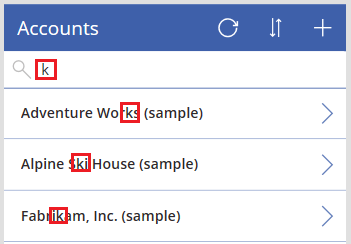

1. Remove all text from the search bar, and then close Preview mode by pressing Esc (or by selecting the close icon near the upper-right corner).

## Change the screen title

1. Select the title of the screen by clicking or tapping it.

    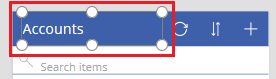

1. Ensure that the property list shows **Text** and then, in the formula bar, replace **Accounts** with **Browse** (retaining the double quotation marks).

    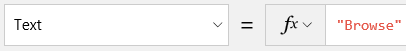

    The screen reflects your change.

    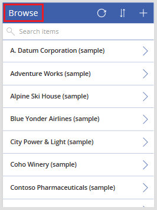

## Show a scrollbar

If your users might have neither touch screens nor mouse wheels, configure the gallery to show a scrollbar when the user hovers over it with the mouse. That way, users can show all accounts even if the screen can't show them all at once.

1. Select the gallery as the first procedure describes.

    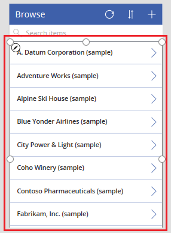

1. Set the gallery's **Show scrollbar** property to **true**.

## Next steps

In this tutorial, you've customized the gallery and made other changes to the default screen for browsing records in a generated app. You can also customize the default screens for displaying details and creating or updating accounts. As the browse screen contains a gallery, the other two screens in the app contain forms. You can change, for example, which types of data the forms show and in which order.

> [!div class="nextstepaction"]
> [Customize forms](customize-forms-sharepoint.md)

### See also

- [SharePoint integration scenarios](sharepoint/scenarios-intro.md)


[!INCLUDE[footer-include](../../includes/footer-banner.md)]