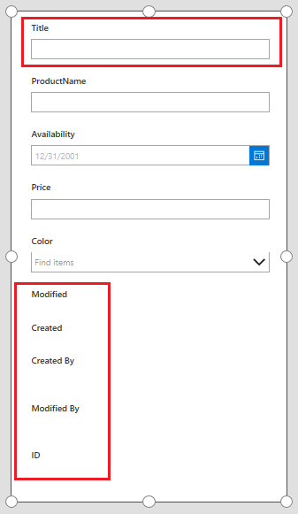
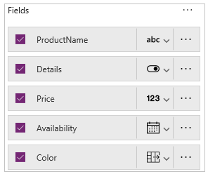

# Customize a SharePoint list form by using PowerApps
You can easily customize the form for a SharePoint list by opening PowerApps in a browser. You don't need to write traditional code, such as C#, or download another app, such as InfoPath. When you publish your changes, the form is embedded within the SharePoint list so that all of its users can use your form. In PowerApps, you can also review analytics reports, create rules for conditional formatting by pointing and clicking, and connect to other data sources.

To follow the steps in this topic, you'll create a simple list so that you can see how customization works, and then you can apply the same concepts to your own list. If the **Customize forms** option isn't available or doesn't work correctly for your list, it might contain data types that [PowerApps doesn't support](connections/connection-sharepoint-online.md#known-issues).

## Customize a form
1. On a SharePoint site, create a list named **NewProducts**, and add these columns:

    - **ProductName** (single line of text)
    - **Availability** (date without time, friendly format)
    - **Price** (currency)
    - **Color** (choice, with options for **Red**, **Green**, and **Blue**)

1. On the command bar, select **PowerApps**, and then select **Customize forms**.

    PowerApps Studio opens in the same browser tab.

1. If the **Welcome to PowerApps Studio** dialog box opens, select **Skip**.

    In the center of your screen, PowerApps shows your form, but it contains some fields that you don't want to show.

    

1. In the **Data** pane, clear the check boxes for each field that you didn't create.

    Those fields disappear from the form, leaving only the fields that you need.

    

1. (optional) Customize your app in a variety of other ways, including these:

    * [Customize the form further](customize-forms-sharepoint.md)
    * [Change the size and orientation](set-aspect-ratio-portrait-landscape.md)
    * [Format the text](controls/properties-text.md)
    * [Add an image](add-images-pictures-audio-video.md) or [add a chart](use-line-pie-bar-chart.md)
    * [Add custom data validation](functions/function-validate.md)
    * [Add rules](working-with-rules.md)
    * [Create more views](https://powerapps.microsoft.com/blog/separate-custom-forms/)

1. When you're done, open the **File** menu, select **Save**, and then select **Publish to SharePoint** twice.

1. In the upper-left corner, select the back arrow, and then select **Back to SharePoint**., and then select **New** in the command bar. The form opens inline on the right-hand side of the browser window.

    

1. If you want to [further customize your form](sharepoint-form-integration.md), click or tap **Customize**, and then make your changes. When you're done, be sure to save your changes.

    

    You can customize and save as many times as you want, but your changes will not be visible in SharePoint until you click or tap **Publish to SharePoint**.

## Toggle between using the default form and your custom form

1. From your list in SharePoint, click or tap **Settings**, click or tap **List settings**, and then click or tap **Form settings**.

1. On the **Form Settings** page, click or tap one of the following, and then click or tap **OK**.

    * **Use the default SharePoint form** - SharePoint will use the default SharePoint form for your list.

    * **Use a custom form created in PowerApps** - SharePoint will use the form that you customized in PowerApps. (Alternatively, you can re-publish the form from the **Save** page in PowerApps Studio.)

    You can toggle back and forth between options, as needed.

    

## Delete the custom list form
1. Open your list in SharePoint, and then select **Settings** > **List settings** > **Form settings**.

1. On the **Form Settings** page, select **Use the default SharePoint form**.

1. Under **Use a custom form created in PowerApps**, select **Delete custom form**.

    

## Q & A

### Forms vs. apps

**Q:** How does a customized list form differ from a standalone app that I create from SharePoint or PowerApps?

**A:** If you customize the form for a SharePoint list, the form doesn't appear as an app in PowerApps Studio or PowerApps Mobile. You can open the form only from the SharePoint list for which you created it.

**Q:** When should I customize a form to manage data in a SharePoint list, and when should I create a standalone app?

**A:** Customize a form if you want your users to manage data without leaving SharePoint (for example, in a desktop browser). Create an app if you want your users to manage data outside of SharePoint (for example, on a mobile device).

**Q:** Can I customize a form and create an app for the same list?

**A:** Yes.

**Q:** Can I customize a list and create an app using the same features?

**A:** Yes.

**Q:** Can I customize a form in an environment other than the default environment in my organization?

**A:** No.

### Manage your customized form

**Q:** How can I easily share my form with others?

**A:** Open the form, select **Copy link**, and then send the link to anyone you want to use the form.

**Q:** Can I update my form without making my changes visible to others?

**A:** Yes. You can change your form and save as many times as you want, but your changes won't be visible to anyone else unless you select **Publish to SharePoint** twice.

**Q:** If I customize a list form and make a mistake, can I revert to a previous version?

**A:** Yes.

1. Open your list, select **PowerApps** on the command bar, and then select **Customize forms**.

1. In PowerApps Studio, select **File**, and then select **See all versions**. The **Versions** page opens in a new browser tab.

    > [!NOTE]
    > If you don't see the **See all versions** button, select **Save**. The button should appear.

1. Without closing the **Versions** page or the browser tab, go back to the **Save** page in the other browser tab, click or tap the arrow at the top of the left navigation pane, and then click or tap **Back to SharePoint** to unlock your form and close PowerApps Studio.

1. Go back to the **Versions** page in the other browser tab, locate the version that you want to restore, and then select **Restore**.

    > [!NOTE]
    > If you get an error message saying the restore failed because the form is locked by another user, wait until the user unlocks the form, and then try again.

**Q:** Can I move my form from one list to another?

**A:** No.

### Administer custom list forms

**Q:** How do I share my form?

**A:** You don't need to share the form - the form inherits permissions from the SharePoint list. When you're done customizing it, just [publish it back to SharePoint](customize-list-form.md#save-and-publish-the-list-form-back-to-sharepoint) so that others can use it.

**Q:** Who can customize list forms?

**A:** Anyone with SharePoint permissions to manage, design, or edit the associated list.

**Q:** Do I need a PowerApps license to create or use custom list forms?

**A:** You need an [Office 365 plan that includes PowerApps](../../administrator/pricing-billing-skus.md#licenses).

**Q:** What happens when guest users access a list that has a custom form?

**A:** Guest users get an error message if they try to access a list form that's been customized using PowerApps.

**Q:** As an administrator, how do I get a list of all customized forms in my organization?

**A:** If you're a tenant administrator for PowerApps or you have environment-administrator permissions on the default PowerApps environment of your organization, do the following:

1. In the [PowerApps admin center](https://admin.powerapps.com), select the default environment for your organization from the list of environments.

1. At the top of the default environment page, select **Resources**.

1. From the list of apps, look for apps with a **SharePoint Form** app type - these are the customized forms.

    
