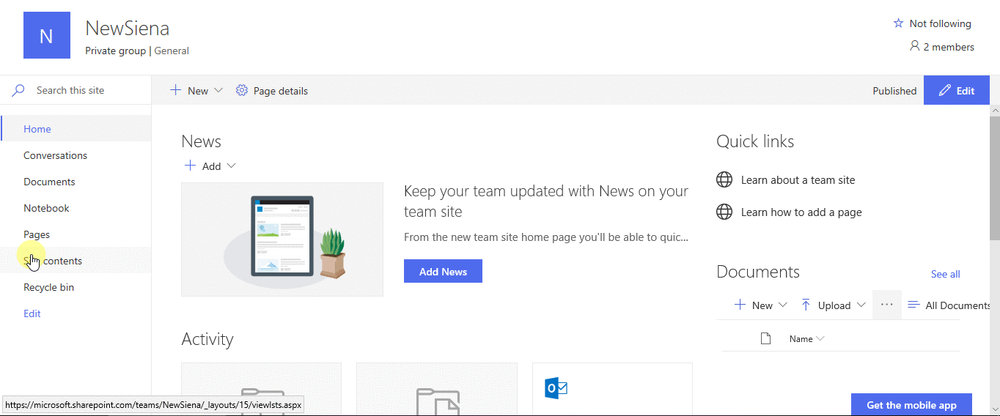
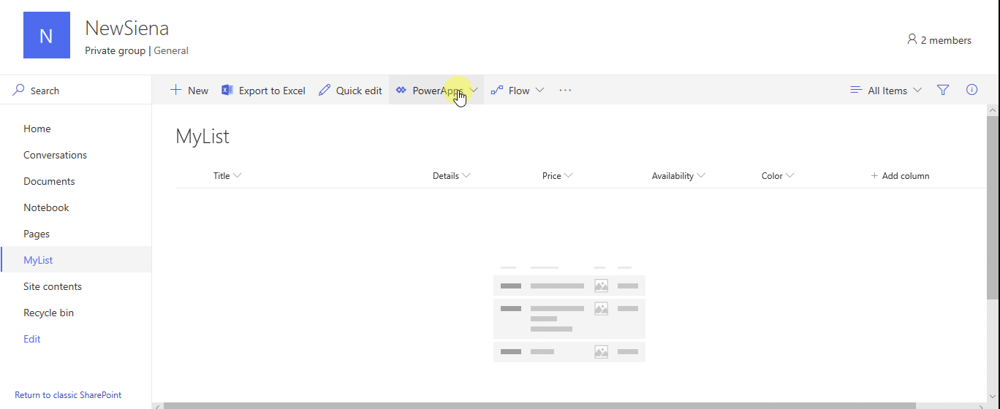
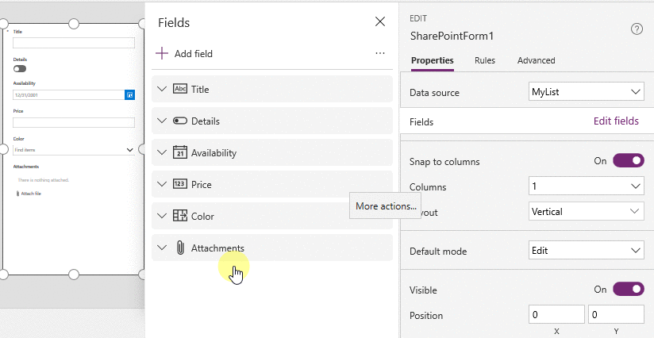
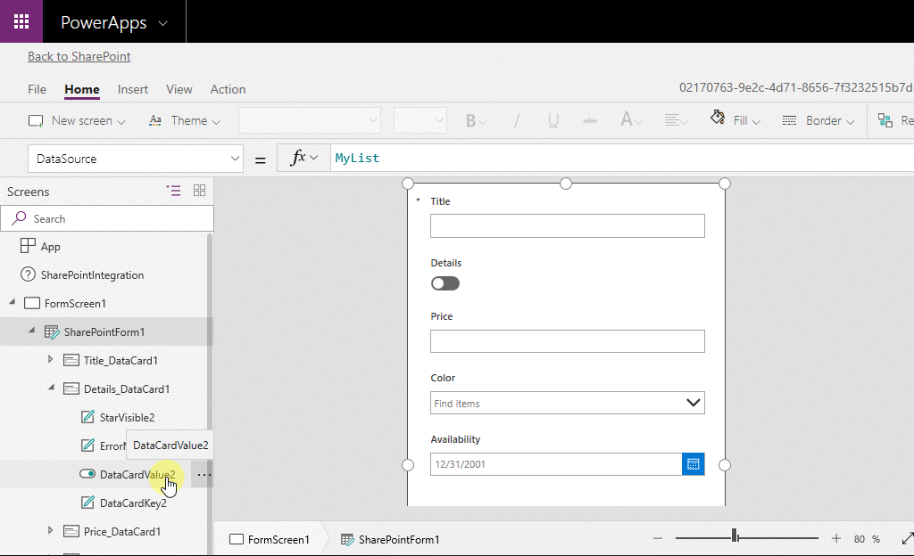
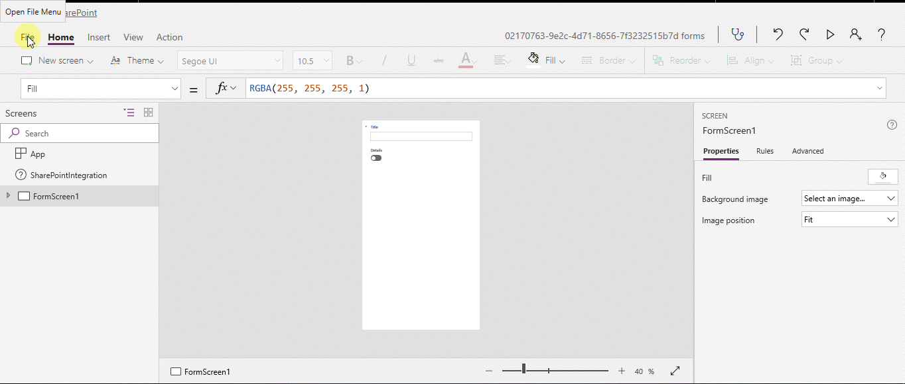
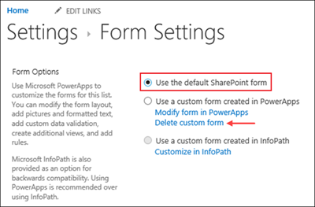
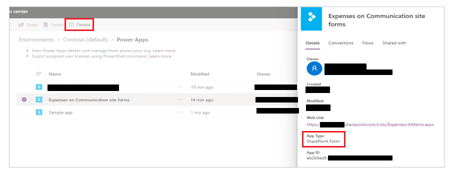

# Customize a SharePoint list or library form by using Power Apps

You can easily customize the form for a SharePoint list or SharePoint document library by opening Power Apps in a browser. You don't need to write traditional code, such as C#, or download another app, such as InfoPath. When you publish your changes, the form is embedded within the SharePoint list for use by all of its users. In Power Apps, you can also review analytics reports, easily create conditional formatting, and connect to other data sources.

To follow the steps in this article, you'll create a list so that you can see how customization works, and then you can apply the same concepts to your own list.

> [!NOTE]
> - If the **Customize forms** option isn't available or doesn't work correctly for your list, it might contain data types that [Power Apps doesn't support](connections/connection-sharepoint-online.md#known-issues). Also, you can't move your form to a different list or [environment](/power-platform/admin/working-with-environments). 
> - Custom forms for lists are only supported in generic lists and generic document libraries. Custom list and library templates are currently not supported; including but not limited to lists such as Announcements, Contacts and Tasks.
> - Custom forms for document libraries only supports editing custom metadata. Editing or managing file(s) is not supported.
> - Additional actions are needed when changing the address of a SharePoint site that uses custom forms. More information: [Effects of changing a SharePoint site address on Power Apps](/sharepoint/change-site-address#effects-of-changing-a-site-address).
> - To access custom form, users must have access to the SharePoint list.

Watch this video to learn how to customize a list form:
> [!VIDEO https://www.microsoft.com/videoplayer/embed/RWLvLK]

## Requirements

Using, creating and editing SharePoint list forms requires the following for organization users and guests.

|User type  |SharePoint custom form action  |Requirements  |
|---------|---------|---------|
|Guest     |View         |<ul> <li> View access to SharePoint site hosting the custom form. </li> <li> Power Apps plan that includes use rights to connect to Office.   **Note:** Separate licenses may be required for custom forms that use Premium capabilities. </li> </ul>          |
|Guest    |Create/Edit         |<ul> <li> Edit access to SharePoint site hosting the custom form. </li> <li> Power Platform Environment Maker security role in environment hosting the SharePoint site. </li> </ul>           |
|Organization user    |View        |<ul> <li> View access to SharePoint site hosting the custom form. </li> <li> Power Apps plan that includes use rights to connect to Office.   **Note:** Separate licenses may be required for custom forms that use Premium capabilities. </li> </ul>          |
|Organization user     |Create/Edit         |<ul> <li> Edit access to SharePoint site hosting the custom form. </li> <li> Power Platform Environment Maker security role in environment hosting the SharePoint site. </li> </ul>         |

More information:

- [Licensing Guide section: Power Apps user rights included with Microsoft 365](https://go.microsoft.com/fwlink/?linkid=2085130)
- [What license must be assigned to my guest so they can run an app shared with them?](share-app-guests.md#what-license-must-be-assigned-to-my-guest-so-they-can-run-an-app-shared-with-them)
- [Microsoft 365 plan that includes Power Apps](/power-platform/admin/pricing-billing-skus#licenses)
- [Premium connectors](/connectors/connector-reference/connector-reference-premium-connectors)

## Create a list

On a SharePoint site, create a list, and then add these columns to that list:

- **Details** (yes/no)
- **Price** (currency)
- **Availability** (date without time)
- **Color** (choice)

> [!div class="mx-imgBorder"]
> 

## Open the form

1. In the command bar, select **Integrate** -> **Power Apps** -> **Customize forms**.

    Power Apps Studio opens in the same browser tab.

1. If the **Welcome to Power Apps Studio** dialog box opens, select **Skip**.

> [!div class="mx-imgBorder"]
> 

## Move and remove a field

1. Drag the **Availability** field to the bottom of the list of fields.

    The fields appear in the order that you specify.

1. Hover over the **Attachments** field, select the ellipsis (...) that appears, and then select **Remove**.

    The field that you specify disappears from the form.

> [!div class="mx-imgBorder"]
> 

## Set conditional formatting

You can configure the **Price**, **Availability**, and **Colors** fields to appear only if **Details** is set to yes.

1. In the left navigation bar, expand **Details_DataCard1**, and note the numeral that appears at the end of **DataCardValue**.

1. Set the **Visible** property of the **Color**, **Availability**, and **Price** cards to this formula (replacing, if necessary, the numeral with the one that you noted in the previous step):

    **If(DataCardValue2.Value = true, true)**

1. Keep the **Alt** key on the keyboard pressed, and select the **Details** toggle multiple times.

    The three fields that you configured appear and disappear from the form.

> [!div class="mx-imgBorder"]
> 

## Save and publish the form

1. Open the **File** menu, select **Save**, and then select **Publish to SharePoint** twice.

1. In the upper-left corner, select the back arrow, and then select **Back to SharePoint**.

> [!div class="mx-imgBorder"]
> 

## Further customize your form

1. Open your list, select **New** in the command bar, and then select **Customize** near the top of the form.

1. Customize your form in different ways, such as those that these articles describe:

    - Change its size, orientation, or both (for example, to [make the form wider](set-aspect-ratio-portrait-landscape.md)).
    - [Customize one or more cards](working-with-cards.md) (for example, change a card's display text or input control).
    - Create a [lookup field](sharepoint-lookup-fields.md).

    More information: [Understand SharePoint forms integration](sharepoint-form-integration.md).

## Use the default form

1. From your list in SharePoint, open the settings page (by selecting the gear icon near the upper-right corner), and then select **List settings**.

2. Under **General settings**, select **Form settings**.

3. On the **Form Settings** page, select one of these options, and then select **OK**.

    - **Use the default SharePoint form** - When a user opens your list and selects **New** in the command bar, the default form for the list will appear.

    - **Use a custom form created in Power Apps** - When a user opens your list and selects **New** in the command bar, your custom form will appear. (As an alternative, you can publish the form again in Power Apps.)

    You can toggle back and forth between options, as needed.

    

## Delete the custom form

1. From your list in SharePoint, open the settings page (by selecting the gear icon near the upper-right corner), and then select **List settings**.

1. Under **General settings**, select **Form settings**.

1. On the **Form Settings** page, select **Use the default SharePoint form**, and then select **Delete custom form**.

    

## Q & A

### Forms vs. apps

**Q:** How does a customized form differ from a standalone app that I create from SharePoint or Power Apps?

**A:** If you customize the form for a SharePoint list, the form doesn't appear as an app in Power Apps Studio or Power Apps Mobile. You can open the form only from the list for which you created it.

**Q:** When should I customize a form to manage data in a SharePoint list, and when should I create a standalone app?

**A:** Customize a form if you want your users to manage data without leaving SharePoint (for example, in a desktop browser). Create an app if you want your users to manage data outside of SharePoint (for example, on a mobile device).

**Q:** Can I customize a form and create an app for the same list?

**A:** Yes.

**Q:** Can I customize a list and create an app using the same features?

**A:** Yes.

**Q:** Can I customize a form in an environment other than the default environment in my organization?

**A:** No.

### Manage your custom form

**Q:** How can I easily share my form with others?

**A:** Open the form, select **Copy link**, and then send the link to others.

**Q:** Can I update my form without making my changes visible to others?

**A:** Yes. You can change your form and save as many times as you want, but your changes won't be visible to anyone else unless you select **Publish to SharePoint**.

**Q:** If I customize a list form and make a mistake, can I revert to a previous version?

**A:** Yes.

1. Open your list, select **Integrate** -> **Power Apps** -> **Customize forms**.

1. In Power Apps Studio, select **File**, and then select **See all versions**. The **Versions** page opens in a new browser tab.

    > [!NOTE]
    > If you don't see the **See all versions** button, select **Save**. The button should appear.

1. Without closing the **Versions** page or the browser tab, go back to the **Save** page in the other browser tab, select the arrow at the top of the left navigation pane, and then select **Back to SharePoint** to unlock your form and close Power Apps Studio.

1. Go back to the **Versions** page in the other browser tab, locate the version that you want to restore, and then select **Restore**.

    > [!NOTE]
    > If you get an error message saying that the restore failed because the form is locked by another user, wait until the user unlocks the form, and then try again.

**Q:** Can I move my form from one list to another?

**A:** No.

**Q:** What happens to my custom form if the list is deleted or restored from the Recycle Bin?

**A:** Deleting a list automatically deletes the associated custom form. If a list that contains an associated custom form is restored from the Recycle Bin, the custom form is also restored automatically with the list.

### Administer your custom form

**Q:** How do I share my form?

**A:** You don't need to share the form—the form inherits permissions from the SharePoint list. When you're done customizing it, just [publish it back to SharePoint](customize-list-form.md#save-and-publish-the-form) so that others can use it.

**Q:** Who can customize forms?

**A:** See [Requirements](#requirements).

**Q:** Do I need a Power Apps license to create or use custom list forms?

**A:** See [Requirements](#requirements).

**Q:** What happens when guest users access a list that has a custom form?

**A:** See [Requirements](#requirements).

**Q:** As an administrator, how do I get a list of all customized forms in my organization?

**A:** You can’t list all the customized forms in the organization. However, a tenant administrator for Power Apps, or environment-administrator for the default Power Apps environment can do the following to check the app type as **SharePoint Form** for individual apps:

1. In the [Power Platform admin center](https://admin.powerplatform.microsoft.com/), select the default environment for your organization from the list of environments.

1. Select **Power Apps** from the **Resources** section on the right.

1. Select the app.

1. Select **Details**.

1. Check the **App Type**.

    If the app type is SharePoint Form, the app is a customized form.

    

### See also

- [Manage who can share canvas apps](/power-platform/admin/admin-manage-apps#manage-who-can-share-canvas-apps)
- [Assign a security role](/power-platform/admin/create-users#assign-a-security-role)
- [Licensing overview for Microsoft Power Platform](/power-platform/admin/pricing-billing-skus)
- [Understand Power Platform environments](/power-platform/admin/environments-overview)

[!INCLUDE[footer-include](../../includes/footer-banner.md)]