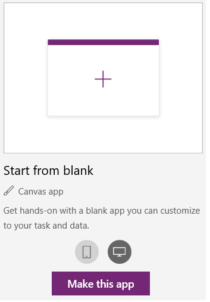
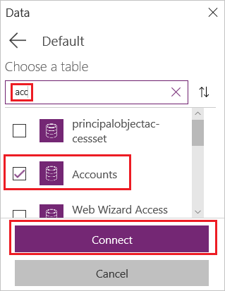

# Create a canvas app from scratch using Common Data Service for Apps

Build a canvas app to manage data that's stored in Common Data Service for Apps, using standard entities (which are built in), custom entities (which your organization creates), or both.

When you build an app from the Common Data Service, you don't need to create a connection from PowerApps, as you do with data sources such as SharePoint, Dynamics 365, or Salesforce. You only need to specify the entities that you want to show, manage, or use for both activities in the app.

## Prerequisites

- Before you create an app from scratch, familiarize yourself with PowerApps basics by [generating an app](data-platform-create-app.md) and then customizing that app's [gallery](customize-layout-sharepoint.md), [forms](customize-forms-sharepoint.md), and [cards](customize-card.md).
- [Switch to an environment](working-with-environments.md) in which a database has been created with sample data. If you have an appropriate license, you can [create an environment](../../administrator/create-environment.md) to meet this need.
- To create an app, you must be assigned to the [Environment Maker](https://docs.microsoft.com/power-platform/admin/database-security.md#predefined-security-roles) security role.

## Open a blank app

1. Sign in to [PowerApps](http://web.powerapps.com?utm_source=padocs&utm_medium=linkinadoc&utm_campaign=referralsfromdoc).

1. Under **Make your own app**, hover over the **Start from blank** tile for canvas apps, click or tap the phone icon, and then click or tap **Make this app**.

    

    You can design an app from scratch for phones or other devices (such as tablets); this topic will focus on designing an app for phones.

## Specify an entity

1. In the middle of the screen, click or tap **connect to data** and then, in the **Data** pane, click or tap the **Common Data Service** connection.

1. In the search box, type or paste the first few letters of **Accounts** to filter the list of entities, select the **Accounts** check box, and then click or tap **Connect**.

    

1. Close the **Data** pane by clicking or tapping the close icon in the upper-right corner.

## Add a list screen

1. On the **Home** tab, click or tap the down arrow for **New screen**, and then click or tap **List screen**.

    

1. In the left navigation bar, click or tap **TemplateGalleryList1** to select it, and then set the value of the **Items** property to this formula:

    `SortByColumns(Search(Accounts, TextSearchBox1.Text, "name"), "name", If(SortDescending1, SortOrder.Descending, SortOrder.Ascending))`

    This formula specifies that:

   - The gallery should show data from the **Accounts** entity.
   - The data should be sorted in ascending order until a user clicks or taps the sort button to toggle the sort order.
   - If a user types or pastes one or more characters into the search bar, the list will show only those accounts for which the name field contains the characters that the user specified.

     You can use [these and many other functions](formula-reference.md) to specify how your app appears and behaves.

     

1. Set the gallery's layout to show only the name of each account, and configure the title bar to show the word **Browse**, as [Customize a gallery](customize-layout-sharepoint.md) describes.

    

1. In the left navigation bar, hover over **Screen1**, click or tap the ellipsis icon (...), and then click or tap **Delete**.

1. In the left navigation bar, hover over **Screen2**, click or tap the ellipsis icon (...), and then click or tap **Rename**.

1. Type or paste **BrowseScreen**, and then rename the gallery in that screen as **BrowseGallery**.

    

## Add a form screen

1. Repeat the first step of the previous procedure, except add a **Form screen** instead of a **List screen**.

1. Set the form's **DataSource** property to **Accounts** and its **Item** property to **BrowseGallery.Selected**, as shown on the **Advanced tab** of the right-hand pane.

    

1. On the **Properties** tab of the right-hand pane, click or tap **Accounts** to open the **Data** pane, and then select the checkboxes for these fields:

    - Account name
    - Address 1: Street 1
    - Address 1: City
    - Address 1: ZIP/Postal code
    - Number of Employees
    - Annual Revenue

1. Set the title bar's **Text** property to show **Create/Edit**.

    The screen reflects your changes.

    

1. Rename this screen **FormScreen**.

## Configure icons

1. On the **BrowseScreen**, click or tap the circular icon near the top of the screen, and set its **OnSelect** property to this formula:

    `Refresh(Accounts)`

    

1. Click or tap the plus icon, and set its **OnSelect** property to this formula:

    `NewForm(EditForm1); Navigate(FormScreen, ScreenTransition.None)`

    

1. Click or tap the first arrow pointing to the right, and set its **OnSelect** property to this formula:

    `EditForm(EditForm1); Navigate(FormScreen, ScreenTransition.None)`

    

1. On the **FormScreen**, click or tap the cancel icon, and set its **OnSelect** property to this formula:

    `ResetForm(EditForm1);Navigate(BrowseScreen, ScreenTransition.None)`

    

1. Click or tap the checkmark icon, and set its **OnSelect** property to this formula:

    `SubmitForm(EditForm1); Navigate(BrowseScreen, ScreenTransition.None)`

    

1. On the **Insert** tab, click or tap **Icons**, and then click or tap the **Trash** icon.

1. Set the **Trash** icon's **Color** property to **White** and its **OnSelect** property to this formula:

    `Remove(Accounts, BrowseGallery.Selected); Navigate(BrowseScreen, ScreenTransition.None)`

    

## Test the app

1. In the left navigation bar, select **BrowseScreen**, and then open Preview by pressing F5 (or by clicking or tapping the play icon near the upper-right corner).

    

1. Toggle the list between ascending and descending sort orders, and filter the list by specific characters in each account name.

1. Add an account, edit the account that you added, start to update the account but cancel your changes, and then delete the account.

## Next steps

- [Link this app to a solution](add-app-solution.md) so that you can, for example, deploy it to a different environment or publish it on AppSource.
- [Open one or more sample apps](open-and-run-a-sample-app.md), and explore different types of apps that you can create.
