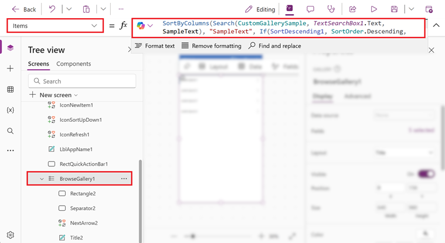
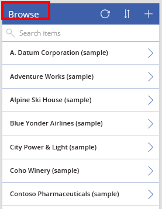
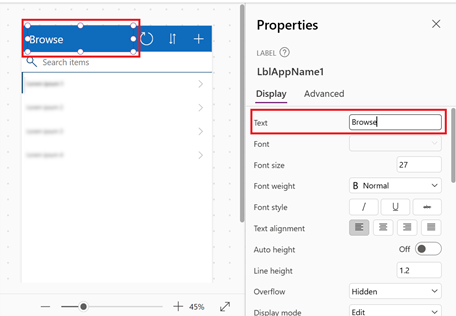
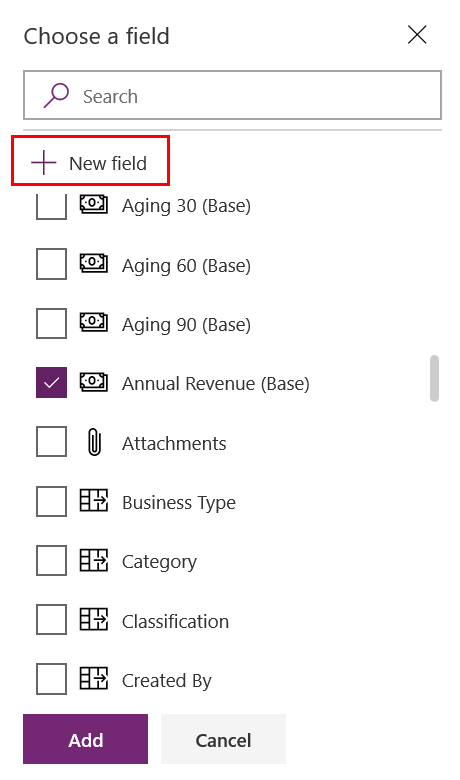
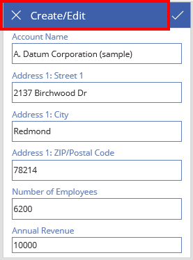
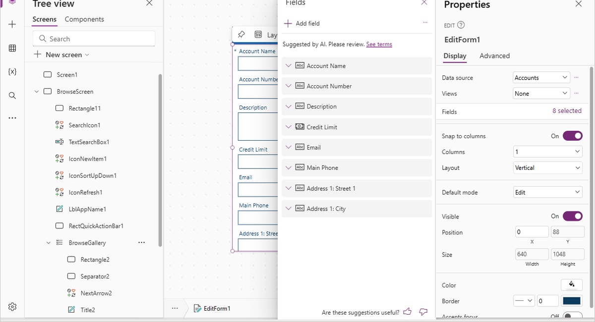

# Create a canvas app using Microsoft Dataverse

Microsoft Dataverse provides a secure, cloud-based platform for storing and managing business data. With Power Apps, you can create canvas apps that connect directly to Dataverse to display, edit, and manage your organization's data without complex data connections.

This article shows you how to build canvas apps using Dataverse tables. You'll learn three different approaches: generating apps from existing data, creating new tables and apps together, and building custom apps from scratch. Whether you're working with standard tables or custom organizational data, these methods help you create functional business apps quickly.

## Prerequisites

- [Switch to an environment](intro-maker-portal.md#choose-an-environment) where a database is created with sample data. If you have an appropriate license, you can [create an environment](/power-platform/admin/create-environment) to meet this need.
- Ensure you have the [Environment Maker](/power-platform/admin/database-security#predefined-security-roles) security role, either directly or through a Dataverse team that is part of the **AAD Security Group** category. Custom security roles aren't currently supported for Canvas App maker scenarios.

## Create an app

1. Sign in to [Power Apps](https://make.powerapps.com?utm_source=padocs&utm_medium=linkinadoc&utm_campaign=referralsfromdoc).

1. From the home screen, choose one of the following options based on how you want to create your app using Dataverse:

    | Create options using Dataverse | Benefits | Navigation |
    |---|---|---|
    | A single-page gallery app | Use your existing business data in Dataverse and create a lightweight responsive app. | Select **Start with data** > **Dataverse**. Select a table and select **Create app**. |
    | Create new data and build an app | Set up structured tables in Dataverse to organize data and build secure, scalable apps. | Select **Start with data** > **Create new data**. Use the table designer or Copilot to create tables, then select **Save and exit**. |
    | Blank app that uses data from Dataverse | Use your existing business data in Dataverse to tailor your app with flexibility, free from the limitations of predesigned templates. | In the left navigation pane, select **Create** > **Start with blank canvas** > **Phone size**. |

    > [!NOTE]
    > The Power Apps home screen now surfaces a **vibe.powerapps.com** prompt, introducing a new experience that brings together generative design, AI agents, and plan-driven workflows. You can try this experience to go from idea to a working app faster.

1. The app is created and [Power Apps Studio](power-apps-studio.md) opens, where you continue building the app.

## Start with data using Dataverse

The **Start with data** experience lets you quickly connect to an existing Dataverse table and generate a canvas app. You can also create new tables directly from this experience.

### Connect to an existing Dataverse table

1. Sign in to [Power Apps](https://make.powerapps.com?utm_source=padocs&utm_medium=linkinadoc&utm_campaign=referralsfromdoc).

1. From the home screen, select **Start with data**.

1. On the **Create an app** page, select **Dataverse**.

1. Select an existing Dataverse table and select **Create app**.

Power Apps Studio opens with a gallery app connected to your selected table.

### Create new data

If you don't have an existing table, you can create one directly from the **Start with data** experience.

1. From the home screen, select **Start with data**.

1. Select **Create new data**.

1. In the **Create new tables** designer, you can:
   - Add a new table by selecting **+ New table**.
   - Add an existing table by selecting **+ Existing table**.
   - Use **Copilot** to describe your tables, columns, rows, and relationships, and it generates them for you.
   - Import data from Excel or .CSV files, or SharePoint lists by selecting **Import data** in the Copilot pane.

    :::image type="content" source="media/data-platform-create-app/create-new-tables.png" alt-text="Screenshot of the Create new tables designer with Copilot pane open.":::

1. When you finish defining your tables, select **Save and exit** to generate the app.

## Add a Dataverse table in a blank app

To help you understand how to create an app with data from Dataverse, start by creating a blank app and then adding data from Dataverse.

1. Sign in to [Power Apps](https://make.powerapps.com?utm_source=padocs&utm_medium=linkinadoc&utm_campaign=referralsfromdoc).

1. In the left navigation pane, select **Create** > **Start with blank canvas** > **Phone size**.

1. When Power Apps Studio opens, go to the [app authoring menu](power-apps-studio.md#5--app-authoring-menu) and select **Data**.

   > [!NOTE]
   > If this is your first time connecting to Dataverse, you're prompted to create a connection. Select **Create** to establish the connection.

1. Select **Add data**, enter **Accounts** in the search box, and select it.

1. Close the **Data** pane by selecting the close icon in the upper right corner.

    :::image type="content" source="media/data-platform-create-app-scratch/close-data.png" alt-text="Screenshot of the close data pane.":::

### Add a list screen

1. On the command bar, select **New screen** > **List**.

1. In the left navigation bar, select **BrowseGallery1**, and then set the value of the **Items** property to this formula:

    `SortByColumns(Search(Accounts, TextSearchBox1.Text, "name"), "name", If(SortDescending1, SortOrder.Descending, SortOrder.Ascending))`

    This formula specifies that:

   - The gallery shows data from the **Accounts** table.
   - The data is sorted in ascending order until a user selects the sort button to toggle the sort order.
   - If a user types or pastes one or more characters into the search bar (**TextSearchBox1**), the list shows only those accounts for which the **name** field contains the characters that the user specified.

     You can use [these and many other functions](formula-reference.md) to specify how your app appears and behaves.

     

1. In the gallery's **Properties** pane, set the **Layout** to **Title**.

1. Edit the **Title** text property and rename it to **Browse**. For more information, see [Customize a gallery](customize-layout-sharepoint.md).

    

1. In the left app authoring pane, hover over **Screen1**, select the ellipsis icon (...), and then select **Delete**.

1. In the left app authoring pane, hover over **Screen2**, select the ellipsis icon (...), and then select **Rename**.

1. Type or paste **BrowseScreen**, and then rename the gallery in that screen as **BrowseGallery**.

    

### Add a form screen

1. Repeat the first step of the previous procedure, but add a **Form** screen instead of a **List** screen.

1. Set the form's **DataSource** property to **Accounts** and its **Item** property to **BrowseGallery.Selected** as the **Advanced** tab of the right-hand pane shows.

1. On the **Properties** tab of the right-hand pane, select **Edit Fields** to open the **Fields** pane.

1. Select **Add field**, and then select the checkboxes for these fields:

    - **Account Name**
    - **Address 1: Street 1**
    - **Address 1: City**
    - **Address 1: ZIP/Postal code**
    - **Number of Employees**
    - **Annual Revenue**

    > [!NOTE]
    > Outside of this scenario, you can create a custom field by selecting **New field**, providing the required information, and then selecting **Done**. For more information, see [Create a column](../data-platform/create-edit-field-portal.md#create-a-column).  

1. Select **Add**.

1. Set the title bar's **Text** property to show **Create/Edit**.

    The screen reflects your changes.

    

1. Rename this screen **FormScreen**.

### Configure icons

1. On the **BrowseScreen**, set the **OnSelect** property of the circular icon near the top of the screen to this formula:

    `Refresh(Accounts)`

    

1. Set the **OnSelect** property of the plus icon to this formula:

    `NewForm(EditForm1); Navigate(FormScreen, ScreenTransition.None)`

    

1. Set the **OnSelect** property of the first arrow pointing to the right to this formula:

    `EditForm(EditForm1); Navigate(FormScreen, ScreenTransition.None)`

    

1. On the **FormScreen**, set the **OnSelect** property of the cancel icon to this formula:

    `ResetForm(EditForm1);Navigate(BrowseScreen, ScreenTransition.None)`

    

1. Set the **OnSelect** property of the checkmark icon to this formula:

    `SubmitForm(EditForm1); Navigate(BrowseScreen, ScreenTransition.None)`

    

1. On the **Insert** tab, select **Icons**, and then select the **Trash** icon.

1. Set the **Trash** icon's **Color** property to **White** and its **OnSelect** property to this formula:

    `Remove(Accounts, BrowseGallery.Selected); Navigate(BrowseScreen, ScreenTransition.None)`

    

### Test the app

1. On the actions menu, select  **Preview the app**. For more information, see [Preview an app](preview-app.md).

1. Toggle the list between ascending and descending sort orders, and filter the list by one or more characters in the account name.

1. Add an account, edit the account that you added, start to update the account, but cancel your changes, and then delete the account.

## See also

- [Vibe coding in Power Apps (preview)](vibe-coding.md)
- [Customize a gallery](customize-layout-sharepoint.md)
- [Create a column](../data-platform/create-edit-field-portal.md#create-a-column)

[!INCLUDE[footer-include](../../includes/footer-banner.md)]
