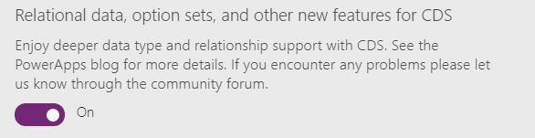
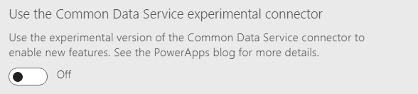

# Delegable data sources in canvas apps
As the [Understand delegation](delegation-overview.md) article outlines in detail, delegation is where PowerApps will delegate the processing of data to the data source rather than moving data to the canvas app for processing locally.

Delegation is supported for tabular data sources only. This list identifies tabular data sources and whether they support delegation, with details in the next section.

* Common Data Service (CDS) for Apps - **Yes**
* SharePoint - **Yes**
* SQL Server - **Yes**
* Dynamics 365 - **Yes**
* Salesforce - **Yes**
* Dynamics 365 for Operations - Not yet
* Dynamics 365 for Financials - Not yet
* Dynamics NAV - Not yet
* Google Sheets - Not yet

More tabular data sources and delegation support for them are being added continuously.

This document lists the current state of supported delegation per data source.

## Prerequisites

Familiarize yourself with the [Understand delegation](delegation-overview.md) article.

## List of data sources and supported delegation
This list of data sources and delegable functions and predicates will be updated periodically to reflect the current status of delegation support in PowerApps.

### Top-level delegable functions

| &nbsp; | CDS for Apps | SharePoint | SQL Server | Dynamics 365 | Salesforce |
| --- | --- | --- | --- | --- | --- |
| Average |Yes2 |No |Yes |No |No |
| Filter |Yes |Yes |Yes |Yes |Yes |
| LookUp |Yes |Yes |Yes |Yes |Yes |
| Max |Yes2 |No |Yes |No |No |
| Min |Yes2 |No |Yes |No |No |
| Search |Yes1 |No |Yes |Yes |Yes |
| Sort |Yes |Yes |Yes |Yes |Yes |
| SortByColumns |Yes |Yes |Yes |Yes |Yes |
| Sum |Yes2 |No |Yes |No |No |

1 For string fields only. 
2 **See note below**. The aggregate functions are limited to a collection of 50,000 records. If needed, use the [**Filter**](functions/function-filter-lookup.md) function to select 50,000 records from a larger set before using the aggregate function.

> [!NOTE]
> Aggregate functions for CDS for Apps are supported only with the new version of the connector. Depending on the version of PowerApps that you're using, enable this connector with either this Preview switch: 
>  
> or this Experimental switch: 
>  
> To find both switches, open the **File menu**, and then select **App settings** > **Advanced settings**.

### Filter and LookUp delegable predicates

| &nbsp; | CDS for Apps | SharePoint | SQL Server | Dynamics 365 | Salesforce |
| --- | --- | --- | --- | --- | --- |
| Not |Yes |No |Yes |Yes |Yes |
| IsBlank |No |No |Yes |Yes |No |
| TrimEnds |No |No |Yes |No |No |
| Len |No |No |Yes |No |No |
| +, - |No |No |Yes |No |No |
| <, <=, =, <>, >, >= |Yes |Yes3 |Yes |Yes |Yes |
| And (&&), Or (&#124;&#124;), Not (!) |Yes4 |Yes (except Not(!)) |Yes |Yes |Yes |
| in |No |No |Yes |No |Yes |
| StartsWith |No |Yes |No |No |No |

3 For numeric columns, all operators can be delegated. For ID columns, only the '=' can be delegated. Date columns can't be delegated. 
4 For operators only. And/Or/Not functions aren't delegated.
