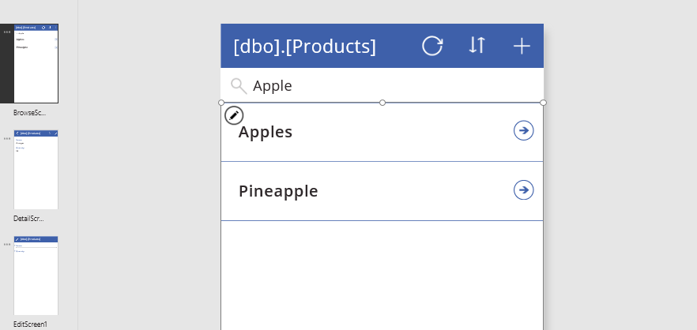

# Understand delegation in a canvas app

Power Apps includes a powerful set of functions for filtering, sorting, and shaping tables of data in a canvas app: **[Filter](functions/function-filter-lookup.md)**, **[Sort](functions/function-sort.md)**, and **[AddColumns](functions/function-table-shaping.md)** functions to name just a few. With these functions, you can provide your users with focused access to the information they need. For those with a database background, using these functions is the equivalent of writing a database query.

The key to building efficient apps is to minimize the amount of data that must be brought to your device. Perhaps you need only a handful of records from a sea of million, or a single aggregate value can represent thousands of records. Or perhaps only the first set of records can be retrieved, and the rest brought in as the user gestures that they want more. Being focused can dramatically reduce the processing power, memory, and network bandwidth that your app needs, resulting in snappier response times for your users, even on phones connected via a cellular network. 

*Delegation* is where the expressiveness of Power Apps formulas meets the need to minimize data moving over the network. In short, Power Apps will delegate the processing of data to the data source, rather than moving the data to the app for processing locally.

Where this becomes complicated, and the reason this article exists, is because not everything that can be expressed in a Power Apps formula can be delegated to every data source. The Power Apps language mimics Excel's formula language, designed with complete and instant access to a full workbook in memory, with a wide variety of numerical and text manipulation functions. As a result, the Power Apps language is far richer than most data sources can support, including powerful database engines such as SQL Server.

**Working with large data sets requires using data sources and formulas that can be delegated.** It's the only way to keep your app performing well and ensure users can access all the information they need. Take heed of delegation warnings that identify places where delegation isn't possible. If you're working with small data sets (fewer than 500 records), you can use any data source and formula because the app can process data locally if the formula can't be delegated. 

> [!NOTE]
> Delegation warnings were previously flagged in Power Apps as "blue dot" suggestions, but delegation suggestions have since been re-classified as warnings. If the data in your data source exceeds 500 records and a function can't be delegated, Power Apps might not be able to retrieve all of the data, and your app may have wrong results. Delegation warnings help you manage your app so that it has correct results.

## Delegable data sources
Delegation is supported for certain tabular data sources only. If a data source supports delegation, its [connector documentation](/connectors/) outlines that support. For example, these tabular data sources are the most popular, and they support delegation:

- [Power Apps delegable functions and operations for Microsoft Dataverse](connections/connection-common-data-service.md#power-apps-delegable-functions-and-operations-for-dataverse) 
- [Power Apps delegable functions and operations for SharePoint](/connectors/sharepointonline/#power-apps-delegable-functions-and-operations-for-sharepoint) 
- [Power Apps delegable functions and operations for SQL Server](/connectors/sql/#power-apps-delegable-functions-and-operations-for-sql-server) 
- [Power Apps delegable functions and operations for Salesforce](/connectors/salesforce/#power-apps-delegable-functions-and-operations-for-salesforce) 

Imported Excel workbooks (using the **Add static data to your app** data source), collections, and tables stored in context variables don't require delegation. All of this data is already in memory, and the full Power Apps language can be applied.

## Delegable functions
The next step is to use only those formulas that can be delegated. Included here are the formula elements that could be delegated. However, every data source is different, and not all of them support all of these elements. Check for delegation warnings in your particular formula.

These lists will change over time. We're working to support more functions and operators with delegation.

### Filter functions
**[Filter](functions/function-filter-lookup.md)**, **[Search](functions/function-filter-lookup.md)**, and **[LookUp](functions/function-filter-lookup.md)** can be delegated.  

Within the **Filter** and **LookUp** functions, you can use these with columns of the table to select the appropriate records:

* **[And](functions/function-logicals.md)** (including **[&&](functions/operators.md)**), **[Or](functions/function-logicals.md)** (including **[||](functions/operators.md)**), **[Not](functions/function-logicals.md)** (including **[!](functions/operators.md)**)
* **[In](functions/operators.md)**
* **[=](functions/operators.md)**, **[<>](functions/operators.md)**, **[>=](functions/operators.md)**, **[<=](functions/operators.md)**, **[>](functions/operators.md)**, **[<](functions/operators.md)**
* **[+](functions/operators.md)**, **[-](functions/operators.md)**
* **[TrimEnds](functions/function-trim.md)**
* **[IsBlank](functions/function-isblank-isempty.md)**
* **[StartsWith](functions/function-startswith.md)**, **[EndsWith](functions/function-startswith.md)**
* Constant values that are the same across all records, such as control properties and [global and context variables](working-with-variables.md).

You can also use portions of your formula that evaluate to a constant value for all records. For example, **Left( Language(), 2 )**, **Date( 2019, 3, 31 )**, and **Today()** don't depend on any columns of the record and, therefore, return the same value for all records. These values can be sent to the data source as a constant and won't block delegation. 

The previous list doesn't include these notable items:

* **[If](functions/function-if.md)**
* **[*](functions/operators.md)**, **[/](functions/operators.md)**, **[Mod](functions/function-mod.md)**
* **[Concatenate](functions/function-concatenate.md)** (including **[&](functions/operators.md)**)
* **[ExactIn](functions/operators.md)**
* String manipulation functions: **[Lower](functions/function-lower-upper-proper.md)**, **[Upper](functions/function-lower-upper-proper.md)**, **[Left](functions/function-left-mid-right.md)**, **[Mid](functions/function-left-mid-right.md)**, **[Len](functions/function-left-mid-right.md)**, ...
* Signals: **[Location](functions/signals.md)**, **[Acceleration](functions/signals.md)**, **[Compass](functions/signals.md)**, ...
* Volatiles: **[Rand](functions/function-rand.md)**, ...
* [Collections](working-with-variables.md)

### Sorting functions
**[Sort](functions/function-sort.md)** and **[SortByColumns](functions/function-sort.md)** can be delegated.

In **Sort**, the formula can only be the name of a single column and can't include other operators or functions.

### Aggregate functions
**[Sum](functions/function-aggregates.md)**, **[Average](functions/function-aggregates.md)**, **[Min](functions/function-aggregates.md)**, and **[Max](functions/function-aggregates.md)** can be delegated. Only a limited number of data sources support this delegation at this time; check the [delegation list](#delegable-data-sources) for details.

> [!NOTE]
> If an expression is not delegated, it'll only work on the first 500 records (configurable up to 2000, see [Changing the limit](#non-delegable-limits)) retrieved from the data source rather than delegating the processing of all data at the data source.

Counting functions such as **[CountRows](functions/function-table-counts.md)**, **[CountA](functions/function-table-counts.md)**, and **[Count](functions/function-table-counts.md)** can't be delegated.

Other aggregate functions such as **[StdevP](functions/function-aggregates.md)** and **[VarP](functions/function-aggregates.md)** can't be delegated.

### Table shaping functions

**[AddColumns](functions/function-table-shaping.md)**, **[DropColumns](functions/function-table-shaping.md)**, **[RenameColumns](functions/function-table-shaping.md)**, and **[ShowColumns](functions/function-table-shaping.md)** partially support delegation.  Formulas in their arguments can be delegated.  However, the output of these functions are subject to the non-delegation record limit.

As in this example, makers often use **AddColumns** and **LookUp** to merge information from one table into another, commonly referred to as a Join in database parlance:

```powerapps-dot
AddColumns( Products, 
    "Supplier Name", 
    LookUp( Suppliers, Suppliers.ID = Product.SupplierID ).Name 
)
```

Even though **Products** and **Suppliers** may be delegable data sources and **LookUp** is a delegable function, the output of the **AddColumns** function isn't delegable. The result of the entire formula is limited to the first portion of the **Products** data source. Because the **LookUp** function and its data source are delegable, a match for **Suppliers** can be found anywhere in the data source, even if it's large. 

If you use **AddColumns** in this manner, **LookUp** must make separate calls to the data source for each of those first records in **Products**, which causes a lot of network chatter. If **Suppliers** is small enough and doesn't change often, you could call the **Collect** function in [**OnStart**](functions/signals.md) to cache the data source in your app when it starts. As an alternative, you could restructure your app so that you pull in the related records only when the user asks for them.  
 
## Non-delegable functions
All other functions don't support delegation, including these notable functions:

* **[First](functions/function-first-last.md)**, **[FirstN](functions/function-first-last.md)**, **[Last](functions/function-first-last.md)**, **[LastN](functions/function-first-last.md)**
* **[Choices](functions/function-choices.md)**
* **[Concat](functions/function-concatenate.md)**
* **[Collect](functions/function-clear-collect-clearcollect.md)**, **[ClearCollect](functions/function-clear-collect-clearcollect.md)**
* **[CountIf](functions/function-table-counts.md)**, **[RemoveIf](functions/function-remove-removeif.md)**, **[UpdateIf](functions/function-update-updateif.md)**
* **[GroupBy](functions/function-groupby.md)**, **[Ungroup](functions/function-groupby.md)**

## Non-delegable limits
Formulas that can't be delegated will be processed locally. This allows for the full breadth of the Power Apps formula language to be used. But at a price: all the data must be brought to the device first, which could involve retrieving a large amount of data over the network. That can take time, giving the impression that your app is slow or possibly crashed.

To avoid this, Power Apps imposes a limit on the amount of data that can be processed locally: 500 records by default.  We chose this number so that you would still have complete access to small data sets and you would be able to refine your use of large data sets by seeing partial results.

Obviously care must be taken when using this facility because it can confuse users. For example, consider a **Filter** function with a selection formula that can't be delegated, over a data source that contains a million records. Because the filtering is done locally, only the first 500 records are scanned. If the desired record is record 501 or 500,001, it isn't considered or returned by **Filter**.

Aggregate functions can also cause confusion. Take **Average** over a column of that same million-record data source. **Average** can't be delegated in this case since the expression isn't delegated (see the [earlier note](#aggregate-functions)), so only the first 500 records are averaged. If you're not careful, a partial answer could be misconstrued as a complete answer by a user of your app.

## Changing the limit
500 is the default number of records, but you can change this number for an entire app:

1. On the **File** tab, select **Settings**.
1. Under **General**, change the **Data row limit** setting from 1 to 2000.

In some cases, you'll know that 2,000 (or 1,000 or 1,500) will satisfy the needs of your scenario. With care, you can increase this number to fit your scenario. As you increase this number, your app's performance may degrade, especially for wide tables with lots of columns. Still, the best answer is to delegate as much as you can.

To ensure that your app can scale to large data sets, reduce this setting down to 1. Anything that can't be delegated returns a single record, which should be easy to detect when testing your app. This can help avoid surprises when trying to take a proof-of-concept app to production.

## Delegation warnings
To make it easier to know what is and isn't being delegated, Power Apps provides warning (yellow triangle) when you create a formula that contains something that can't be delegated.

Delegation warnings appear only on formulas that operate on delegable data sources. If you don't see a warning and you believe your formula isn't being properly delegated, check the type of data source against the list of [delegable data sources](delegation-overview.md#delegable-data-sources) earlier in this topic.

## Examples
For this example, you'll automatically generate a three-screen app based on a SQL Server table named **[dbo].[Fruit]**. For information about how to generate the app, you can apply similar principles in the [topic about Dataverse](data-platform-create-app.md) to SQL Server.


The gallery's **Items** property is set to a formula that contains **SortByColumns** and **Search** functions, both of which can be delegated.

In the search box, type **"Apple"**.

Marching dots appear momentarily near the top of the screen as the app communicates with SQL Server to process the search request. All records that meet the search criteria appear, even if the data source contains millions of records.



The search results include **"Apples"**, **"Crab apples"**, and **"Pineapple"** because the **Search** function looks everywhere in a text column. If you wanted to find only records that contain the search term at the start of the fruit's name, you can use another delegable function, **Filter**, with a more complicated search term. (For simplicity, remove the **SortByColumns** call.)


The new results include **"Apples"** but not **"Crab apples"** or **"Pineapple"**.  However, a yellow triangle appears next to the gallery (and in the screen thumbnail if the left navigation bar shows thumbnails), and a blue, wavy line appears under a portion of the formula. Each of these elements indicate a warning. If you hover over the yellow triangle next to the gallery, this message appears:


SQL Server is a delegable data source, and **Filter** is a delegable function, However, **Mid** and **Len** can't be delegated to any data source.

But it worked, didn't it? Well, kind of. And that is why this is a warning and not a red, wavy squiggle.

- If the table contains fewer than 500 records, the formula worked perfectly. All records were brought to the device, and **Filter** was applied locally.
- If the table contains more than 500 records, the formula won't return record 501 or higher, even if it matches the criteria.

### See also

[Impact of using non-delegable functions and inappropriate data row limits on performance](common-performance-issue-resolutions.md#use-of-non-delegable-functions-and-inappropriate-data-row-limits-for-non-delegable-queries) <br>
[Performance tips and best practice to use delegation](performance-tips.md#use-delegation)


[!INCLUDE[footer-include](../../includes/footer-banner.md)]