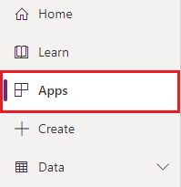
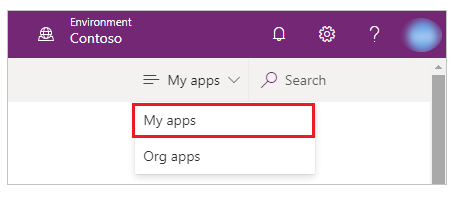
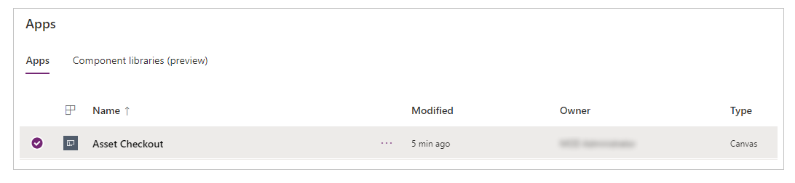
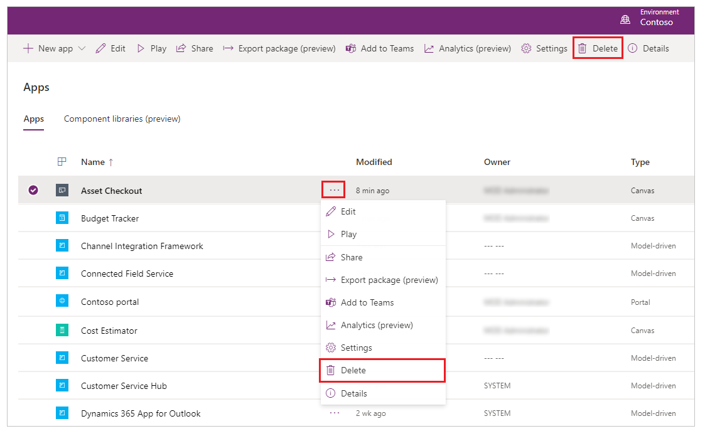
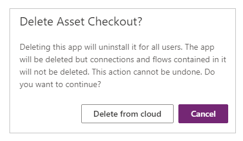

# Delete a canvas app

This article shows you how to delete a canvas app.

## Delete an app as the owner

1. Sign in to [Power Apps](https://make.powerapps.com?utm_source=padocs&utm_medium=linkinadoc&utm_campaign=referralsfromdoc).

1. Select **Apps** from the left pane.

    

1. (optional) Near the upper-right corner, filter the list of apps to show only those apps that you own.

    

   > [!NOTE]
   > If the app that you want to delete doesn't appear, make sure that you're in the right environment.

1. Select an app.

    

1. Select **Delete** from the top menu. You can also select **More Commands** (**..**) and then select **Delete** instead.

    

1. Select **Delete from cloud**.  

    

    > [!IMPORTANT]
    > This action deletes the app not only from your account but also from the accounts of all users with whom this app was shared.

## Delete an app as the administrator

If owner of an app is unavailable, an administrator such as Global admin, Azure Active Directory Global admin, or Dynamics 365 admin can set the owner of an app. And then, the [new owner can delete the app](#delete-an-app-as-the-owner).

To set a user as the owner of an app, use the [Power Apps cmdlets for administrators](/power-platform/admin/powerapps-powershell).

> [!TIP]
> You can also recover a deleted canvas app using [Power Apps cmdlets for administrators](/power-platform/admin/powerapps-powershell#recover-a-deleted-canvas-app) as long as the app is [discoverable](/power-platform/admin/powerapps-powershell#display-a-list-of-deleted-power-apps-in-an-environment).

### See also

- [Share an app](share-app.md)  
- [Change app name and tile](set-name-tile.md)  
- [Restore an app to a previous version](restore-an-app.md)
- [Export and import an app](export-import-app.md)

[!INCLUDE[footer-include](../../includes/footer-banner.md)]