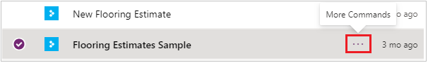
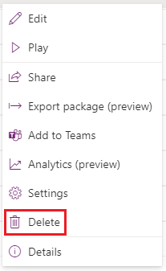
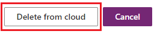

# Delete a canvas app from PowerApps
This article shows you how to delete a canvas app from your PowerApps account and from the accounts of anybody with whom the app was shared.

## Delete an app from your account
1. Open [powerapps.com](https://web.powerapps.com?utm_source=padocs&utm_medium=linkinadoc&utm_campaign=referralsfromdoc), and then click or tap **Apps** in the left navigation bar.
   
    
2. (optional) Near the upper-left corner, filter the list of apps to show only those apps that you own or only those apps to which you contribute.
   
    
   
    > [!NOTE]
   > If the app that you want to delete doesn't appear, make sure that you're in the right environment.
3. Near the right edge, click or tap the info icon for the app that you want to delete.
   
    
4. Near the upper-right corner, click or tap the trash-can icon to delete the app.
   
    
   
    > [!NOTE]
   > You must have the **Contributor** permission for an app before you can delete it.
5. In the dialog box that appears, click or tap **Delete from cloud**.  
   
    > [!IMPORTANT]
   > This action will permanently delete this app not only from your account but also from the accounts of all users with whom this app was shared.
   
    

## More resources
[Share an app](share-app.md)  
[Change app name and tile](set-name-tile.md)  
[Restore an app to a previous version](restore-an-app.md)  

