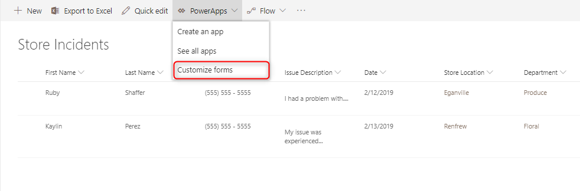
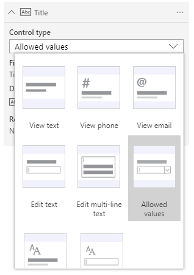
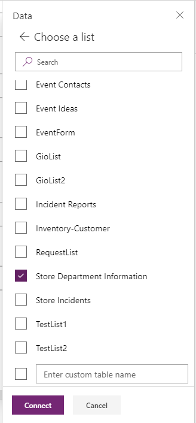
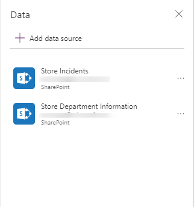
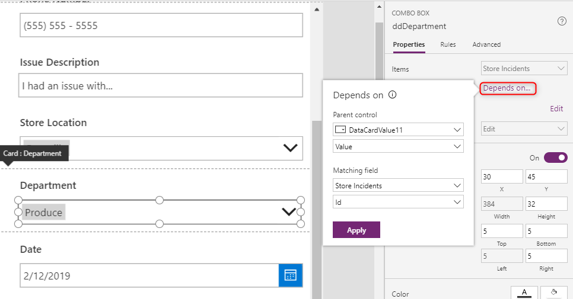
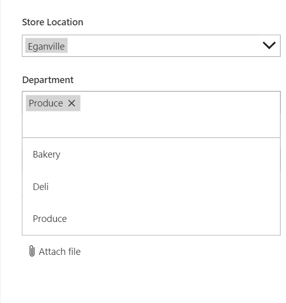

# Create dependent drop-down lists in a canvas app

When you create dependent drop-down lists (also known as "cascading drop-down lists") in an app, it filters one list based on a selection in another list. Many organizations create such lists to help users fill out forms more efficiently. For example, a user might select a country or region in one list to filter another list so that it shows only the cities in that location, or a user might select a category to show only the codes in that category.

The recommended method of setting up your data is to have one app data source that you submit data to and to have another table for the dropdown list values. Using a separate data source to create the options and matching logic for multiple dropdowns allows changes to the options to be done without publishing the app. Additionally this data table could be used across multiple apps. Although you could accomplish the same outcome with a collection or static data, it isn't recommended for enterprise scenarios.

For the purposes of this example, SharePoint Lists will be used as the data source. In our scenario, employees of a store submit issues to the Store Incidents list through a form. We want to allow them to select the store it was reported at and then select the affected department. The person filling out the form should only have the department options available to them that are at that store. For example, if I select "Eganville" as a store location, then I shouldn't see "Pharmacy" as a store department option since that store location does not have a pharmacy.

The Store Department Information table (in this case, a SharePoint list) that has the matching information for the Store Location and Store Department fields.

| Store Location | Store Department |
|----------------|------------------|
| Eganville      | Bakery           |
| Eganville      | Deli             |
| Eganville      | Produce          |
| Renfrew        | Bakery           |
| Renfrew        | Deli             |
| Renfrew        | Produce          |
| Renfrew        | Pharmacy         |
| Renfrew        | Floral           |
| Pembroke       | Bakery           |
| Pembroke       | Deli             |
| Pembroke       | Produce          |
| Pembroke       | Floral           |

The Store Incidents table to which  employees are submitting incidents (in this case, a SharePoint List).

| First Name | Last Name | Phone Number     | Store Location | Department | Issue Description       | Date      |
|------------|-----------|------------------|----------------|------------|-------------------------|-----------|
| Ruby       | Shaffer   | (555) 555 - 1055 | Eganville      | Produce    | I had a problem with…   | 2/12/2019 |
| Kaylin     | Perez     | (333) 555 - 1033 | Renfrew        | Floral     | I experienced an issue… | 2/13/2019 |

1. Open the SharePoint list named Store Incidents, and then select **PowerApps** > **Customize form**.

    

    A new tab will open with the PowerApps Studio with the default form on a screen looking like this:

    

    > [!NOTE]
    > If your parent and child fields aren't **drop down**, **combo box**, or **list box** controls, you will have to change the control type. This usually occurs when the type of column is of type text or choice. On the **Fields** pane, select the field to expand its information. Set the control type to “Allowed Values”, which will change the input to a **drop down** control.

    

1. Add the data source that has your matching logic in it (the SharePoint list named Store Department Information).

    1. Select **View** > **Data Sources**.

    1. Select your existing SharePoint connection or create another one. Select the SharePoint list named Store Department Information, and then select **Connect**.

        

        The form or app shows two SharePoint connections in the form or app. The form is connected to one, and you'll create the dependent drop-down list with the other.

        

1. By default, all the cards are locked. To create the dependent drop-down list, unlock the **Store Location** and **Department** data cards. To unlock a card, select it or a control within it, select the **Advanced** tab in the property pane, and then select **Unlock**.

1. Rename the Store Location control by selecting it (not the data card) and editing the name in the top of the property pane to “ddStoreLocation”, and the Department control to “ddDepartment”. It is best practice to rename your controls so that you know what they are, and it makes the example easier to follow. To learn more best practices, you can view the Coding Standards and Guidelines whitepaper.

1. Let’s check to make sure that the data in our Store Location parent makes sense. Press the Preview button and select the Store Location **drop down** control to see what options are provided. If I created this as a choice field, I would expect to see “Eganville, Renfrew, Pembroke” and all is well. If I created this as a LookUp field to another list/table, the data may have repeats in it. If there are repeats, I will need to wrap a Distinct() function  around the Items property of this control,  making sure I have the second part of the formula where I select which column to ensure there is only one option for, in this case, Store Location.

1. Now the final step – select the child ddDepartment control.  In the properties pane, select the new “Depends on…” text.

    

Select the parent control “ddStoreLocation”, in the following drop down select the column Value. The column name may change depending on the function you used. In some cases where you are evaluating expressions in the parent using LookUps or Distinct(), select Result. In cases where you don’t want to match on string, but on the actual ID of the row of data, select ID.

In the Matching field section, select the data source that has your table “Store Department Information." Now the field in this data source that will match the one in the parent control is Store Location. Select Store Location in the following drop down.

Select Apply. This will have written a Filter formula in the Items property of the child control.

## FAQ

**I can’t see any data: it looks like the sources are all blank or have the wrong data.**
Check that you are displaying the correct field for your control. This can be done selecting the Value property in the property pane for drop downs or by editing the field for combo boxes and ensuring that the primary text is the field you want to display.

**I am seeing multiple, repeated items in my child dropdown.**
This is likely due to using a LookUp column or a Choices function. This is easily solved by wrapping a Distinct function around the properly returning Data. See more on the Distinct function.

## Known limitations

This configuration is only available on **Drop down**, **Combo box**, and **List box** controls that are single select. Multi-select isn't supported at this time. We plan to extend the same type of functionality to galleries. This isn't the recommended experience for working with option sets in CDS. There is more documentation on the way on using option sets in canvas apps.

The Depends On configuration doesn't support static data or collections. To configure with these sources, use the formula bar to edit the expression directly. Additionally, using two choice fields in SharePoint without any matching table of data isn't supported, and defining the Matching within this UI isn't possible.