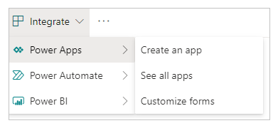

# Create dependent drop-down lists in a canvas app

When you create dependent (or cascading) drop-down lists, users select an option in a list to filter options in another list. Many organizations create dependent lists to help users fill out forms more efficiently. For example, users might select a country or region to filter a list of cities, or users might select a category to show only the codes in that category.

As a best practice, create a data source for the values in the "parent" and "child" lists (for example, countries/regions and cities) that's separate from the data source that users update by using the app. If you take this approach, you can use the same parent and child data in more than one app, and you can update that data without republishing the app or apps that use them. You can accomplish the same outcome by using a collection or static data, but it isn't recommended for enterprise scenarios.

For the scenario in this topic, store employees submit issues to an **Incidents** list through a form. Employees specify not only the location of the store at which the incident occurred but also the department within that location. Not all locations have the same departments, so a **Locations** list ensures that employees can't specify a department for a location that doesn't have that department.

> [!NOTE]
> This article uses Microsoft SharePoint lists as data sources, but all tabular data sources work the same way. Within [Dataverse for Teams](../../teams/create-apps-overview.md), you'll need to enable [classic controls](../../teams/understand-power-apps-studio.md#classic-controls) to get the classic drop-down to work for this scenario.

## Create data sources

A **Locations** list shows the departments at each location.

| Location | Department |
|----------------|------------------|
| Eganville      | Bakery           |
| Eganville      | Deli             |
| Eganville      | Produce          |
| Renfrew        | Bakery           |
| Renfrew        | Deli             |
| Renfrew        | Produce          |
| Renfrew        | Pharmacy         |
| Renfrew        | Floral           |
| Pembroke       | Bakery           |
| Pembroke       | Deli             |
| Pembroke       | Produce          |
| Pembroke       | Floral           |

An **Incidents** list shows contact information and information about each incident. Create the Date column as a **Date** column, but create the other columns as **Single line of text** columns to simplify configuration and avoid [delegation](./delegation-overview.md) warnings in Microsoft Power Apps.

| First Name | Last Name | Phone Number     | Location | Department | Description       | Date      |
|------------|-----------|------------------|----------------|------------|-------------------------|-----------|
| Tonya       | Cortez   | (206) 555 - 1022 | Eganville      | Produce    | I had a problem with…   | 2/12/2019 |
| Moses     | Laflamme     | (425) 555 - 1044 | Renfrew        | Floral     | I experienced an issue… | 2/13/2019 |

By default, custom SharePoint lists include a **Title** column that you can't rename or remove, and it must contain data before you can save an item in the list. To configure the column so that it doesn't require data:

1. Near the upper-right corner, select the gear icon, and then select **List settings**.
1. On the **Settings** page, select **Title** in the list of columns.
1. Under **Require that this column contains information**, select **No**.

After that change, you can ignore the **Title** column, or you can [remove it](https://support.office.com/article/edit-a-list-column-in-sharepoint-online-77130c2e-76d1-4f80-af8b-4c6f47b264b8) from the default view if at least one other column appears.

## Open the form

1. Open the **Incidents** list, and then select **Integrate** -> **Power Apps** -> **Customize forms**.

    

    A browser tab opens with the default form in Power Apps Studio.

1. (optional) In the **Fields** pane, hover over the **Title** field, select the ellipsis (...) that appears, and then select **Remove**.

    If you've closed the **Fields** pane, you can open it again by selecting **SharePointForm1** in the left navigation bar and then selecting **Edit fields** on the **Properties** tab of the right-hand pane.

1. (optional) Repeat the previous step to remove the **Attachments** field from the form.

    The form appears with just the fields that you added.

    > [!div class="mx-imgBorder"]
    > 

## Replace the controls

1. In the **Fields** pane, select the arrow next to **Location**.

    If you've closed the **Fields** pane, you can open it again by selecting **SharePointForm1** in the left navigation bar and then selecting **Edit fields** on the **Properties** tab of the right-hand pane.

1. Open the **Control type** list, and then select **Allowed Values**.

    > [!div class="mx-imgBorder"]
    > 

    The input mechanism changes to a **Drop down** control.

1. Repeat these steps for the **Department** card.

## Add the Locations list

1. Select **View** > **Data Sources** > **Add data source**.

1. Select or create a SharePoint connection, and then specify the site that contains the **Locations** list.

1. Select the check box for that list, and then select **Connect**.

    > [!div class="mx-imgBorder"]
    > 

    The list of connections shows the **Incidents** list, on which the form is based, and the **Locations** list, which will identify locations and departments in the form.

    > [!div class="mx-imgBorder"]
    > 

## Unlock the cards

1. Select the **Location** card, select the **Advanced** tab in the right-hand pane, and then select **Unlock to change properties**.

1. Repeat the previous step for the **Department** card.

## Rename the controls

If you rename your controls, you can identify them more easily, and the examples are easier to follow. To discover other best practices, review the [Coding Standards and Guidelines whitepaper](https://aka.ms/powerappscanvasguidelines).

1. In the **Location** card, select the **Drop down** control.

1. Near the top of the right-hand pane, rename the selected control by typing or pasting **ddLocation**.

    > [!div class="mx-imgBorder"]
    > 

1. Repeat the previous two steps in the **Department** card to rename the **Drop down** control to **ddDepartment**.

## Configure the locations

1. Set the **Items** property of **ddlocation** to this formula:

    `Distinct(Locations, Location)`

1. (optional) While holding down the Alt key, open **ddLocation**, and confirm that the list shows the three locations.

## Configure the departments

1. Select **ddDepartment**, and then, on the **Properties** tab of the right-hand pane, select **Depends on.**

1. Under **Parent control**, ensure that **ddLocation** appears in the upper list and **Result** appears in the lower list.

    > [!NOTE]
    > If you don’t want to match on a string but on the actual ID of the row of data, select **ID** Instead of **Result**.

1. Under **Matching field**, select **Locations** in the upper list, select **Location** in the lower list, and then select **Apply**.

    > [!div class="mx-imgBorder"]
    > 

    The **Items** property of **ddDepartment** is set to this formula:

    `Filter(Locations, Location = ddLocation.Selected.Result)`

    This formula filters the items in **ddDepartment** based on what the user selects in **ddLocation**. Such a configuration ensures that the "child" list of departments reflects the data for its "parent" location, as the **Locations** list in SharePoint specifies.

1. On the **Properties** tab of the right-hand pane, open the list next to **Value**, and then select **Department**.

    This step sets the display text to the options from the **Department** column of the **Locations** list in SharePoint.

    > [!div class="mx-imgBorder"]
    > 

## Test the form

While holding down the Alt key, open the list of locations, select one, open the list of departments, and then select one.

The lists of locations and departments reflects the information in the **Locations** list in SharePoint.

> [!div class="mx-imgBorder"]
> 

## Save and open the form (optional)

1. Open the **File** menu, and then select **Save** > **Publish to SharePoint** > **Publish to SharePoint**.

1. In the upper-left corner, select the back arrow, and then select **Back to SharePoint**.

1. In the command bar, select **New** to open your customized form.

## FAQ

**I can’t see any data: the sources are all blank or have the wrong data.**
Confirm whether you're displaying the correct field for your control in either of these ways:

- Select a drop-down list, and then select the **Value** property in the **Properties** tab of the right-hand pane.

    > [!div class="mx-imgBorder"]
    > 

- Select a combo box, and then ensure that the primary text is the field that you want to display.

    > [!div class="mx-imgBorder"]
    > 

**My child drop-down list contains duplicate items.**
This symptom is likely due to using a **LookUp** column in SharePoint or a **Choices** function in Power Apps. To remove the duplication, wrap a **Distinct** function around the properly returning data. More information: [Distinct function](functions/function-distinct.md).

## Known limitations

This configuration is available on **Drop down** controls, as well as **Combo box** and **List box** controls that allow one selection at a time. You can't use the **Depends On** configuration for any of those controls if they allow multiple selections. This approach isn't recommended for working with choices in Microsoft Dataverse.

The **Depends On** configuration doesn't support static data or collections. To configure dependent drop-down lists with these sources, edit the expression directly in the formula bar. In addition, Power Apps doesn't support using two choice fields in SharePoint without any matching table of data, and you can't define **Matching field** within this UI.

[!INCLUDE[footer-include](../../includes/footer-banner.md)]