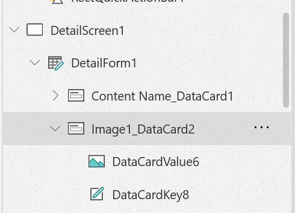
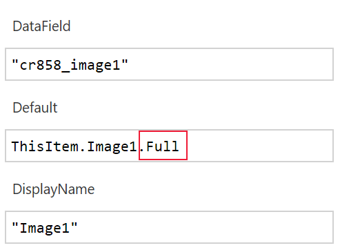

# Display a full-sized image on a canvas app form
By default,	when an app user adds an image to display to a form in a canvas app, the image displayed is the thumbnail image. To display a full image for a canvas app, follow these steps: 
1. Open the canvas app in PowerApps Studio. 
2. Select **Insert**, and then select **Image**.
3. Select the image data card. 

    > [!div class="mx-imgBorder"] 
    > 

4. Under the **Advanced** tab set the **Data** field to the table that contains the image you want to display.
5.	Add **.Full** after the value for the image **Default** setting. 

    > [!div class="mx-imgBorder"] 
    > 

6.	Select **Save**. 

### See also
[Show, edit, or add a record in a canvas app](add-form.md)  
[Image fields](../data-platform/types-of-fields.md#image-columns)

[!INCLUDE[footer-include](../../includes/footer-banner.md)]