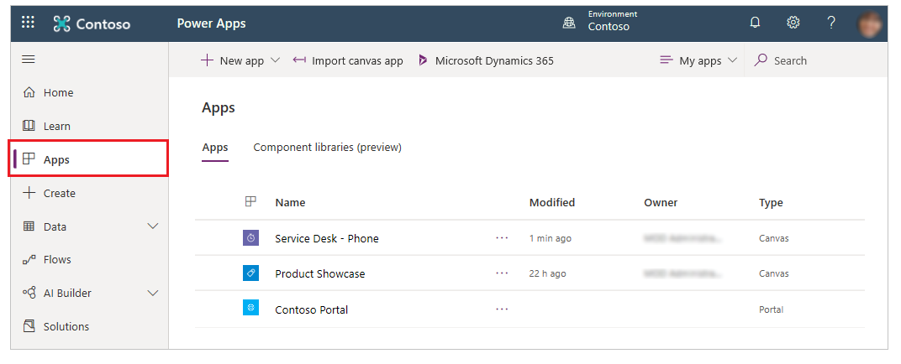
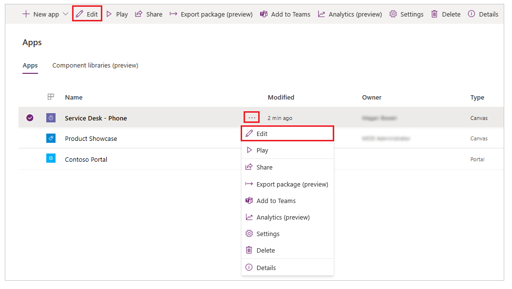
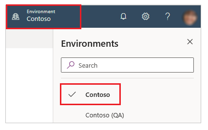
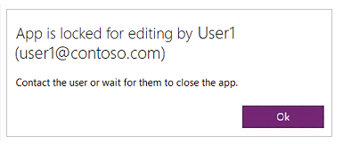
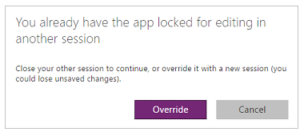

# Edit a canvas app

Edit any canvas app that you created, or for which you have **Co-owner** permission. You can edit an app in Power Apps Studio. 

If you try to edit an app that's open for editing elsewhere, a message tells you whether you already have it open or another user does.

## Edit an app

1. Sign in to [Power Apps](https://make.powerapps.com?utm_source=padocs&utm_medium=linkinadoc&utm_campaign=referralsfromdoc).

1. Select **Apps** in the left navigation pane.

    

1. Select an app.

1. Select **Edit** from top menu. You can also use "**...**" (More Commands) for the app and then select **Edit** from the drop-down menu.

    

If you don't see the app that you want to edit, verify that you've selected the correct environment.

## Collaborate on an app

An app can be shared with others. Any **Co-owner** for an app can edit it. Consider the following scenarios when collaborating over an app.

### Edit an app already being edited

Only one user can edit an app at a time.

If you try to edit an app that someone else is already editing, you'll see the following message.

You can't continue until the other user closes the app, or that user's session times out.

### Edit an app across multiple sessions

Consider that you already have an app open for editing. And then, you try to open the app for editing on another device, or in another browser window. In that case, you'll see the following message.

You can override the previous session, but you might lose any changes that you haven't saved.

## Next Steps

Learn more about how to add a [screen](add-screen-context-variables.md), a [control](add-configure-controls.md), or a [data connection](add-data-connection.md).

### See also

- [Restore an app to a previous version](restore-an-app.md)
- [Export and import an app](export-import-app.md)

[!INCLUDE[footer-include](../../includes/footer-banner.md)]