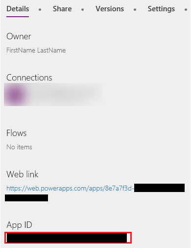

# Integrate canvas apps into websites and other services
The apps you build are often most useful when they're available right where people are doing their work. PowerApps enables you to embed canvas apps in an iframe so that you can integrate those apps into websites and other services, such as Power BI or SharePoint.

In this topic, we'll show you how to set parameters for app embedding; then we'll embed our Asset Ordering app in a website.


Keep the following restrictions in mind:

* Only PowerApps users in the same tenant can access the embedded app.
* To access PowerApps using Internet Explorer 11, you must turn off Compatibility View.

You can also integrate PowerApps into SharePoint Online (without using an iframe). For more information, see [Generate an app from within SharePoint using PowerApps](app-from-sharepoint.md#generate-an-app-from-within-sharepoint-online).

## Set URI parameters for your app
If you have an app you want to embed, the first step is to set parameters for the Uniform Resource Identifier (URI), so that the iframe knows where to find the app. The URI is in the following form:

```
https://web.powerapps.com/webplayer/iframeapp?source=iframe
&appId=/providers/Microsoft.PowerApps/apps/[AppID]
```

> [!NOTE]
> We added a line break so the URI displays better on the page.

The only thing you have to do is substitute the ID of your app for [AppID] in the URI (including '[' & ']'). We'll show you how to get that value shortly, but first here are all the parameters available in the URI:

* **[appID]** - is in the format `/providers/Microsoft.PowerApps/apps/[AppID]`. It provides the ID of the app to run.
* **screenColor** - is used to provide a better app loading experience for your users. This parameter is in the format [RGBA (red value, green value, blue value, alpha)](../canvas-apps/functions/function-colors.md) and controls the screen color while the app loads. It is best to set it to the same color as your app's icon.
* **source** - does not affect the app, but we suggest you add a descriptive name to refer to the source of the embedding.
* Lastly, you can add any custom parameters you want using the [Param() function](../canvas-apps/functions/function-param.md), and those values can be consumed by your app. They are added to the end of the URI, such as `[AppID]&param1=value1`. These parameters are read only during launch of the app; if you need to change them, you need to re-launch the app.

### Get the App ID
The app ID is available on powerapps.com. For the app you want to embed:

1. In [powerapps.com](https://powerapps.microsoft.com), on the **Apps** tab, click or tap the ellipsis ( **. . .** ), then **Details**.
   
    
2. Copy the **App ID**.
   
    
3. Substitute the `[AppID]` value in the URI. For our Asset Ordering app, the URI looks like this:
   
    ```
    https://web.powerapps.com/webplayer/iframeapp?source=iframe&appId=/providers/Microsoft.PowerApps/apps/76897698-91a8-b2de-756e-fe2774f114f2
    ```

## Embed your app in a website
Embedding your app is now as simple as adding the iframe to the HTML code for your site (or any other service that supports iframes, such as Power BI or SharePoint):

```
<iframe width="[W]" height="[H]" src="https://web.powerapps.com/webplayer/iframeapp?source=website&screenColor=rgba(165,34,55,1)&appId=/providers/Microsoft.PowerApps/apps/[AppID]" allow="geolocation; microphone; camera"/>
```

Specify values for the iframe width and height, and substitute the ID of your app for `[AppID]`.

> [!NOTE]
> Include `allow="geolocation; microphone; camera"` in your iframe HTML code to allow your apps to use these capabilities on Google Chrome.

The following image shows the Asset Ordering app embedded in a Contoso sample website.


Keep the following points in mind for authenticating users of your app:

* If your website uses Azure Active Directory (AAD) based authentication, no additional sign-in is required.
* If your website uses any other sign-in mechanism or is not authenticated, your users see a sign-in prompt on the iframe. After they sign-in, they will be able to run the app as long as the author of the app has shared it with them.

As you can see, embedding apps is simple and powerful. Embedding enables you to bring apps right to the places you and your customers work – websites, Power BI dashboards, SharePoint pages, and more.

