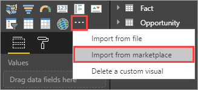
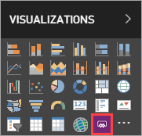
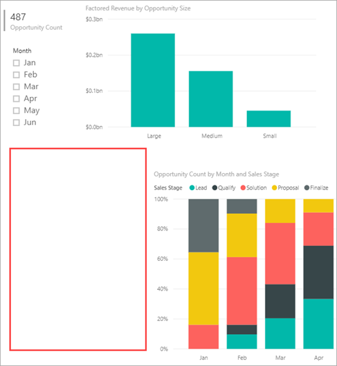
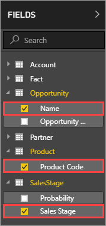
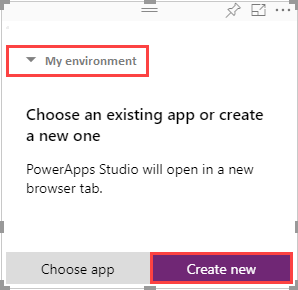
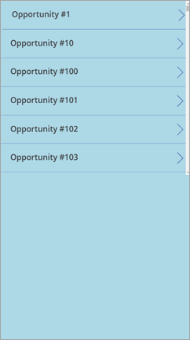
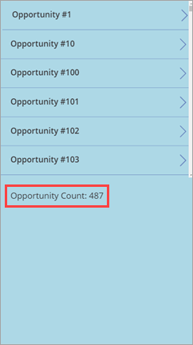
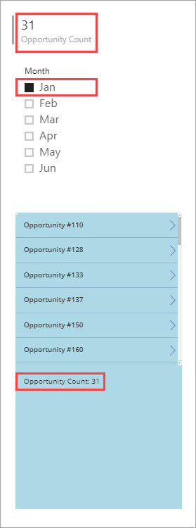

# Embed a new canvas app in a Power BI Report

Power BI enables you to extend its capabilities by adding *custom visuals* to a report. In this tutorial, you use the PowerApps custom visual to create a canvas app that's embedded in a sample report. This app interacts with other items in that report.

If you don't have a PowerApps subscription, [create a free account](../signup-for-powerapps.md) before you begin.

In this tutorial, you learn how to:
> [!div class="checklist"]
> * Import the PowerApps custom visual into a Power BI report
> * Create a new app that uses data from the report
> * View the app in the report

## Prerequisites

* [Google Chrome](https://www.google.com/chrome/browser/) or [Microsoft Edge](https://www.microsoft.com/windows/microsoft-edge) browser
* A [Power BI subscription](https://docs.microsoft.com/power-bi/service-self-service-signup-for-power-bi), with the [Opportunity Analysis Sample](https://docs.microsoft.com/power-bi/sample-opportunity-analysis#get-the-content-pack-for-this-sample) installed
* An understanding of how to [create apps in PowerApps](data-platform-create-app-scratch.md) and how to [edit Power BI reports](https://docs.microsoft.com/power-bi/service-the-report-editor-take-a-tour)

## Import the PowerApps custom visual

The first step is to import the PowerApps custom visual so that you can use it in the sample report.

1. In the Opportunity Analysis Sample report, click or tap the **Upcoming Opportunities** tab.

2. At the top of the report, click or tap **Edit report**.

3. In the **Visualizations** pane, click or tap the ellipses (**. . .**) > **Import from marketplace**. 

    

4. In the **Power BI Visuals** screen, search for "PowerApps", then click or tap **Add**. Power BI adds the custom visual icon to the bottom of the **Visualizations** pane.

    

5. Save the report.

## Create a new app
Now you add the custom visual to your report and create a new app based on data in the report. When you create the app, it launches PowerApps Studio with a live data connection between PowerApps and Power BI.

1. Move and resize some of the report tiles to make space for an app.

    

2. Click or tap the PowerApps custom visual icon, then resize the tile to fit the space you made.

3. In the **Fields** pane, select **Name**, **Product Code**, and **Sales Stage**. 

    

4. In the custom visual tile, select the PowerApps environment where you want to create the app, then click or tap **Create new**.

    

    In PowerApps Studio, you see that a basic app is created, with a *gallery* that shows one of the fields you selected in Power BI.

5.  Resize the gallery so it takes up only half of the screen. 

6. In the left pane, click or tap **Screen1**, then set the screen's **Fill** property to "LightBlue" (so it shows up better in the report).

    

6. Add a Label control under the gallery, with the **Text** property set to `"Opportunity Count: " & CountRows(Gallery1.AllItems)`. It now shows the total number of opportunities in the data set.

    

7. Save the app with the name "Opportunities". 

## View the app in the report
The app is now available in the report, and it interacts with other visuals because it shares the same data source.

In the Power BI report, select **Jan** in the slicer, which filters the whole report, including the data in the app.

Notice that the opportunity count in the app matches the count in the upper left of the report. You can select other items in the report, and the data in the app updates.

## Clean up resources
If you don't want to use the Opportunity Analysis Sample anymore, you can delete the dashboard, report, and dataset.

## Next steps
In this tutorial, you learned how to:
> [!div class="checklist"]
> * Import the PowerApps custom visual into a Power BI report
> * Create a new app that uses data from the report
> * View the app in the report

Advance to the next article to learn more
> [!div class="nextstepaction"]
> [PowerApps custom visual for Power BI](powerapps-custom-visual.md)

