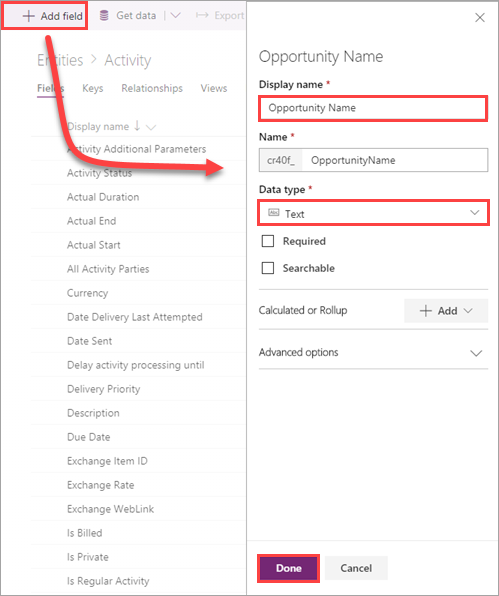

# Embed an app in Power BI

[TODO] - introduction

If you don't have a PowerApps subscription, [create a free account](../signup-for-powerapps.md) before you begin.

In this tutorial, you learn how to:
> [!div class="checklist"]
> * Import the PowerApps custom visual into a Power BI report
> * Create a new app that uses data from the report
> * Add related data from the Common Data Service for Apps 
> * Use the app to filter data and take action in the report
> * [TODO] - possibly tweak the 4th entry and add others if necessary (same at the end of the article)

[TODO] - possibly add full screen of completed report here.

## Prerequisites

* A [Power BI subscription](https://docs.microsoft.com/power-bi/service-self-service-signup-for-power-bi), with the [Opportunity Analysis Sample](https://docs.microsoft.com/power-bi/sample-opportunity-analysis#get-the-content-pack-for-this-sample) installed
* A [PowerApps subscription](../signup-for-powerapps.md) with Common Data Service for Apps (CDS), with sample data installed
* A [PowerApps environment](../../administrator/environments-overview.md) in which you have permissions to modify CDS entities
* An understanding of the following:
    * [Editing Power BI reports](https://docs.microsoft.com/power-bi/service-the-report-editor-take-a-tour)
    * [Creating apps in PowerApps](data-platform-create-app-scratch.md)
    * [Working with the Common Data Service for Apps](../common-data-service/data-platform-intro.md)

## Import the PowerApps custom visual
[TODO] - possible section intro

1. In the Opportunity Analysis Sample report, click or tap the **Upcoming Opportunities** tab.

2. At the top of the report, click or tap **Edit report**.

3. In the **Visualizations** pane, click or tap the ellipses (**. . .**) > **Import from marketplace**. 

    

4. In the **Power BI Visuals** screen, search for "PowerApps", then click or tap **Add**. Power BI adds the custom visual icon to the bottom of the **Visualizations** pane.

    

5. Save the report.

## Create a new app
[TODO] - possible section intro

1. Move and resize some of the report tiles to make space for an app.

    

2. Click or tap the PowerApps custom visual icon, then resize the tile to fit the space you made.

3. In the **Fields** pane, select **Name**, **Product Code**, and **Sales Stage**. 

    

4. In the custom visual tile, select the PowerApps environment where you want to create the app, then click or tap **Create new**.

    

    In PowerApps Studio, you see that a basic app is created, with a *gallery* that shows one of the fields you selected in Power BI.

5.  Resize the gallery so it takes up only half of the screen. In the left pane, click or tap **Screen1**, then set the screen's **Fill** property to "LightBlue".

    

6. Add a Label control under the gallery, with the **Text** property set to `"Opportunity Count: " & CountRows(Gallery1.AllItems)`. It now shows the total number of opportunities in the data set.

    

7. Save the app with the name "Opportunities". 

8. Back in the Power BI report, select **Jan** in the slicer, which filters the whole report, including the data in the app. 

    

    Notice that the opportunity count in the app matches the count in the upper left of the report.
 
## Add related data
[TODO] - possible section intro

### Modify the Activity entity

1. In [web.powerapps.com](https://web.powerapps.com), on the left menu, click or tap **Common Data Service** > **Entities**.  

2. At the bottom of the screen, click or tap **remove the filter** to show all entities.

3. Click or tap the **Activity** entity.

4. Click or tap **Add field**, enter values for the new field, then click or tap **Done**.

    

    | Option       | Value            |   |   |   |
    |--------------|------------------|---|---|---|
    | Display name | Opportunity Name |   |   |   |
    | Data type    | Text             |   |   |   |
    |              |                  |   |   |   |

5. Click or tap **Save Entity**.

6. [TODO] - add data to the entity (error on save right now)

### Connect to the entity from the app
[TODO] - possible section intro

[TODO] - step by step

[TODO] - add to later steps:

`"Product code: " & Gallery1.Selected.'Product Code'`
`"Sales stage: " & Gallery1.Selected.'Sales Stage'`

## Use the app in the report
[TODO] - possible section intro

[TODO] - step by step

## Clean up resources
[TODO] - does the sample count against your PBI quota? (probably not a big deal either way).

## Next steps
In this tutorial, you learned how to:
> [!div class="checklist"]
> * Import the PowerApps custom visual into a Power BI report
> * Create a new app that uses data from the report
> * Add related data from the Common Data Service for Apps 
> * Use the app to filter data and take action in the report

Advance to the next article to learn more
> [!div class="nextstepaction"]
> [Next steps button]() [TODO] - add a link to the next logical article

