# Embed a PowerApps app in Teams 

You can share a PowerApps you've created by embedding it directly into Microsoft Teams. When completed, users can select **+** to add your app to any of **your** team channels or conversations in the team you are in. The app appears as a tile under **Tabs for your team**. 

An admin can upload the app so it shows up for **all** teams in your tenant under the **All tabs section**. See [Share an app in Microsoft Teams](https://docs.microsoft.com/en-us/power-platform/admin/embed-app-teams).

> [!NOTE]
> Team custom app policies must be set to allow uploading custom apps. If unable to embed your app in Teams, check with your administrator to see if they've setup [custom app settings](https://docs.microsoft.com/MicrosoftTeams/teams-custom-app-policies-and-settings#custom-app-policy-and-settings). 

## Prerequisites

- [Have a PowerApps license](https://docs.microsoft.com/power-platform/admin/pricing-billing-skus)
- Created a canvas app

## Locate your PowerApp's GUID

Find and make note of your PowerApp's GUID to use in a later step.

1. Sign in to [https://web.powerapps.com](https://web.powerapps.com), and then select **Apps** in the menu.

   > [!div class="mx-imgBorder"] 
   > 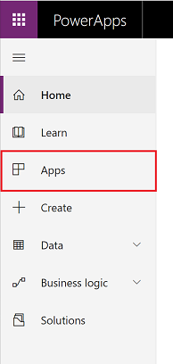

2. Select **More Commands** (...) for the app you want to share in Teams, and then select **Details**.

   > [!div class="mx-imgBorder"] 
   > 

3. Record the **App ID** for later use.

   > [!div class="mx-imgBorder"] 
   > 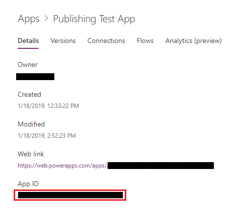

## Install App Studio

You can skip these steps if App Studio is already installed. 

1. In Teams, select **Apps** in the lower-left of the Teams menu ().

2. Search for "App Studio" in the search box and then select it.

   > [!div class="mx-imgBorder"] 
   > 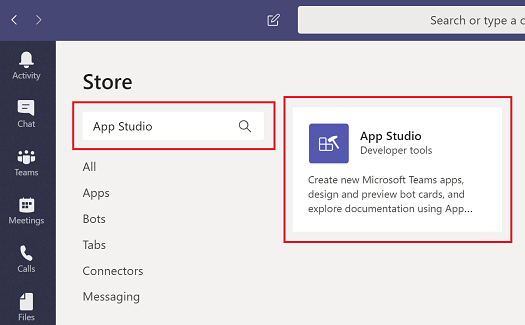

3. Select **Install**. 

   > [!div class="mx-imgBorder"] 
   > 

4. Select **Open** for the App feature.

   > [!div class="mx-imgBorder"] 
   > 

## Create a Teams app for your PowerApp

1. In Teams, open App Studio.

   > [!div class="mx-imgBorder"] 
   > 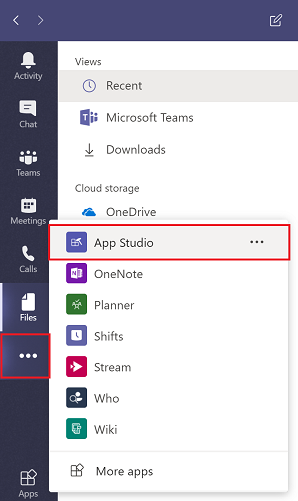

2. Select the **Manifest editor** tab, and then select **Create a new app** under Welcome.

   > [!div class="mx-imgBorder"] 
   > 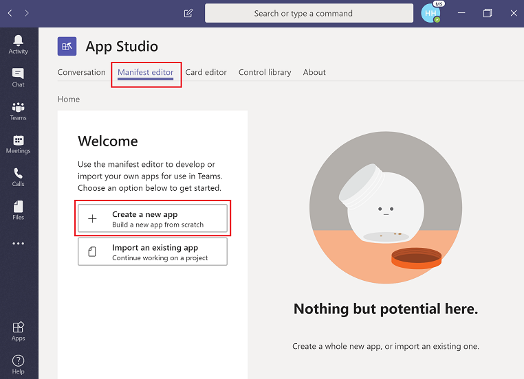

3. Fill in information about your app in the **App Details** page.  For the App ID GUID, you should use your PowerApp's App ID GUID you recorded above.  This will avoid duplication of Teams apps for a particular PowerApp.
 
   > [!div class="mx-imgBorder"] 
   > 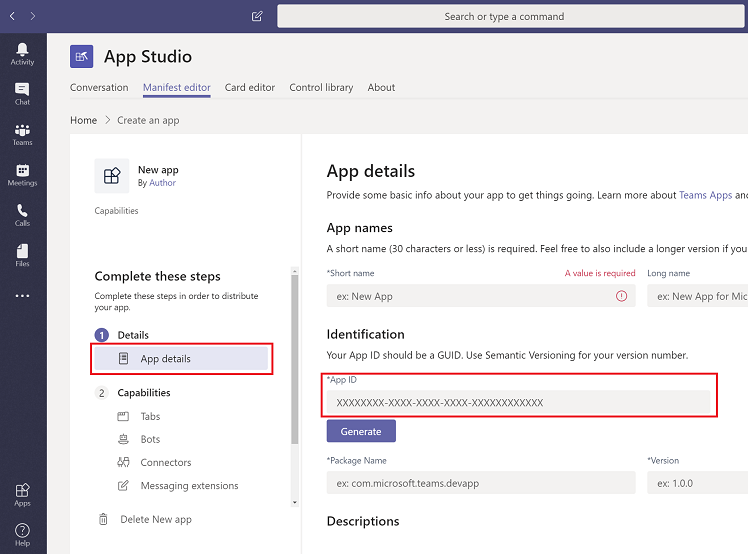

   |Fields  |Description  |
   |---------|---------|
   |**App names** |    |
   |Short name     | Required. The short display name for the app. 30 character limit.        |
   |Long name     | The full name of the app, used if the full app name exceeds 30 characters.       | 
   |**Identification**     |         |
   |App ID     | Required. The unique Microsoft-generated identifier for this app.        |
   |Package Name     | Required. A unique identifier for this app. We recommend using reverse domain notation; for example, com.example.<AppName>.       |
   |Version     | Required. The version of the specific app. If you update something in your manifest, the version must be incremented as well.     |
   |**Descriptions**    |     |
   | Short description    | Required. A short description of your app experience, used when space is limited. 80 character limit.   |
   | Long description    | Required. The full description of your app.     |
   | **Developer information**    |     |
   | Name    | Required. The display name for the company or developer.     |
   | Website    | Required. The https:// URL to the website for your app via powerapps.com. When someone installs your app, an “About your app” page will appear. It should link to the web version of your app on powerapps.com.   |
   | **App URLs**    | These links will show up in the **About** page along with the website URL.     |
   | Privacy statement    | Required. The https:// URL to the developer's privacy policy. [Example](https://go.microsoft.com/fwlink/p/?LinkID=698505).   |
   | Terms of use    | Required. The https:// URL to the developer's terms of use.  [Example](https://go.microsoft.com/fwlink/p/?LinkID=698507).  |
   | **Branding**    |     |
   | Full color    | A relative file path to a full color 192x192 PNG icon.    |
   | Transparent outline    |A relative file path to a transparent 32x32 PNG outline icon.     |
   | Accent color    | A color to use in conjunction with and as a background for your outline icons.     |

For more information, see [Manifest Editor](https://docs.microsoft.com/microsoftteams/platform/get-started/get-started-app-studio#manifest-editor) and [Manifest schema](https://docs.microsoft.com/microsoftteams/platform/resources/schema/manifest-schema).

4. Scroll down to the Branding section and add your logos and the accent color desired for your app.  These are the logos that will appear for your app in Teams. 

   > [!div class="mx-imgBorder"] 
   > 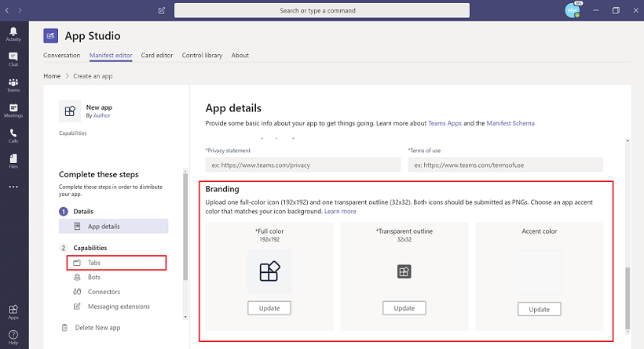

5. Under **Capabilities**, select **Tabs**.

6. Under **Team tab** select **Add**.

   > [!div class="mx-imgBorder"] 
   > 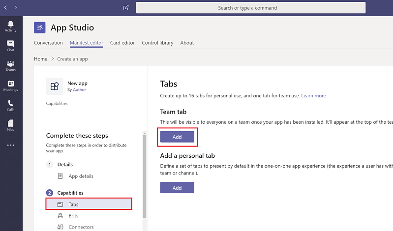

7. Add your app's configuration URL in the "Configuration URL" input field, using the following format: `https://apps.powerapps.com/teams/settings/<PowerApp ID>`

   Replace `<PowerApp ID>` with the App ID GUID you recorded above.

   Select the [scope](https://docs.microsoft.com/microsoftteams/platform/concepts/tabs/tabs-overview#tab-scope) for your app to appear in. Ensure **Can update configuration** is checked, and then select **Save**.

   > [!div class="mx-imgBorder"] 
   > 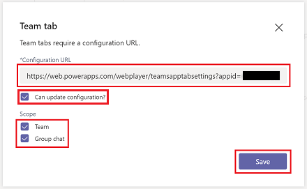

8. Under **Finish**, select **Valid domains**. Add **apps.powerapps.com** and **apps.preview.powerapps.com** as valid domains for the Teams application.

   > [!div class="mx-imgBorder"] 
   > 

9. Under **Finish**, select **Test and distribute**. Under **Install**, select **Install**.

   > [!div class="mx-imgBorder"] 
   > 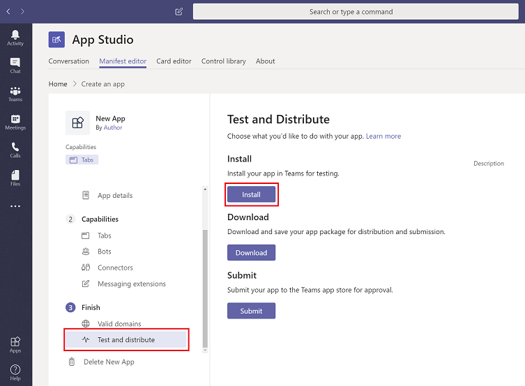

10. Select the team you want the app installed in, and then select **Install**.

    > [!div class="mx-imgBorder"] 
    > 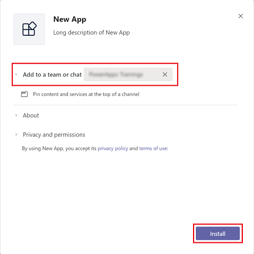
11. If you want to add an instance of that app to a channel right away, select the channel you wish to use the app in and select **Set up**.

    > [!div class="mx-imgBorder"] 
    > 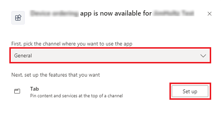

12. Select **Save**.

## Add the app as a tab

To add the app as a tab to any channel or conversation, select **+**, and then under **Tabs for your team** select your app. 

> [!div class="mx-imgBorder"] 
> 

The app now appears as a tab.

> [!div class="mx-imgBorder"] 
> 

### See also
[Welcome to Microsoft Teams](https://docs.microsoft.com/MicrosoftTeams/teams-overview) 
[For admins: Embed an app in Microsoft Teams](https://docs.microsoft.com/power-platform/admin/share-app-teams)
