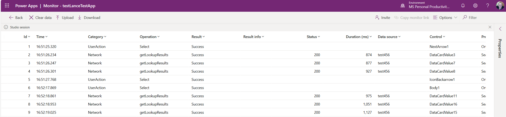
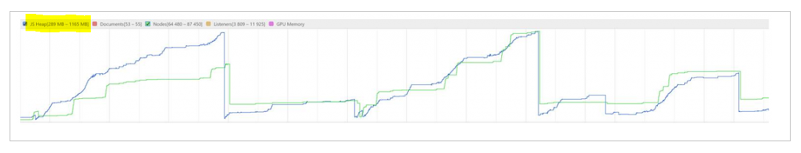

# Understand canvas app execution phases, data call flow, and performance monitoring

When a user opens a canvas app, the app goes through several phases of execution before showing any user interface. While the app loads, it connects to different [data sources](./connections-list.md#popular-connectors)&mdash;such as SharePoint, Microsoft Dataverse, SQL Server (on-premises), Azure SQL Database (online), Excel, and Oracle.

In this article, you'll learn about these different phases of execution and how an app connects to data sources and about tools you can use to monitor performance.

## Execution phases in canvas apps

A canvas app goes through the following phases of execution before showing the interface to a user:

1. **Authenticate the user**: Prompts the first-time user to sign in with credentials for whatever connections the app needs. If that user opens the app again, that person might be prompted again, depending on the organization's security policies.

1. **Get metadata**: Retrieves metadata, such as the version of the Power Apps platform on which the app runs and the sources from which it must retrieve data.

1. **Initialize the app**: Performs any tasks specified in the [OnStart](functions/object-app.md#onstart-property) property.

1. **Render the screens**: Renders the first screen with controls that the app populates with data. If the user opens other screens, the app renders them by using the same process.  

## Data call flow in canvas apps

Data calls from canvas apps send data to tabular data sources by using connectors over the OData protocol.OData requests flow to back-end layers to reach out to the target data source and retrieve data for the client, or commit data to the data source. Action based connectors that enable APIs work in the same way. 

Understanding how OData and API requests travel in canvas apps can help you to optimize your canvas app performance and your back-end data sources.

In this section, you'll learn about how the data call flows in canvas apps with different data source types.

### Data call flow with online data sources

The following diagram shows how a typical data request in a canvas app (on the left side) travels server-side layers, reaches out to the target data source (on the right side), and then returns the data to the client.

Each layer in the preceding diagram can perform quickly or encounter some overhead while processing the request. In many apps, two particular spots commonly present noticeable overhead:

- **Back-end data source** while processing the request.

- **Client** while sending the request&mdash;or while manipulating the received data on the heap memory and executing the associated JavaScript functions to process data to show in screens.

### Data call flow with on-premises data gateway

If a canvas app connects to an on-premises data source like SQL Server, you need to have another layer called an [*on-premises data gateway*](gateway-reference.md). This gateway is mandatory for accessing on-premises data sources. It takes charge of converting OData protocol requests to SQL Data Manipulation Language (DML) statements.

The following diagram shows where and how the on-premises data gateway is put in place to process data requests.

If the app uses a data source on-premises, the location and the specification of the data gateway also affect the performance of data calls.

### Data call flow with Microsoft Dataverse

When you use Microsoft Dataverse as the data source, data requests go to the environment instance directly&mdash;without passing through Azure API Management. Because of this, the performance of data calls is faster compared to the rest of the data sources. The app is by default connected to Microsoft Dataverse when you create a new canvas app.

With the understanding of this high-level concept of how data calls travel, you can get into the details of reviewing the performance of your app. In summary, performance overhead can happen at any of the layers&mdash;from client, API Management, connector, on-premises data gateway, or back-end data sources.

## Measuring performance

### Power Apps Monitoring tool
While you can use the browser's developer tools to see performance, Power Apps subsets the set of calls in the Monitoring tool to just those that are Power Apps. 

The Power Apps monitoring tool can help you track what is actually sent to the data source and timestamps for when requests are sent and responses come from the server. 

You can learn more about the monitoring tool in this article: [Debugging canvas apps with Monitor](optimized-query-data-patterns.md) . 

### Measuring memory pressure on the client

To see memory consumption graphically, you can use the developer tools for your browser to profile memory. It helps you visualize heap size, documents, nodes, and listeners. Profile the app's performance by using a browser, as described in [Microsoft Edge (Chromium) Developer Tools overview](/microsoft-edge/devtools-guide-chromium/landing/). Check the scenarios that exceed the memory threshold of the JS heap. More information: [Fix memory problems](/microsoft-edge/devtools-guide-chromium/memory-problems/)

 

## Next steps
[Small data payloads](small-data-payloads.md)

### See also

[Troubleshooting issues for Power Apps](/troubleshoot/power-platform/power-apps/isolate-and-troubleshoot-common-issues/common-issues-and-resolutions)

[!INCLUDE[footer-include](../../includes/footer-banner.md)]
