# Install and configure the Expense Report sample for canvas apps in PowerApps

Step-by-step instructions for installing and configuring the Expense Report sample. You can also preview the sample app [here](https://aka.ms/previewmyexpenses).

Estimated time to complete these steps: **10-15 minutes**

> [!TIP]
> Watch [this video](https://youtu.be/kJXZPILfbwU) for a demonstration of how to use the Expense Report sample app. 

Track expense reports from submission to approval. Tally line items as individual expenses accrue and submit for approval when ready. This app requires a small amount of setup to make it your own.

> [!TIP]
> Watch [this](https://youtu.be/h6E9cdrOvMU) video to see how to use the Expense Report PowerApps Sample.

## Prerequisites

- [Sign up](../signup-for-powerapps.md) for PowerApps.

## Create the Expenses SharePoint list

This list stores the expense reports.

1. Open a web browser and navigate to https://portal.office.com.
2. Log in with an account that has permission to create lists.
3. Navigate to the site collection where you want the Expenses list to reside.
4. Click the **gear icon** in the top right portion of the web page.
5. Click **Add an app**.
6. In the **Find an app** textbox, enter **Custom**.
7. Click the **search icon**.
8. Click the **Custom List** app.
9. In the **Name** textbox, enter **Expenses**.

	> [!IMPORTANT]
	> If you choose a different name for the list make sure you write it down because you will need to substitute it for Expenses everywhere you see it during the installation and configuration process.

10. Click **Create**.

### Create Cost Center column

1. Click the **Expenses** list.
2. Click the **gear icon** in the top right portion of the web page.
3. Click **List settings**.
4. Click **Create column**.
5. In the **Column name** textbox enter **Cost Center**.
6. In the **type of information in this column is** radio button list, select **Choice**.
7. In the **Type each choice on a separate line** textbox enter the following values, each on a separate line: 
	- Microsoft
	- Contoso
8. In the **Default value** textbox, enter **Microsoft**.
9. Click **OK**.

### Create Comments column

1. Click **Create column**.
2. In the **Column name** textbox enter **Comments**.
3. In the **type of information in this column is** radio button list, select **Multiple lines of text**.
4. Click **OK**.

### Create Status column

1. Click the **Expenses** list.
2. Click the **gear icon** in the top right portion of the web page.
3. Click **List settings**.
4. Click **Create column**.
5. In the **Column name** textbox enter **Status**.
6. In the **type of information in this column is** radio button list, select **Choice**.
7. In the **Type each choice on a separate line** textbox enter the following values, each on a separate line: 
	- Open
	- Pending
	- Approved
8. In the **Default value** textbox, enter **Open**.
9. Click **OK**.

### Create ApproverName column

1. Click **Create column**.
2. In the **Column name** textbox enter **ApproverName**.
3. In the **type of information in this column is** radio button list, select **Person or Group**.
4. In the **Require that this column contains information** radio button list, select **Yes**.
5. Click **OK**.

### Create DateSubmitted column

1. Click **Create column**.
2. In the **Column name** textbox enter **DateSubmitted**.
3. In the **type of information in this column is** radio button list, select **Date and Time**.
4. In the **Require that this column contains information** radio button list, select **Yes**.
5. Click **OK**.

### Create StartDate column

1. Click **Create column**.
2. In the **Column name** textbox enter **StartDate**.
3. In the **type of information in this column is** radio button list, select **Date and Time**.
4. In the **Require that this column contains information** radio button list, select **Yes**.
5. Click **OK**.

### Create EndDate column

1. Click **Create column**.
2. In the **Column name** textbox enter **EndDate**.
3. In the **type of information in this column is** radio button list, select **Date and Time**.
4. In the **Require that this column contains information** radio button list, select **Yes**.
5. Click **OK**.

## Create the Line Items SharePoint list

This list stores the lines items associated with expense reports.

1. Navigate to the same site collection where you created the Expense list.
2. Click the **gear icon** in the top right portion of the web page.
3. Click **Add an app**.
4. In the **Find an app** textbox, enter **Custom**.
5. Click the **search icon**.
6. Click the **Custom List** app.
7. In the **Name** textbox, enter **LineItems**.

	> [!IMPORTANT] 
	> If you choose a different name for the list make sure you write it down because you will need to substitute it for Expense everywhere you see it during the installation and configuration process.

8. Click **Create**.
 
### Create Category column

1. Click the **LineItems** list.
2. Click the **gear icon** in the top right portion of the web page.
3. Click **List settings**.
4. Click **Create column**.
5. In the **Column name** textbox enter **Category**.
6. In the **type of information in this column is** radio button list, select **Choice**.
7. In the **Type each choice on a separate line** textbox enter the following values, each on a separate line: 
	- Food & Beverage
	- Transportation
	- Business needs
8. In the **Default value** textbox, enter **Food & Beverage**.
9. Click **OK**.

### Create Cost column

1. Click **Create column**.
2. In the **Column name** textbox enter **Cost**.
3. In the **type of information in this column is** radio button list, select **Number (1, 10, 100)**.
4. In the **Require that this column contains information** radio button list, select **Yes**.
5. Click **OK**.

### Create Date column

1. Click **Create column**.
2. In the **Column name** textbox enter **Date**.
3. In the **type of information in this column is** radio button list, select **Date and Time**.
4. In the **Require that this column contains information** radio button list, select **Yes**.
5. Click **OK**.

### Create Description column

1. Click **Create column**.
2. In the **Column name** textbox enter **Description**.
3. In the **type of information in this column is** radio button list, select **Multiple lines of text**.
4. In the **Require that this column contains information** radio button list, select **Yes**.
5. In the **Specify the type of text to allow** radio button list, select **Plain text**.
6. Click **OK**.

### Create ReportID column

1. Click **Create column**.
2. In the **Column name** textbox enter **ReportID**.
3. In the **type of information in this column is** radio button list, select **Lookup (information already on this site)**.
4. In the **Require that this column contains information** radio button list, select **Yes**.
5. In the **Get information from** dropdown list, select the **Expense** list you created.
6. In the **In this column** dropdown list, select **ID**.
7. Click **OK**.

### Edit Title column

1. Click the **Title** column link.
2. In the **Require that this column contains information** radio button list, select **No**.
3. Click **OK**.

## Download the Expense Report PowerApp

1.	In a web browser, navigate to the following link:

	[http://pappsfeprodwestuscontent.blob.core.windows.net/sampleapps/myexpenses/docs/MyExpenses(SP_List).zip](http://pappsfeprodwestuscontent.blob.core.windows.net/sampleapps/myexpenses/docs/MyExpenses(SP_List).zip).

2.	Download the Expense Report PowerApps Sample package and save it to your machine.

## Create connections

1.	In a web browser, navigate to [web.powerapps.com](https://web.powerapps.com?utm_source=padocs&utm_medium=linkinadoc&utm_campaign=referralsfromdoc).
2.	Sign in by providing the same credentials that you used to sign up.
3.	In the menu on the left, select **Connections**.

### Create Approvals connection

1.	Click **+ New connection**.
2.	In the **Search** textbox, enter **Approvals**.
3.	Select **Approvals** in the list.
4.	Click **Create**.
	
### Create Office 365 Outlook connection

1.	Click **+ New connection**.
2.	In the **Search** textbox, enter **Office 365 Outlook**.
3.	Select **Office 365 Outlook** in the list.
4.	Click **Create**.
5.	In the popup window, select the account you logged in with.

### Create SharePoint connection

1.	Click **+ New connection**.
2.	In the **Search** textbox, enter **SharePoint**.
3.	Select **SharePoint** in the list.
4.	Click **Create**.
5.	In the popup window, select the account you logged in with.

## Import the Expense Report PowerApp

1. In a web browser, navigate to https://web.powerapps.com.
2. Sign in by providing the same credentials that you used to sign up.
3. In the menu on the left, select **Apps**. 
4. Click **Import package(preview)**.
	
   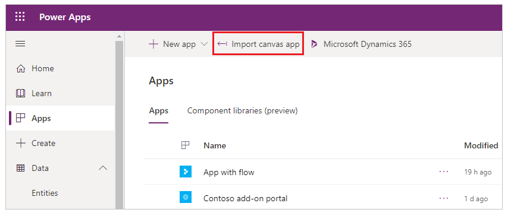

5. Click the **Upload** button and select the PowerApp package you downloaded in previous steps.
6. For the **App** and **Flow** resource types, set **IMPORT SETUP** to **Create as new**.
7. For the **SharePoint** and **Outlook** connections, set **IMPORT SETUP** to **Select during import**.
	
   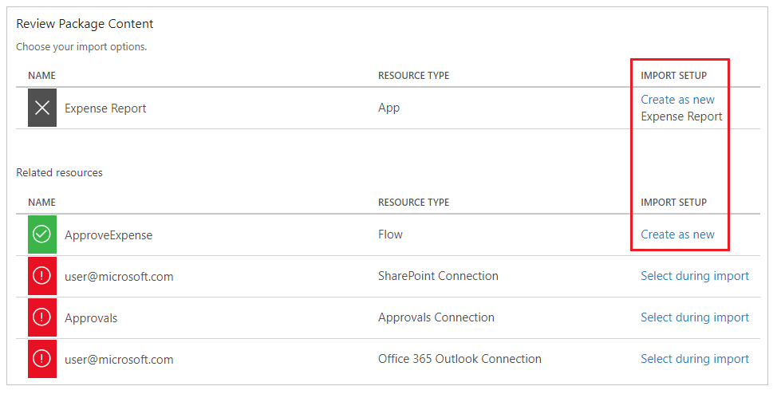

8. Click the **red icon** for the **SharePoint Connection**.
9. In the connections list, click the item with your username.

   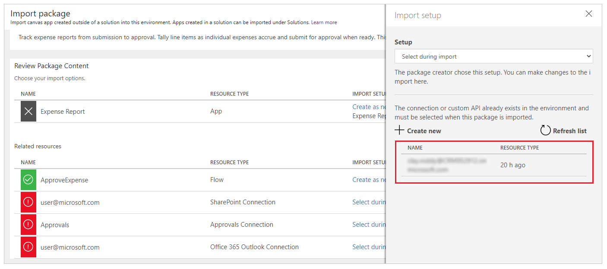

10. Click **Save**.
11. Click the **red icon** for the **Approval Connection**.
12. In the connections list, click the item with your username.

	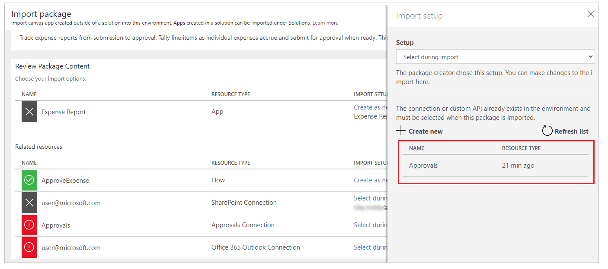

13. Click **Save**.
14. Click the **red icon** for the **Office 365 Outlook Connection**.
15. In the connections list, click the item with your username.

	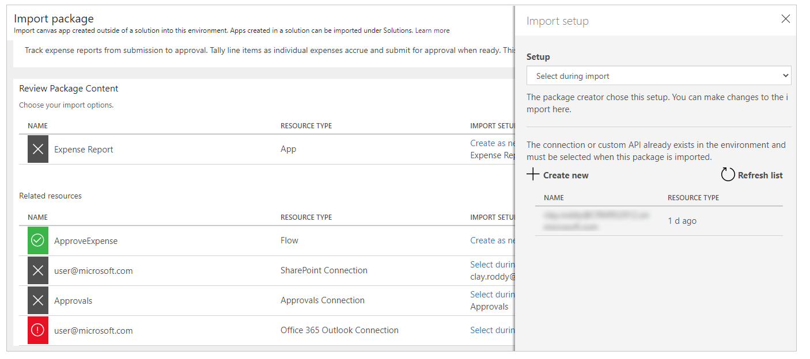

16. Click **Save**.

	> [!TIP] 
	> When you are done, it will look like this:

	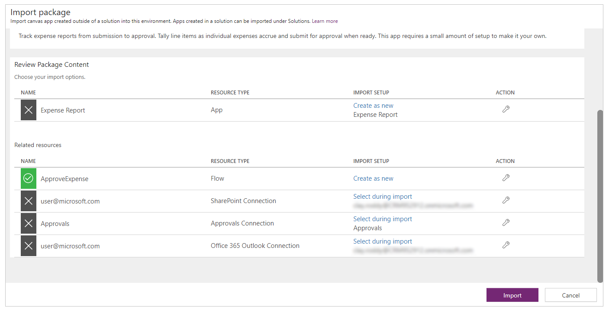

17.	Click **Import** and wait until the process is complete.

	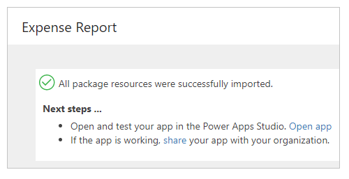

## Configure the PowerApp to use the SharePoint lists

1. In the web browser, click **Apps**.
2. Click the **ellipses** next to the Expense Report PowerApp.
3. Click **Edit on the web**.
4. Click **Allow**.

### Delete connections
1. Click **View**.
2. Click **Data sources**.
3. In the **Data** pane, click the **ellipses** next to **Expenses**.
4. Click **Remove**.
5. In the **Data** pane, click the **ellipses** next to **LineItems**.
6. Click **Remove**.

### Expenses list

1. Click **View**.
2. Click **Data sources**.
3. In the **Data** pane, click **+ Add data source**.
4. Click **+ New connection**.
5. Select **SharePoint**.
6. Click **Create**.
7. In the **Recent sites** list, select the SharePoint site where you created the Expenses List.

	> [!TIP] 
	> If the site does not appear in the list, enter the URL to the SharePoint site in the textbox and click, **Go**.

8. In the **Search** textbox at the top of the list enter **Expenses**.
9. Check the checkbox next to the **Expenses** list.
10. Click **Connect**.

### LineItems list

1. Click **View**.
2. Click **Data sources**.
3. In the **Data** pane, click **+ Add data source**.
4. Click **+ New connection**.
5. Select **SharePoint**.
6. Click **Create**.
7. In the **Recent sites** list, select the SharePoint site where you created the LineItems List.

	> [!TIP] 
	> If the site does not appear in the list, enter the URL to the SharePoint site in the textbox and click, **Go**.

8. In the **Search** textbox at the top of the list enter **LineItems**.
9. Check the checkbox next to the **LineItems** list.
10. Click **Connect**.
11. Click **File**.
12. Click **Save**.
13. Click **Publish**.
14. Click **Publish this version**.

## Modify the Flow

1.	In the menu on the left, click **Flows**.
2.	If prompted to sign in, sign in by providing the same credentials that you used to sign up.
3.	Select **My flows** in the top menu.
4.	Next to the **ApproveExpense** Flow, click the **pencil icon**.
 
	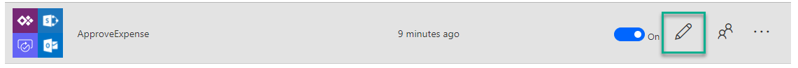

5.	Expand the **Get items** action. 
6.	Change the **Site Address** and **List Name** to match the Expense SharePoint list you created.
	
	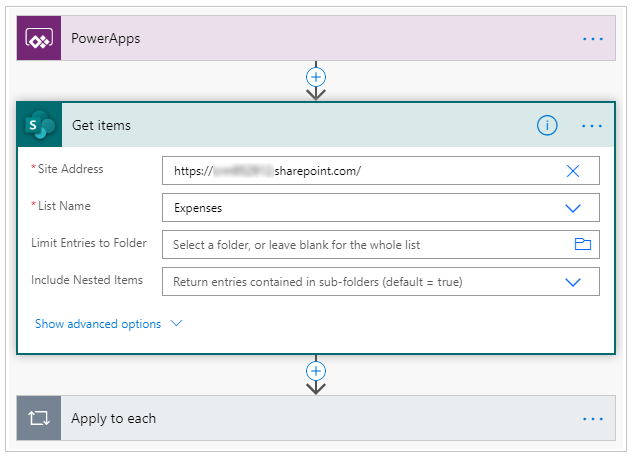

	> [!TIP] 
	> You don’t need to type it manually, you can choose it in the dropdown lists.

7.	Expand the **Condition**.
8.	Expand the **If yes** section.
9.	Expand the **Change item status to Approved** action.
10.	Change the **Site Address** and **List Name** to match the Expense SharePoint list you created.

	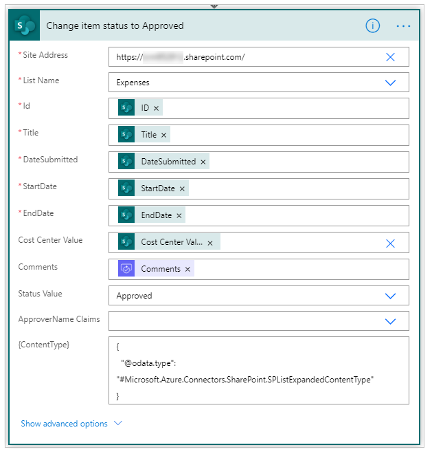 

	> [!TIP] 
	> You don’t need to type it manually, you can choose it in the dropdown lists.

11. Expand the **If no** section.
12.	Expand the **Change item status to Open** action.
13.	Change the **Site Address** and **List Name** to match the Expense SharePoint list you created. 

	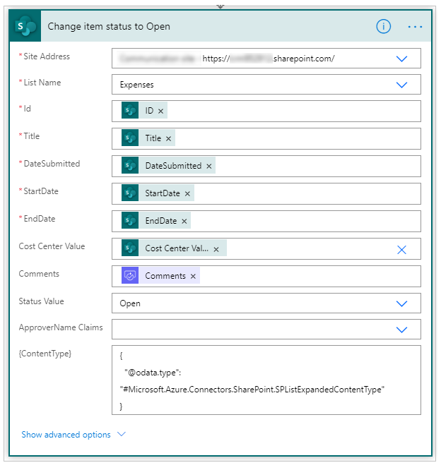

	> [!TIP] 
	> You don’t need to type it manually, you can choose it in the dropdown lists.

14.	Click **Update flow**.

## Play the PowerApp

1. In the web browser, click **Apps**.
2. Click the **ellipses** next to the Expense Report PowerApp.
3. Click **Open**.

## Next steps
- [Customize a SharePoint list form](https://docs.microsoft.com/powerapps/maker/canvas-apps/customize-list-form)
- [Add and configure a control](https://docs.microsoft.com/powerapps/maker/canvas-apps/add-configure-controls)
- [Edit and manage permissions for a SharePoint list or library](https://support.office.com/en-us/article/edit-and-manage-permissions-for-a-sharepoint-list-or-library-02d770f3-59eb-4910-a608-5f84cc297782)

