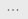
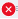

# Install and configure the Expense Report sample for canvas apps in Power Apps

Step-by-step instructions for installing and configuring the Expense Report sample. You can also preview the sample app [here](https://aka.ms/previewmyexpenses).

Estimated time to complete these steps: **10-15 minutes**

> [!TIP]
> For a demonstration of how to use the Expense Report sample app, watch this [video](https://youtu.be/kJXZPILfbwU).

Track expense reports from submission to approval. Tally line items as individual expenses accrue and submit for approval when ready. This app requires a small amount of setup to make it your own.

## Prerequisites

- [Sign up](../signup-for-powerapps.md) for Power Apps.
- Must have a valid SharePoint Online license and permission to create lists.

## Create the Expenses list

This list stores the expense reports.

1. Open a web browser.
1. Go to the SharePoint site where you want to create the Expenses list.
1. Sign in with an account that has permission to create lists.
1. Select the **gear icon** in the top-right portion of the web page.
1. Select **Add an app**.
1. In the **Find an app** textbox, enter **Custom**.
1. Select the **search icon**.
1. Select the **Custom List** app.
1. In the **Name** textbox, enter **Expenses**.

	> [!IMPORTANT]
	> If you choose a different name for the list, make sure you write it down because you will need to substitute it for Expenses everywhere you see it during the installation and configuration process.

1. Select **Create**.

### Create Cost Center column

1. Select the **Expenses** list.
1. Select the **gear icon** in the top-right portion of the web page.
1. Select **List settings**.
1. Select **Create column**.
1. In the Column name textbox, enter **Cost Center**.
1. In the **type of information in this column is** radio button list, select **Choice**.
1. In the **Type each choice on a separate line** textbox, enter the following values, each on a separate line: 
	- Microsoft
	- Contoso
1. In the **Default value** textbox, enter **Microsoft**.
1. Select **OK**.

### Create Comments column

1. Select **Create column**.
1. In the **Column name** textbox, enter **Comments**.
1. In the **type of information in this column is** radio button list, select **Multiple lines of text**.
1. Select **OK**.

### Create Status column

1. Select **Create column**.
1. In the Column name textbox, enter **Status**.
1. In the **type of information in this column is** radio button list, select **Choice**.
1. In the **Type each choice on a separate line** textbox, enter the following values, each on a separate line: 
    - Open
    - Pending
    - Approved
1. In the **Default value** textbox, enter **Open**.
1. Select **OK**.

### Create ApproverName column

1. Select **Create column**.
1. In the **Column name** textbox, enter **ApproverName**.
1. In the **type of information in this column is** radio button list, select **Person or Group**.
1. In the **Require that this column contains information** radio button list, select **Yes**.
1. Select **OK**.

### Create DateSubmitted column

1. Select **Create column**.
1. In the **Column name** textbox, enter **DateSubmitted**.
1. In the **type of information in this column is** radio button list, select **Date and Time**.
1. In the **Require that this column contains information** radio button list, select **Yes**.
1. Select **OK**.

### Create StartDate column

1. Select **Create column**.
1. In the **Column name** textbox, enter **StartDate**.
1. In the **type of information in this column is** radio button list, select **Date and Time**.
1. In the **Require that this column contains information** radio button list, select **Yes**.
1. Select **OK**.

### Create EndDate column

1. Select **Create column**.
1. In the **Column name** textbox, enter **EndDate**.
1. In the **type of information in this column is** radio button list, select **Date and Time**.
1. In the **Require that this column contains information** radio button list, select **Yes**.
1. Select **OK**.

## Create the LineItems list

This list stores the line items that are associated with each expense report.

1. Go to the same site collection where you created the Expenses list.
1. Select the **gear icon** in the top-right portion of the web page.
1. Select **Add an app**.
1. In the **Find an app** textbox, enter **Custom**.
1. Select the **search icon**.
1. Select the **Custom List** app.
1. In the **Name** textbox, enter **LineItems**.

	> [!IMPORTANT] 
	> If you choose a different name for the list, make sure you write it down because you'll need to substitute it for LineItems everywhere you see it during the installation and configuration process.

1. Select **Create**.
 
### Create Category column

1. Select the **LineItems** list.
1. Select the **gear icon** in the top-right portion of the web page.
1. Select **List settings**.
1. Select **Create column**.
1. In the Column name textbox, enter **Category**.
1. In the **type of information in this column is** radio button list, select **Choice**.
1. In the **Type each choice on a separate line** textbox, enter the following values, each on a separate line: 
	- Food & Beverage
	- Transportation
	- Business needs
1. In the **Default value** textbox, enter **Food & Beverage**.
1. Select **OK**.

### Create Cost column

1. Select **Create column**.
2. In the Column name textbox, enter **Cost**.
3. In the **type of information in this column is** radio button list, select **Number (1, 10, 100)**.
4. In the **Require that this column contains information** radio button list, select **Yes**.
5. Select **OK**.

### Create Date column

1. Select **Create column**.
2. In the Column name textbox, enter **Date**.
3. In the **type of information in this column is** radio button list, select **Date and Time**.
4. In the **Require that this column contains information** radio button list, select **Yes**.
5. Select **OK**.

### Create Description column

1. Select **Create column**.
2. In the Column name textbox, enter **Description**.
3. In the **type of information in this column is** radio button list, select **Multiple lines of text**.
4. In the **Require that this column contains information** radio button list, select **Yes**.
5. In the **Specify the type of text to allow** radio button list, select **Plain text**.
6. Select **OK**.

### Create ReportID column

1. Select **Create column**.
2. In the Column name textbox, enter **ReportID**.
3. In the **type of information in this column is** radio button list, select **Lookup (information already on this site)**.
4. In the **Require that this column contains information** radio button list, select **Yes**.
5. In the **Get information from** dropdown list, select the **Expenses** list you created.
6. In the **In this column** dropdown list, select **ID**.
7. Select **OK**.

### Edit Title column

1. Select the **Title** column link.
2. In the **Require that this column contains information** radio button list, select **No**.
3. Select **OK**.

## Download the Expense Report app

1. In a web browser, go to the following link:

    [https://pappsfeprodwestuscontent.blob.core.windows.net/sampleapps/myexpenses/docs/MyExpenses(SP_List).zip](https://pappsfeprodwestuscontent.blob.core.windows.net/sampleapps/myexpenses/docs/MyExpenses(SP_List).zip).

2. Download the Expense Report Power Apps Sample package, and save it to your computer.

## Create connections

1. In a web browser, go to [Power Apps](https://make.powerapps.com?utm_source=padocs&utm_medium=linkinadoc&utm_campaign=referralsfromdoc).
1. Sign in by providing the same credentials that you used to sign up.
1. From the left-pane, expand **Data**.
1. Select **Connections**.

### Create an Approvals connection

1.	Select **+ New connection**.
2.	In the **Search** textbox, enter **Approvals**.
3.	Select **Approvals** in the list.
4.	Select **Create**.
	
### Create an Office 365 Outlook connection

1.	Select **+ New connection**.
2.	In the **Search** textbox, enter **Office 365 Outlook**.
3.	Select **Office 365 Outlook** in the list.
4.	Select **Create**.
5.	In the popup window, select the account you logged in with.

### Create a SharePoint connection

1.	Select **+ New connection**.
2.	In the **Search** textbox, enter **SharePoint**.
3.	Select **SharePoint** in the list.
4.	Select **Create**.
5.	In the popup window, select the account you logged in with.

## Import the app

1. In a web browser, go to [Power Apps](https://make.powerapps.com).
1. Sign in with the same credentials that you used to sign up.
1. From the left-pane, select **Apps**.
1. Select **Import package**.

    

1. Select **Upload**, and then select the package that you downloaded earlier.
1. For the **App** and **Flow** resource types, set **IMPORT SETUP** to **Create as new**.

    

1. Select  for the **SharePoint Connection**.
1. In the connections list, select the item with your username.

    

1. Select **Save**.
1. Select  for the **Approval Connection**.
1. In the connections list, select **Approvals**.

    

1. Select **Save**.
1. Select  for the **Office 365 Outlook Connection**.
1. In the connections list, select the item with your username.

    

1. Select **Save**.

    > [!TIP]
    > When you're done, it will look like this:

    

1. Select **Import**, and then wait until the process is complete.

    

## Configure the app to use the SharePoint lists

1. In the web browser, select **Apps**.
1. Select  next to the Expense Report app.
1. Select **Edit**.
1. Select **Allow** to let the app use connections.

### Delete connections

1. On the **View** tab, select **Data sources**.
1. In the **Data** pane, select  next to **Expenses**.
1. Select **Remove**.
1. Repeat the previous step to remove the **LineItems** data source.

### Expenses list

1. Select **Add data source**.
1. Select **New connection**.
1. Search for **SharePoint**.
1. Select **Connect**.
1. In the **Recent sites** list, select the SharePoint site where you created the Expenses list.

    > [!TIP]
    > If the site doesn't appear in the list, enter or paste the URL to the SharePoint site in the textbox, and then select **Connect**.

1. In the **Search** box at the top of the list, enter or paste **Expenses**.
1. Select the checkbox next to **Expenses**, and then select **Connect**.

### LineItems list

1. On the **View** tab, select **Data sources**.
1. In the **Data** pane, select **SharePoint**.
1. In the **Recent sites** list, select the SharePoint site where you created the LineItems list.

    > [!TIP] 
    > If the site doesn't appear in the list, enter or paste the URL to the SharePoint site in the textbox, and then select **Connect**.

1. In the **Search** box at the top of the list, enter or paste **Line Items**.
1. Select the checkbox next to **LineItems**, and then select **Connect**.
1. Select **File** > **Save** > **Publish** > **Publish this version**.

## Modify the flow

1. From the left-pane, select **Flows**.
1. If prompted to sign in, provide the same credentials that you used to sign up.
1. Select **My Flows**.
1. Select  next to the **ApproveExpense** flow.
1. Expand the **Get items** action. 
1. Change the **Site Address** and **List Name** to match the Expenses list that you created in SharePoint.

    

    > [!TIP]
    > - You don’t need to type it manually; you can select it in the drop-down lists.
    > - If you select an incorrect list, you can discard the changes to the flow and restart flow modifications as a quick fix.

1. Select **Apply to each**.
1. Expand the **Condition**.
1. Expand the **If yes** section.
1. Expand the **Change item status to Approved** action.
1. Change the **Site Address** and **List Name** to match the Expenses list that you created in SharePoint.

     

1. Expand the **If no** section.
1. Expand the **Change item status to Open** action.
1. Change the **Site Address** and **List Name** to match the Expenses list that you created in SharePoint. 

    

14. Select **Save**.

## Update app functions

1. Select **Apps**.
1. Select  next to the Expense Report app.
1. Select **Edit**.
1. Select **NewExpense** screen from the tree view.
1. Select text input next to **Cost Center** label.
1. Select **Items** property.
1. Update the formula from `Choices(Expenses.Costcenter)` to `Choices(Expenses.Cost_x0020_Center)`.
1. Select **DeleteExpenseConfirm** screen from the tree view.
1. Select the expense ID label.
1. Select the **Text** property.
1. Update the formula from `SelectedReport.ExpenseID` to `SelectedReport.ID`.
1. Select **View**.
1. Select **Data sources**.
1. In the **Data** pane, select  next to **Expenses**.
1. Select **Refresh**.
1. Repeat the above step for **LineItems** list.
1. Select **File** > **Save** > **Publish** > **Publish this version**.

> [!TIP]
> You can select different screens from the tree view and quickly check for any formula errors represented as . Most quick-fixes include column name updates such as from *Costcenter* to *Cost_x0020_center* to account for a *space*, or updating to a diferent name you may have used while creating columns earlier.

## Play the app

1. In the web browser, select **Apps**.
1. Select the Expense Report app.

## Next steps

[Share a canvas app](share-app.md)

### See also

- [SharePoint integration scenarios](sharepoint/scenarios-intro.md)
- [Customize a SharePoint list form](https://docs.microsoft.com/powerapps/maker/canvas-apps/customize-list-form)
- [Add and configure a control](https://docs.microsoft.com/powerapps/maker/canvas-apps/add-configure-controls)
- [Edit and manage permissions for a SharePoint list or library](https://support.office.com/article/edit-and-manage-permissions-for-a-sharepoint-list-or-library-02d770f3-59eb-4910-a608-5f84cc297782)

[!INCLUDE[footer-include](../../includes/footer-banner.md)]