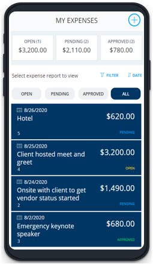
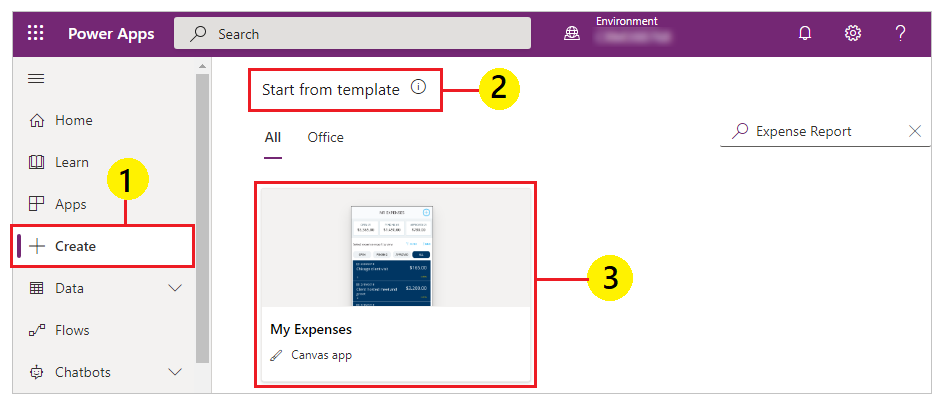

# Set up and explore the Expense Report sample template in Power Apps

In Power Apps, the Expense Report sample template is a tool for helping you track expense reports from submission to approval. By running the app, you can tally line items as individual expenses accrue and submit them for approval when you’re ready. This app requires a small amount of setup to make it your own.

## Where can I run the app?

You can run this sample app in your browser, on a tablet, or on another device that has a similar form factor.

## How do I open the template and run the app?

The Expense Report sample app is available in [Power Apps](https://make.powerapps.com). Follow these steps to open and run the sample app:

1. Sign in to [Power Apps](https://make.powerapps.com).

1. On the left pane, select **Create**.

1. On the right side of the screen, scroll down to the **Start from template** section.

1. Select **Expense Report** from the available sample app templates.

    

1. Enter a name.

1. Select **Create**.

1. When prompted, select **Allow** to let the app use the connections.

1. Press **F5** on the keyboard or use  to play the app.

> [!NOTE]
> This sample app includes locally saved information using [collections](create-update-collection.md). To use the app for business purposes, customize the app to store information using [connectors](/connectors/connector-reference/connector-reference-powerapps-connectors).

## How do I build the app myself?

The Expense Report sample app includes a lot of the functionality commonly used in Power Apps. You can extend the app functionality by using connectors to connect the app to a data source instead of the default [collections](create-update-collection.md) used by the sample app.

[Save the app](save-publish-app.md#save-changes-to-an-app) and update it to use a data source such as [SharePoint](connections/connection-sharepoint-online.md) or [Microsoft Dataverse](connections/connection-common-data-service.md).

You can also enable the capability to send emails or approval routing using [Power Automate flow](using-logic-flows.md) or [Approvals connector](/connectors/approvals).

## Next steps

[Design the app inteface - add, configure controls](add-configure-controls.md)

### See also

[Canvas apps connectors for Power Apps](connections-list.md)  
[Formula reference](formula-reference.md)  
[Controls reference](reference-properties.md)  
[Share a canvas app](share-app.md)

[!INCLUDE[footer-include](../../includes/footer-banner.md)]

