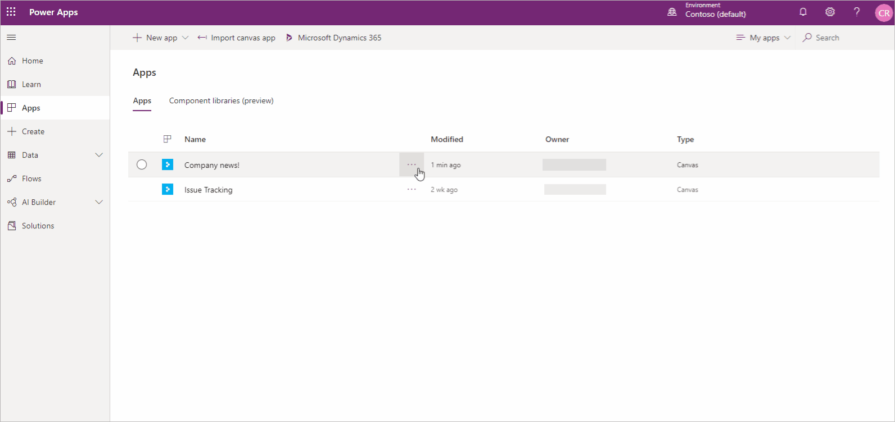
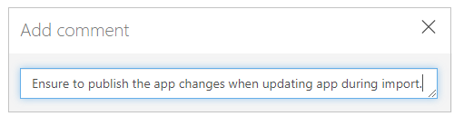
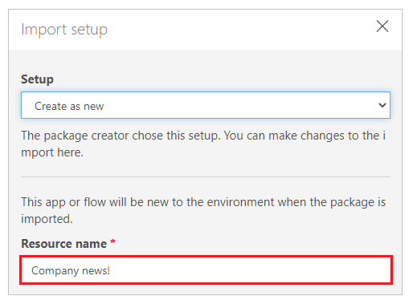

# Export and import canvas apps as a package

This article provides a step-by-step guide for exporting and importing canvas apps. Before you begin, review the [overview](export-import-app.md) article to learn about the different export and import options available.

> [!IMPORTANT]
> It's recommended to use solutions for application lifecycle management (ALM) to ensure proper management and support.

## Export a canvas apps package

To export a canvas apps package, select your app, and then select **Export Package**.

You can change the default **Import Action** for each resource used by your canvas app. By default, resources in a canvas app package, including the app itself, are set to **Update**. However, you have the option to select **Create as new** during import, which will create the resource instead of updating an existing one. The import action you select will be the default action during the app import

> [!IMPORTANT]
> You can only import the exported package. Changes to the exported package file aren't supported.

<!--markdownlint-disable MD036-->
**To export a canvas app package**
<!--markdownlint-enable MD036-->

1. Sign in to [Power Apps](https://make.powerapps.com).

1. Select **Apps** from the left pane.

1. Select the app that you want to export.

1. Select **Export Package**.

    

1. Enter the package **Name** and **Description**. You can also change the **Environment** name, if needed.

    

1. Select **Update** to choose the import action for the app package resource.

    

1. Select **Create as new** if the app should be created during import, or **Update** to update an existing app.

    

    > [!NOTE]
    > The **Import Setup** action text changes depending on your new selection.

1. Repeat the previous step for each additional resource in the app package.

1. (Optional) Select  (comment icon) to insert a comment for each resource.

    

1. Select **Export** to export the package.

The package is downloaded to your browser's default downloads folder.

## Importing a canvas app package

To import a canvas app package, select **Import canvas app**. Be sure to select the correct actions for each app package resource&mdash;for example, create a new instance of an app or a flow. You can also read additional information in comments that were entered while the app package was being exported.

If you're updating an existing app or resource, be sure to [publish](save-publish-app.md) the app so users can see the changes.

> [!TIP]
> You can quickly confirm selections before importing an app package by viewing the icon changes for each resource type.
> <table >
>  <tr>
>    <th align="left">Icon</th>
>    <th align = "left">Description</th>
>  </tr>
>  <tr>
>    <td></td>
>    <td><b>Create as new</b>: A new resource will be created.</td>
>  </tr>
>  <tr>
>    <td></td>
>    <td><b>Import action changed</b>: The import action for the resource has been modified.</td>
>  </tr>
>  <tr>
>    <td></td>
>    <td><b>Action required</b>: You must select an import action before the app package can be imported.</td>
>  </tr>
> </table>

<!--markdownlint-disable MD036-->
**To import a canvas app package**
<!--markdownlint-enable MD036-->

1. Sign in to [Power Apps](https://make.powerapps.com).

1. Select **Apps** from the left pane.

1. Select **Import canvas app**.

    

1. Select **Upload**, and select the app package file that you want to import.

1. Select the **Import Setup** action, or  for a resource.

    

    - If you select **Create as new**, you can change the resource name.

        

    - If you select **Update**, select an app that you want to update during the import.

        

1. Repeat the previous step for each additional resource in the app package.

1. (Optional) If the app package contains references to [connections](connections-list.md), you can choose the connection from the available connections list.

    

    Select **Select during import** to choose the appropriate connection.

    

    > [!NOTE]
    > - If no connections are available, or the connection you want isn't listed, select **Create new** to create a new connection in a new browser tab. Ensure that you create the connection for the correct resource type. After creating the connection, return to the import app browser tab and select **Refresh list** to reflect and choose the newly created connection.
    > - In some cases, it is necessary to reconfigure the flow association when you import a canvas app with flows. For more information, see [Add an existing flow](working-with-flows.md#add-an-existing-flow)

1. (Optional) If comments were entered for a resource during the export of the app package, the comment icon will appear filled and the text **Comment yes** will appear when you hover over it. Select the comment to view it.

    

1. Select **Import** to import the app package.

    > [!IMPORTANT]
    > If you select to **Update** an existing app, the new changes will be saved as a draft of the app. You'll need to [publish](save-publish-app.md) the app so users can see the changes.
