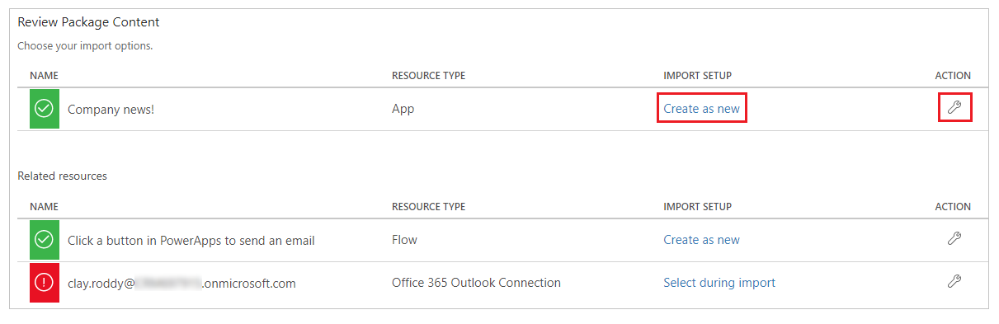

# Export and import canvas app packages

In this article, you'll learn how to export and import canvas apps.

You can export and import canvas apps by using packages. This feature allows you to export an app from one environment and import it to another. When exporting and importing canvas app packages, consider the scenario that best fits the available options. For example, you can save a canvas app locally by using the *Save As* option when you select the location as *This computer*. The saved file will have the file name extension *.msapp*. This file doesn't include any additional components such as flows created with Power Automate and used by the saved app. Although you can use this method to create a copy of an existing app, you can use the recommended export and import feature that includes [additional resources](#resources-included-in-the-package) with the package. Export and import packages have the file format *.zip*.

> [!IMPORTANT]
> - For ALM capabilities in Microsoft Power Platform environments, use Microsoft Dataverse and solutions instead of the canvas app package export and import. More information: [ALM overview](/power-platform/alm/overview-alm)
> - Canvas app packages can't be used with [Dataverse solution packages](../data-platform/solutions-overview.md) because of the package incompatibility.

## Resources included in the package

An app can consume different resources. For example, most apps use connections. Other apps might use Power Automate, have custom connectors, or connect by using gateways to on-premises resources. Some apps might also use Dataverse customizations.

The following table explains different resource types, supportability, and import options.

| Resource type | Supported | Import options |
| --- | --- | --- |
| App |Yes, for canvas apps |There are two options to import an app into an environment: <ul><li><b>Create new</b>: The app will be created as a new app in the environment where the package is imported.</li> <li><b>Update</b>: The app already exists in the environment and will be updated when this package is imported.</li></ul> |
| Power Automate |Yes |There are two options to import a flow into an environment: <ul><li><b>Create new</b>: The flow will be created as a new flow in the environment where the package is imported.</li> <li><b>Update</b>: The flow already exists in the environment and will be updated when this package is imported.</li></ul>  <b>Note: </b>All resources that the flow depends on will also be included in the app package that's exported and will need to be configured when the package is imported.     You can also export and import flows by using solutions. More information: [Power Automate solutions](/power-automate/overview-solution-flows) |
| Custom connectors |No |Exporting a custom connector isn't supported. You'll need to re-create the custom connector on the target environment. |
| Connections |No |Exporting a connection isn't supported. You'll need to re-create connections on the target environment. |
| Dataverse customizations |No |Exporting Dataverse customizations as a part of a canvas app package isn't supported. You'll need to use Dataverse solutions instead. More information: [Dataverse solutions](../../developer/data-platform/introduction-solutions.md) |
| Gateways |No | You can't export or import gateways. You'll need to re-create gateways on the target environment. |

## Permissions required to export a canvas app package

Only the **Owner** or **Co-owner** of an app can export a canvas app package. To import an app, the **Environment Maker** permission is required on the destination environment.

## Exporting a canvas app package

To export a canvas app package, select your app, and then select **Export Package**.

You can change the default **Import Action** for each resource that your canvas app uses. The default action for resources in a canvas app package, including the app, is **Update**. You can choose to **Create as new** during import, to create the resource during the import instead of updating existing resource. However, the import action that you select will become the default action during the app import.

> [!IMPORTANT]
> You can only import the exported package. Changes to the the exported package file aren't supported.

<!--markdownlint-disable MD036-->
**To export a canvas app package**
<!--markdownlint-enable MD036-->

1. Sign in to [Power Apps](https://make.powerapps.com).

1. Select **Apps** from the left pane.

1. Select the app that you want to export.

1. Select **Export Package**.

    

1. Enter the package **Name** and **Description**. You can also change the **Environment** name, if needed.

    

1. Select **Update** to choose the import action for the app package resource.

    

1. Select **Create as new** if the app should be created during import, or **Update** to update an existing app.

    

    > [!NOTE]
    > The **Import Setup** action text changes depending on your new selection.

1. Repeat the previous step for each additional resource in the app package.

1. (Optional) Select  (comment icon) to insert a comment for each resource.

    

1. Select **Export** to export the package.

The package is downloaded to your browser's default downloads folder.

## Importing a canvas app package

To import a canvas app package, select **Import canvas app**. Be sure to select the correct actions for each app package resource&mdash;for example, create a new instance of an app or a flow. You can also read additional information in comments that were entered while the app package was being exported.

If you're updating an existing app or resource, be sure to [publish](save-publish-app.md#publish-an-app) the app so users can see the changes.

> [!TIP]
> You can quickly confirm selections before importing an app package by viewing the icon changes for each resource type.
> <table >
>  <tr>
>    <th align="left">Icon</th>
>    <th align = "left">Description</th>
>  </tr>
>  <tr>
>    <td></td>
>    <td><b>Create as new</b>: A new resource will be created.</td>
>  </tr>
>  <tr>
>    <td></td>
>    <td><b>Import action changed</b>: The import action for the resource has been modified.</td>
>  </tr>
>  <tr>
>    <td></td>
>    <td><b>Action required</b>: You must select an import action before the app package can be imported.</td>
>  </tr>
> </table>

<!--markdownlint-disable MD036-->
**To import a canvas app package**
<!--markdownlint-enable MD036-->

1. Sign in to [Power Apps](https://make.powerapps.com).

1. Select **Apps** from the left pane.

1. Select **Import canvas app**.

    

1. Select **Upload**, and select the app package file that you want to import.

1. Select the **Import Setup** action, or  for a resource.

    

    - If you select **Create as new**, you can change the resource name.

        

    - If you select **Update**, select an app that you want to update during the import.

        

1. Repeat the previous step for each additional resource in the app package.

1. (Optional) If the app package contains references to [connections](connections-list.md), you can choose the connection from the available connections list.

    

    Select **Select during import** to choose the appropriate connection.

    

    > [!NOTE]
    > If no connections are available, or the connection you want isn't listed, select **Create new** to create a new connection in a new browser tab. Ensure that you create the connection for the correct resource type. After creating the connection, return to the import app browser tab and select **Refresh list** to reflect and choose the newly created connection.

1. (Optional) If comments were entered for a resource during the export of the app package, the comment icon will appear filled and the text **Comment yes** will appear when you hover over it. Select the comment to view it.

    

1. Select **Import** to import the app package.

    > [!IMPORTANT]
    > If you select to **Update** an existing app, the new changes will be saved as a draft of the app. You'll need to [publish](save-publish-app.md#publish-an-app) the app so users can see the changes.

### See also

- [Save and publish an app](save-publish-app.md)
- [Edit an app](edit-app.md)
- [Delete an app](delete-app.md)
- [Share an app](share-app.md)

[!INCLUDE[footer-include](../../includes/footer-banner.md)]