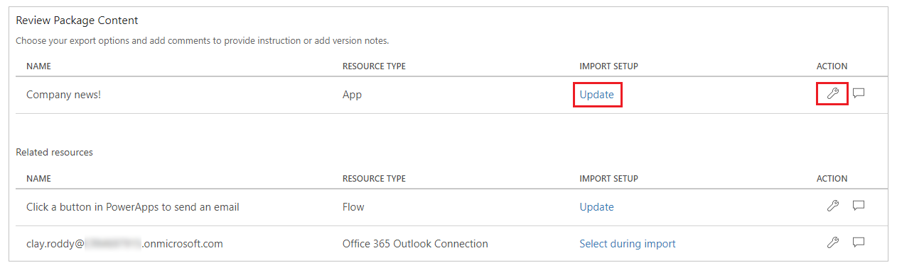
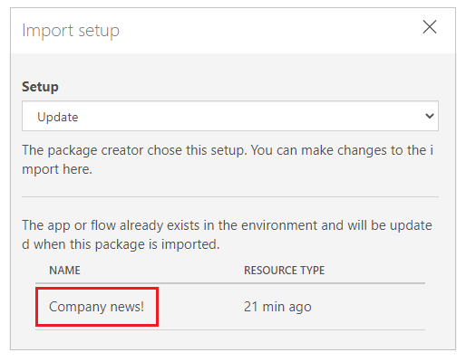

# Export and import canvas app package

In this article, you'll learn how to export and import canvas apps.

One common scenario where you may want to migrate resources is where you have Test or Dev environments and a production environment. Developers and testers have wide access to the apps in their environments. But when it comes time to migrate a new app to production, that environment has rigorous control over permissions to update and change it.

Another scenario is one where each customer has their own environment and data. When a new customer is added, a new environment is created for them, and you would migrate apps into their environment.

## Resources included in the package

> [!IMPORTANT]
> - For application lifecycle management (ALM) capabilities in Microsoft Power Platform environments, use Common Data Service and solutions instead of the canvas app package export and import. More information: [ALM overview](https://docs.microsoft.com/power-platform/alm/overview-alm).
> - Canvas app packages can't be used with [Common Data Service solution packages](../common-data-service/solutions-overview.md) because of the package incompatibility.

An app can consume different resources. For example, most apps use connections. Other apps may use Power Automate, have custom connectors, or connect using gateways to on-premises resources. Some apps may also use Common Data Service customizations.

The following table explains different resource types, supportability, and import options.

| Resource type | Supported | Import options |
| --- | --- | --- |
| App |Yes, for canvas apps |There are two options to import an app into an environment: <ol><li><b>Create new</b> – The app will be created as a new app in the environment where the package is imported.</li> <li><b>Update</b> - the app already exists in the environment and will be updated when this package is imported.</li></ol> |
| Power Automate |Yes |There are two options to import a flow into an environment: <ol><li><b>Create new</b> – The flow will be created as a new flow in the environment where the package is imported.</li> <li><b>Update</b> - The flow already exists in the environment and will be updated when this package is imported.</li></ol>  <b>Note: </b>All resources that the flow depends on will also be included within the app package that is exported and will need to be configured with the package is imported.     You can also export and import flows using solutions. More information: [Power Automate solutions](https://docs.microsoft.com/power-automate/overview-solution-flows). |
| Custom Connectors |No |Exporting a custom connector isn't supported. You'll need to re-create custom connector on target environment. |
| Connections |No |Exporting a connection isn't supported. You'll need to re-create connections on target environment. |
| Common Data Service Customizations |No |Exporting Common Data Service customizations as a part of canvas app package isn't supported. You'll need to use Common Data Service solutions instead. More information: [Common Data Service solutions](https://docs.microsoft.com/powerapps/developer/common-data-service/introduction-solutions) |
| Gateways |No | You can't export or import gateways. You'll need to re-create gateways on target environment. |

## Permissions required to export a canvas app package

Only **Owner** or **Co-owner** of an app can export a canvas app package. To import an app, **Environment Maker** permission is required on the destination environment.

## Exporting a canvas app package

To export a canvas app package, select your app and then select **Export Package**.

You can change the default **IMPORT ACTION** for each resource that your canvas app uses. The default action for resources in canvas app package including the app is **Update**. You can choose to **Create as new** instead, during import. However, the import action that you select will become the default action during the app import.

> [!IMPORTANT]
> You can only import the exported package. Changes to the the exported package file aren't supported.

## Step-by-step: Exporting a canvas app package

1. Sign in to [Power Apps](https://make.powerapps.com).

1. Select **Apps** from the left pane.

1. Select the app that you want to export.

1. Select **Export Package** from the top menu. You can also select **More Commands** (**..**), and then select **Export Package** from the drop-down menu instead.

    

1. Enter package **Name** and **Description**. You can also change the **Environment** name, if needed.

    

1. Select **Update** to choose import action for the app package resource. You can also select the wrench icon instead.

    

1. Select **Create as new** if the app should be created during import, or **Update** to update an existing app.

    

    > [!NOTE]
    > The **IMPORT SETUP** action text changes depending on your new selection.

1. Repeat the previous step for each additional resource in the app package.

1. (Optional) Select comment icon to insert comment for each resource.

    
    
1. Select **Export** to export the package.

The package is downloaded to your browser's default downloads folder.

## Importing a canvas app package

To import a canvas app package, select **Import canvas app**. Ensure to select correct actions for each app package resource. For example, create a new instance of an app or a flow. You can also read comments entered while exporting the app package for additional information.

If you're updating existing app or resource, be sure to [publish](save-publish-app.md#publish-an-app) the app for changes to reflect to the users.

## Step-by-step: Importing a canvas app package

1. Sign in to [Power Apps](https://make.powerapps.com).

1. Select **Apps** from the left pane.

1. Select **Import canvas app**.

    

1. Select **Upload** and select the app package file that you want to import.

1. Select **IMPORT SETUP** action for the app. You can also select the wrench icon instead.

    

    1. If you select **Create as new**, you can change the resource name.

        

    1. If you select **Update**, select an app that you want to update during the import.

        

1. Repeat the previous step for each additional resource in the app package.

1. (Optional) If the app package contains references to [connection(s)](connections-list.md), you'll be able to choose the connection from available connections list.

    

    Select **Select during import** to choose the appropriate connection.

    

    > [!NOTE]
    > If no connections are available, or the connection you want is not listed, select **Create new** to create a new connection in a new browser tab. Ensure you create the connection for the correct resource type. After creating the connection, return to import app browser tab and select **Refresh list** to reflect and choose the newly created connection.

1. (Optional) If a resource has comments entered during the export of the app package, it will show with comment icon filled, and shows *Comment yes* when you hover over. Select the comment to view.

    

    If available, select comment icon to view the comment.

    

    > [!TIP]
    > You can quickly confirm selections before importing an app package by viewing the icon changes for each resource type.
    > <table >
    >  <tr>
    >    <th>Icon</th>
    >    <th>Description</th>
    >  </tr>
    >  <tr>
    >    <td></td>
    >    <td><b>Create as new</b> - a new resource will be created.</td>
    >  </tr>
    >  <tr>
    >    <td></td>
    >    <td><b>Import action changed</b> - import action for the resource is modified.</td>
    >  </tr>
    >  <tr>
    >    <td></td>
    >    <td><b>Action required</b> - you must select an import action before the app package can be imported.</td>
    >  </tr>
    > </table>

1. Select **Import** to import the app package.

    > [!IMPORTANT]
    > If you select to **Update** an existing app, the new changes will be saved as a draft of the applications. You'll need to [publish](save-publish-app.md#publish-an-app) the app for changes to reflect for users.

### See also

- [Save and publish an app](save-publish-app.md)
- [Edit an app](edit-app.md)
- [Delete an app](delete-app.md)
- [Share an app](share-app.md)
