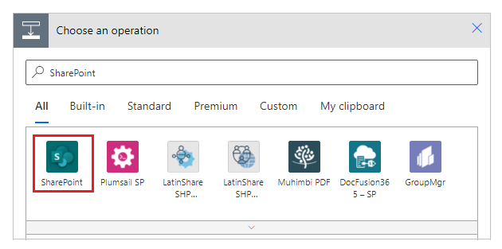

# Using Find and Replace in the formula bar

You can search for combinations of letters, numbers, words, and phrases within a formula in the formula bar using Find and Replace capability. In complex Power Apps, formulas can get lengthy and using Find and Replace can help you locate all instances of the specified word or sequence of characters, replace one or more matches, or replace all matches at once.

## Prerequisites

- [Sign up](../signup-for-powerapps.md) for Power Apps.
- Create an app or open an existing app in Power Apps.
- Learn how to [configure a control](add-configure-controls.md).

## Launch the Find and Replace control

You can launch the Find and Replace control in the formula bar using the Find and Replace button or quick keys. Additionally, you can pre-populate text in the search input.

### Using the Find and Replace button

1. Sign in to [Power Apps](https://make.powerapps.com).

1. Open an existing app, or select a sample app under Create > Start from template. The formula bar appears near the top of the screen.

1. Select the Expand button to expand the formula bar.

1. Options appear beneath the formula bar, including the **Find and Replace** button.

1. Selecting the Find and Replace button launches the Find and Replace control on the righthand side of the formula bar.

    

### Using Quick Keys

While your cursor is within the formula bar: 

- Press **Ctrl+F** as a shortcut to find a specified word or sequence of characters in the current formula.
- Press **Ctrl+H** as a shortcut to find and replace a specified word or sequence of characters in the current formula.

### Launch Find and Replace with text pre-selected

You can also launch the control pre-populated with text from your formula that you wish to search for.

1. Select the desired text within the formula. The text will be highlighted to indicate it is selected.

1. Select the Find and Replace button beneath the formula bar, or press Ctrl + F or Ctrl + H on your keyboard to launch the control with the desired text already populated in the search input field.

    

## Working with Find and Replace

There are several ways you can use the Find and Replace Control to work with a formula.

### Find

Add text or characters to search for into the provided input area. You can then use the icons on the righthand side of the input area to help refine your search:

- **Match case** returns only matches with the specified case. 
In the example below, instances of TicketList will appear as a match, but ticketlist would not.

- **Match Whole Word** returns only exact matches of the entire sequence of characters.
In the example below, instances of “Ticket” returns no matches although the word “Ticket” appears within names several times in the formula. 

- **Use regular expression (RegEx)** returns only matches conforming to the regular expression specified within the input area. See regular-expression syntax for an introduction to the syntax. 
In the example below, using the Regular Expression search capability with Screen(Priority|Task) returns matches for Screen when it appears together with either Priority or Task as in the control names shown below

- Use the **Previous Match** and **Next Match** arrow icons to move forward and backward through any matches the search returns. As you move through the matches, the match position updates and the row containing the match is highlighted to let you know which match you are currently working with.

    

**Find in selection** limits the search area within a formula to only the selected portion of a formula. To select part of the formula, Select and hold at the beginning of the desired searching area and then drag your cursor to highlight the entire desired area. To select using the keyboard, move cursor focus to the beginning of the desired search area, then hold shift and use the arrow keys to highlight the desired search area.  

In the example below, the search has been limited to the selected area, so the search now only returns two matches instead of the four matches retuned previously.

    

### Replace

By default, the Find and Replace control opens in collapsed format and only displays the Find capability. To expand the control and show the Replace capability, select the icon to the left of the search input box, or press Ctrl + H on your keyboard. To collapse again, select the rotated icon.

In the Replace input area, specify the word or sequence of characters you’d like to replace the search text.

Use the Replace or Replace All icons to update one or all matches returned with the specified word/characters.

### See also

[Create a rule in canvas apps](working-with-rules.md)
  [Add and configure controls](add-configure-controls.md)

[!INCLUDE[footer-include](../../includes/footer-banner.md)]
